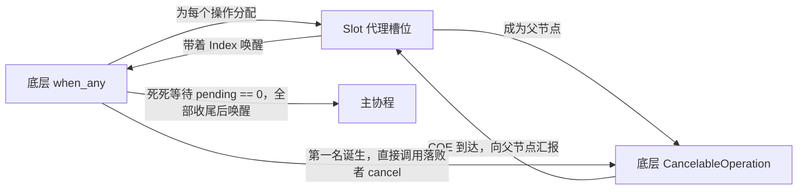
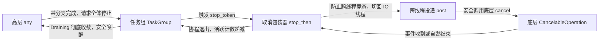

关注本系列的读者应该记得，在之前优化写路径（`write_all`）和实现独立定时器（`timeout`）时，为了拦截和重试底层的 I/O 事件，我们在基类中引入了一个名为 `CancelableOperation` 的抽象，并给它加了一个 `parent` 指针。利用这个 `parent` 钩子，组合器可以拦截子任务的完成事件。

当时我天真地以为，底层的状态机基建已经无懈可击。接下来只要顺理成章地引入 `stop_then`（暴露 `std::stop_token` 以支持手动取消），再基于此实现 `TaskGroup` 和 `when_any`，一套完美的结构化并发（Structured Concurrency）体系就大功告成了。

**但我怎么也没想到，复用这套机制在多线程环境下，拉开了我被 Data Race、野指针和资源泄露疯狂毒打的序幕。**

这篇文章，就是这份排错血泪史的全盘复盘。看看在 C++20 中实现一套绝对安全的**协作式取消（Cooperative Cancellation）**，到底需要填平多少个致命的坑。

---

## 1. `stop_then`：教科书式的想法，灾难级的 Data Race

在 C++20 中，绝对不能直接调用 `handle.destroy()` 去粗暴地析构挂起的协程。因为局部变量都在堆上，如果你把内存释放了，内核底层的 `io_uring` 依然在疯狂读写网卡，DMA 瞬间就会把程序打出段错误。

所以安全的做法是：捕获外部的取消意图，然后调用底层 `CancelableOperation` 的 `cancel()` 接口，向内核发送取消指令。

我的第一步，是实现一个 `stop_then` 包装器。它的核心逻辑非常符合直觉：利用 `std::stop_callback` 监听 `token`，一旦触发，立刻调用被包裹操作的 `cancel()`。

```cpp
// ❌ 第一版致命错误代码：逻辑没毛病，但在多线程下就会崩溃
stop_callback_.emplace(std::move(stop_token_), [&]() {
    inner_operation.cancel(); // 直接调用内部操作的 cancel
});

```

**坑一：跨线程数据竞争（Data Race）**
在 Demo 测试中，这个写法直接引爆了惨烈的 Data Race。为什么？
因为触发 `stop_token` 的人，往往**不在**当前跑着 `io_uring` 的网络事件线程上（比如，可能是另一个负责处理 HTTP 超时的后台定时器线程）。这就等于**在另一个线程无锁修改了底层操作的状态机**，而此时 I/O 线程可能正巧在处理这个操作的真实完成事件！

**坑二：异步取消引发的野指针（UAF）**
为了解决 Data Race，我被迫在框架里引入了跨线程的 `post` 机制，把取消指令打包，扔回目标 `IOContext` 自己去执行。但 `post` 是异步的，于是极其黑色幽默的一幕发生了：
取消任务还在队列里排队，底层的 I/O 居然赶在前面正常完成了！协程被唤醒，继续往下执行，而 `stop_then` 这个包装器（作为局部变量）也随之析构。
等排队的取消任务终于被事件循环取出时，它访问的 `target` 已经是一块被释放的废弃内存，程序瞬间被野指针击毙。

**最终破局版**：
为了解决这些并发时差，我被迫在堆上引入了一个 `std::shared_ptr<bool> alive` 作为生命周期守卫。只有这样，才能拦截住那些滞后的取消动作。

```cpp
// ✅ src/async/stop_then.h 最终活下来的版本
auto await_suspend(std::coroutine_handle<> handle) noexcept -> bool {
    handle_ = handle;
    inner_.parent = this; // 组合器模式：接管子任务的回调

    stop_callback_.emplace(std::move(stop_token_),
        [alive = alive_, &ctx = inner_.context(), target = &inner_]() mutable -> void {
            // 1. 跨线程投递，消除 Data Race
            post(ctx, [alive = std::move(alive), target] {
                // 2. 生命周期守卫：包装器若已析构，*alive 为 false，直接丢弃
                if (*alive) target->cancel();
            });
    });
    // ...
}

```

---

## 2. 深入底层：同步挂起失败与被吞噬的数据

解决了 `stop_then` 包装器信号投递的问题，危机却蔓延到了最底层的 I/O Awaiter 中。

对于普通的单次发送操作，`cancel()` 很好写，直接提交一个 `IORING_OP_ASYNC_CANCEL` SQE 给内核就行。但对于 `recv_multishot`（多段接收流）来说，发内核 Cancel 会砸坏整个底层连接的接收机制。
因此，我在 `ReceiveStream::NextAwaiter` 中实现了“用户态剥离”：在 `cancel()` 时，把自己从底层 Stream 的钩子上摘除，并向事件循环投递一个伪造的 `-ECANCELED` 事件，让协程退出，而内核继续收数据。

但这套逻辑，暴露出两个极其隐蔽的极限竞态。

### 坑三：同步挂起失败导致的悬垂指针

当我们在 `await_suspend` 中将协程挂载到底层 Stream 时，如果内核提交队列（SQ）满了，`arm_operation()` 会失败并返回 `false`。此时 C++ 运行时会拒绝挂起，并立刻同步恢复协程。

```cpp
auto await_suspend(std::coroutine_handle<> handle) noexcept -> bool {
    handle_ = handle;
    stream_.cancel_operation_ = this; // 挂载取消钩子

    if (!stream_.operation_armed_) {
        if (!stream_.arm_operation()) {
            // 💣 致命错误：如果直接 return false，当前 Awaiter 随之析构，
            // 但 stream_.cancel_operation_ 依然指着这块死内存！
            
            // ✅ 必须进行严格的状态机回滚：
            stream_.cancel_operation_ = nullptr;
            stream_.ready_results_.emplace_back(unexpected_system_error(EAGAIN));
            return false;
        }
    }
    return true;
}

```

如果没有 `stream_.cancel_operation_ = nullptr;` 这行状态机回滚，之后一旦触发外部取消，就会去调用这个野指针，引发连环灾难。

### 坑四：被吞噬的事件与永久资源泄露

在“用户态剥离”的取消模式下，假设取消信号（伪造的 `-ECANCELED`）和网卡的真实数据包（真实的 CQE），在同一个微秒内到达了事件队列。协程被唤醒，该如何处理积压的数据？

```cpp
auto await_resume() -> std::expected<resume_type, std::error_code> {
    // ❌ 错误直觉：一旦发现自己被取消了，直接报错退出
    // if (is_canceling_) return unexpected_system_error(operation_canceled);

    // ✅ 正确逻辑：成功优先于取消
    if (!stream_.ready_results_.empty()) {
        auto result = std::move(stream_.ready_results_.front());
        stream_.ready_results_.pop_front();
        return result; // 只要有数据，哪怕被取消了也要带走！
    }

    if (is_canceling_)
        return unexpected_system_error(std::errc::operation_canceled);
}

```

注意这里的优先级！在 `io_uring` 的 `recv_multishot` 模式中，到达的数据包裹在 `PooledBuffer` 中，它实质上占据着内核分配的 Buffer Ring 物理内存槽位。
如果协程收到 `operation_canceled` 后认为操作结束直接退出，那个真实的缓冲包就会被永久遗弃在队列里，**导致 Buffer Ring 槽位永久泄露！**。

---

## 3. `when_any`：底层 I/O 竞速的黑魔法

有了底层的安全撤退机制，我开始实现组合器：`when_any`。
注意，这里的 `when_any` 针对的是**底层 `CancelableOperation`（裸 I/O）的竞速**，比如让 `read` 操作和 `sleep_for` 赛跑。

它的难点在于：当内核返回一个结果，你怎么知道是哪个任务赢了？赢家决出后，怎么清理其他落败者？

我在实现中利用了 `CancelableOperation` 的 `parent` 机制，设计了 **Slot代理模式**：

```cpp
struct Slot: public CancelableOperation {
    WhenAnyAwaiter* owner{ nullptr };
    std::size_t index{ 0 }; // 记住我是第几个任务！

    void complete(int result, std::uint32_t flags) noexcept override {
        // 底层任务完成时，不直接唤醒协程，而是带着自己的 index 向上汇报
        owner->on_slot_complete(index, result, flags);
    }
};

```

在组装 `when_any` 时，我们将每一个底层任务的 `parent` 指向对应的 `Slot`。当底层完成时，`Slot` 会带着精确的 `index` 回调 `when_any` 的主循环，完美解决了“身份危机”。

而对于“安全退出”，逻辑被严格固定为：**先记录赢家，触发所有落败者的 `cancel()`，然后必须死死等 `pending_ == 0`，才唤醒主协程。**

```cpp
void on_slot_complete(std::size_t index, int result, std::uint32_t flags) noexcept {
    if (winner_ < 0) {
        winner_ = static_cast<int>(index); // 记录赢家
        cancel_losers(index, ...);         // 追杀落败者
    }

    --pending_; 

    // 🚨 核心防线：死死等所有被 Cancel 的落败者 CQE 彻底落地！
    if (pending_ == 0 && !is_suspending_)
        this->resume(handle_, result, flags);
}
```

哪怕多等一两微秒，也绝对不能让任何一个落败 I/O 变成悬垂的孤儿。这就是底层状态机的彻底收敛（Draining）原则。

---

## 4. `TaskGroup` 与高层 `any`：结构化并发的最终拼图

底层的 `when_any` 解决了裸 I/O 的竞速。但在实际业务中，我们更常见的需求是**任务级别的竞速**：同时发起两个完整的 `Task<>` 协程，谁先跑完就拿谁的结果，并取消另一个。这就是结构化并发的范畴。

在我的框架里，承载这个概念的实体是 `TaskGroup`。它不仅负责向所有子协程派发 `stop_token`，更承担着和底层一样的神圣使命：**等待子协程安全收尾**。

```cpp
auto join() -> Task<>
{
    closed_ = true;

    // pending_ 初始为 1（代表 join 动作本身）。
    // 每个子任务 co_spawn 时 +1，结束时 -1。
    // 如果减完后等于 1，说明子任务已经全部收尾了，直接返回。
    if (state_->pending_.fetch_sub(1, std::memory_order_acq_rel) == 1)
        co_return;

    // 否则，陷入沉睡，等待最后一个退出的子任务来唤醒我们
    co_await StopRequestedAwaiter(state_->drained_.get_token());
}

```

有了 `TaskGroup` 保驾护航，构建高层业务组合子 `any` 就变成了最优雅的事情：
**包工头（`TaskGroup`）派发任务 $\rightarrow$ 赢家交卷并请求全员停止（`stop_then` 拦截） $\rightarrow$ 等待全员安全下班（`join` 收尾）。**

```cpp
template<stop_awaitable_provider Provider>
auto any_spawned_task(Provider provider, TaskGroup& group) -> Task<>
{
    // 子协程执行，注入 group 的 stop_token
    co_await std::move(provider)(group.stop_token());
    // 任何一个任务先执行完（无论是成功还是失败），都立刻向 Group 广播取消信号
    group.request_stop();
}

template<stop_awaitable_provider... Providers>
auto any(Providers&&... providers) -> Task<>
{
    TaskGroup group;
    // 把所有任务挂入同一个 Group
    (group.spawn(any_spawned_task(std::forward<Providers>(providers), group)), ...);
    
    // 必须等待所有分支全部退出且排干，any 才真正返回！
    co_await group.join();
}

```

你看，高层的 `any` 本身并不需要去跟底层的 `io_uring` 搏斗。它只负责传递令牌和调用 `join()`。真正的取消脏活累活，通过 `stop_token` 层层向下传递，最终被完美地消化在了 `stop_then` 和底层的 `CancelableOperation` 体系中。

---

## 5. 总结：两套兵马，一个目标

回首这段被段错误和野指针毒打的重构之路，我们最终实现出了两套完全独立，但设计哲学高度统一的取消链路。

**链路一：底层裸 I/O 的竞速（`when_any` 的纯状态机流转）**
当我们直接对底层操作进行竞速时，这里没有高层协程的包袱。`when_any` 充当了绝对的独裁者，直接操纵状态机：



**链路二：高层业务协程的协同（`any` 与结构化并发）**
当竞速上升到业务协程（`Task<>`）级别时，`any` 隐居幕后，将生命周期管理全权委托给 `TaskGroup` 和 `stop_token`，通过 `stop_then` 桥接底层：



最初，引入 `CancelableOperation` 仅仅是为了让 `timeout` 和多次提交的 `write_all` 能跑起来。现在刚好在取消机制里被完美利用上了。

而让我没想到的是：
- 为了让取消机制在外部多线程环境下活下来，我被迫加出了一套跨线程 `post` 机制
- 为了解决 `post` 带来的异步时差，被迫加了生命周期守卫
- 为了不漏内存，加上了等待子任务自然结束的排干机制

这套机制明确了协作式取消的边界，把多线程的竞态挡在了事件循环之外，把悬垂指针和资源泄露扼杀在了等待自然结束的收尾机制之中。令人欣慰的是，最初仅仅是为了修补 Data Race 而被迫引入的 `post` 机制，最终也顺理成章地成为了整个框架实现无锁调度、跨线程通信（Channel）的基础。