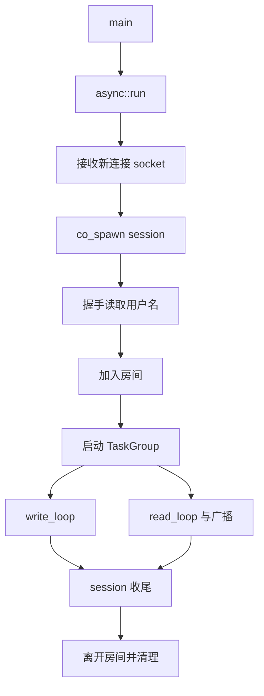
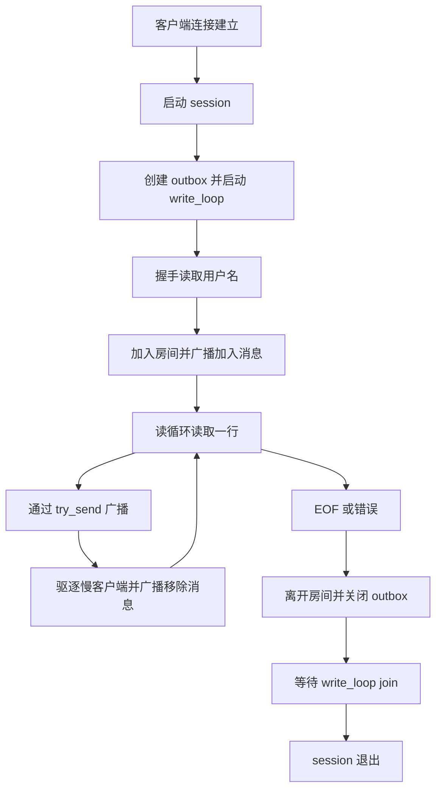
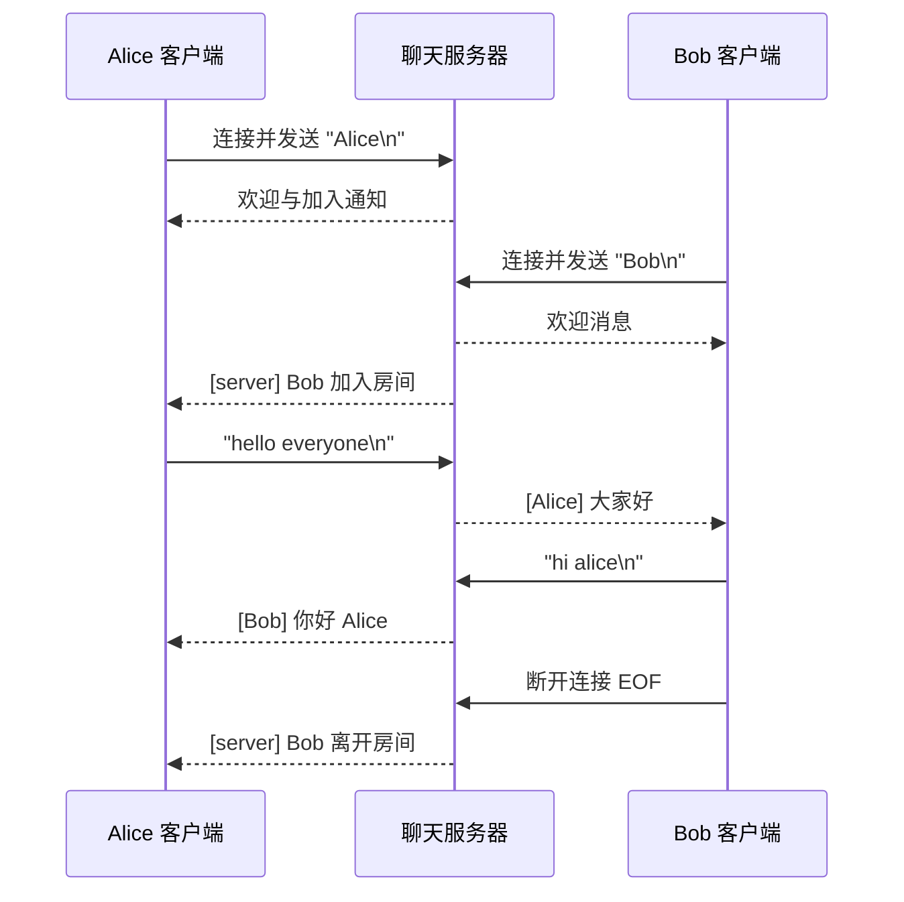
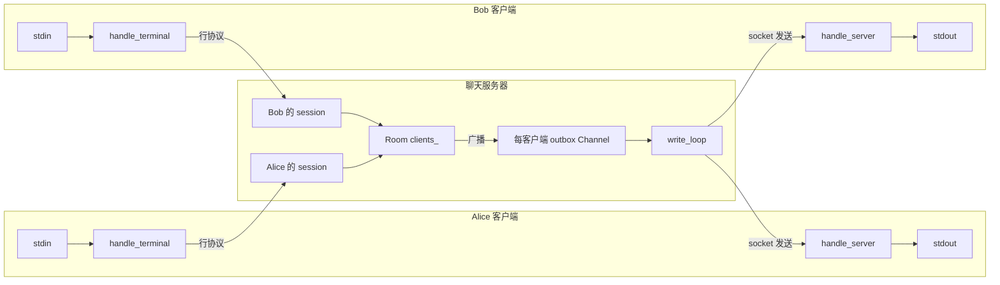

# 聊天室实现：并发会话、广播与慢客户端隔离

## 0. 问题定义与目标

这篇延续前面 01-13 的实现主线，聚焦一个完整多用户聊天室的落地过程：

- 服务端如何组织并发 session
- 为什么读写必须解耦
- 如何用 `TaskGroup` 保证生命周期收敛
- 如何用 `Channel` 做协程间通信，并用 `try_send` 做非阻塞广播与慢客户端驱逐
- 客户端如何处理终端输入与网络收包的并发退出

它不是 API 手册，而是实现复盘：重点是“为什么这样设计”，以及“替代方案会踩到哪些坑”。

完整代码在：
- 服务端：[examples/chat/server.cpp](../../examples/chat/server.cpp)
- 客户端：[examples/chat/client.cpp](../../examples/chat/client.cpp)

---

## 1. 设计约束与术语

本文重点回答：

| 关键概念 | 本文说明 |
|--------|--------|
| **协议设计** | 为什么选择行协议、如何处理流式数据分帧、TCP 流的特性 |
| **Server 架构** | 多 session 并发管理、消息广播、资源生命周期 |
| **Client 架构** | 键盘与网络的并发等待、双向通信、优雅退出 |
| **TaskGroup 模式** | 如何用它管理协程树的生命周期，确保子任务先于父任务结束 |
| **Channel 模式** | 如何用它解耦读写，并通过非阻塞入队 + 驱逐策略处理慢客户端 |
| **常见陷阱** | 为什么分离读写、单线程无锁的前提是什么、如何处理 EOF |

### 1.1 术语约定

- `backpressure`：队列容量有限导致发送方不能无限制生产。
- `非阻塞入队`：`outbox.try_send(msg)`，不等待，立即返回成功/失败。
- `慢客户端隔离`：队列满或不可写即视为慢客户端，当前轮统一驱逐，避免拖慢整体广播路径。

---

## 2. 协议层设计

### 2.1 协议规范

这个 chat room 使用**极简行协议**：

```
[Username]          ← 第一行：用户名（握手）
[Message 1]         ← 第二行及以后：聊天消息
[Message 2]         ← 每条消息必须以 \n 结尾
...
[EOF]               ← 连接关闭
```

**协议细节：**

```cpp
// 从 socket 接收时的处理
// 1. 等待用户名（第一行，以 \n 结尾）
//    输入：Alice\n
//    结果：username = "Alice"

// 2. 等待消息（后续每一行）
//    输入：hello\n
//    结果：msg = "hello"，广播给所有其他客户端

// 3. 连接关闭
//    输入：EOF（或客户端主动关闭）
//    结果：从 Room 移除，通知其他客户端
```

**约束与处理：**

- 用户名不能包含换行符（简化实现，无转义）
- 消息可以为空（会被忽略）
- 每条消息必须以 `\n` 结尾
- 服务端按行处理，不理解消息语义

### 2.2 方案取舍

**对比其他协议：**

| 方式 | 优点 | 缺点 | 适用 |
|-----|------|------|-----|
| **行协议**（本例）| 易调试，可用 `nc` 测试，自文档化 | 不支持二进制，转义复杂 | 原型验证、文本协议 |
| **固定长度帧** | 高效，分帧简单 | 浪费空间，难扩展 | 游戏、视频流 |
| **TLV 格式** | 灵活，高效 | 实现复杂，难调试 | 生产级 IM、RPC |

**工程实践价值：**

```bash
# 1. 可以直接用 nc 做协议验证，不需要额外写 client
$ nc localhost 9090
Alice          # 输入用户名
hello world    # 输入消息

# 2. 可以复现实流处理细节
# - 如果输入 "Ali" 然后暂停 2 秒再输入 "ce\n"
#   服务端会收到两个 partial read（TCP 流的特性）
# - 需要用缓冲和 \n 检测来做分帧

# 3. 可以验证 EOF 路径
# Ctrl+C 关闭，服务端能检测到连接断开
```

---

## 3. 服务端实现

### 3.1 生命周期主线



### 3.2 Room：共享状态容器

`Room` 是服务端的核心共享状态，负责在线用户管理、消息广播与慢客户端驱逐。

```cpp
struct Room {
    struct EvictedClient {
        uint64_t id;
        std::string name;
    };

    struct Client {
        std::string name;
        async::Channel<std::string>* outbox;
    };

    uint64_t next_id_{ 1 };
    std::unordered_map<uint64_t, Client> clients_;

    auto join(std::string name, async::Channel<std::string>& outbox) -> uint64_t {
        uint64_t id = next_id_++;
        clients_[id] = { std::move(name), &outbox };
        return id;
    }

    auto remove(uint64_t id) -> std::optional<EvictedClient> {
        auto it = clients_.find(id);
        if (it == clients_.end())
            return std::nullopt;

        auto evicted = EvictedClient{ .id = id, .name = it->second.name };
        if (it->second.outbox)
            it->second.outbox->close();
        clients_.erase(it);
        return evicted;
    }

    auto leave(uint64_t id) -> std::optional<EvictedClient> { return remove(id); }

    auto broadcast(uint64_t from_id, const std::string& msg)
        -> std::vector<EvictedClient> {
        std::vector<uint64_t> slow_clients;

        for (auto& [id, client] : clients_) {
            if (id == from_id)
                continue;
            if (!client.outbox->try_send(msg))
                slow_clients.push_back(id);
        }

        return evict_clients(slow_clients);
    }

    auto announce(const std::string& msg) -> std::vector<EvictedClient> {
        std::vector<uint64_t> slow_clients;

        for (auto& [id, client] : clients_) {
            if (!client.outbox->try_send(msg))
                slow_clients.push_back(id);
        }

        return evict_clients(slow_clients);
    }

private:
    auto evict_clients(const std::vector<uint64_t>& ids)
        -> std::vector<EvictedClient> {
        std::vector<EvictedClient> evicted;
        for (auto id : ids) {
            if (auto removed = remove(id))
                evicted.push_back(std::move(*removed));
        }
        return evicted;
    }
};
```

### 3.2.1 广播与驱逐流程图

```mermaid
flowchart TD
    A[收到新消息] --> B[遍历 clients_]
    B --> C{是否发送者本人}
    C -- 是 --> B
    C -- 否 --> D{outbox.try_send(msg)}
    D -- 成功 --> B
    D -- 失败 --> E[记录慢客户端 id]
    E --> B
    B --> F[evict_clients(slow_ids)]
    F --> G[关闭 outbox 并移除客户端]
    G --> H[产出 EvictedClient 事件]
```

**设计要点：**

- `clients_` 存储所有在线客户端
- 每个客户端有一个 `outbox` Channel，解耦读写
- 所有操作都在单个 IOContext 线程内，无需加锁
- `broadcast()` 和 `announce()` 使用两阶段策略：
    第 1 阶段：非阻塞 `try_send`，记录入队失败客户端
    第 2 阶段：统一执行驱逐并返回 `EvictedClient` 事件
- 这样可以避免遍历容器时直接删元素，也便于统一通知“哪些客户端被移除”

### 3.3 写路径协程

每个 session 都会创建一个 `write_loop` 协程，**专门负责把消息发送到这个客户端**：

```cpp
auto write_loop(net::ip::tcp::socket& sock,
                async::Channel<std::string>& outbox) -> async::Task<>
{
    while (auto msg = co_await outbox.receive()) {
        // msg 是从 outbox.receive() 获得的 std::optional<std::string>
        // 当 channel 关闭且为空时，receive() 返回 std::nullopt
        
        auto result = co_await net::send(sock, async::buffer(*msg));
        if (!result) {
            // 发送失败（socket 错误、网络断开等）
            co_return;
        }
    }
    // channel 被关闭，退出
}
```

**为什么分离写协程：**

1. **非阻塞读**：主协程在读取客户端输入时，不会被单个慢客户端长期拖住
   ```
   场景：Client A 发来消息，需要转发给 B 和 C
     如果读写不分离：
         写给 B 卡住 → 整个 session 被拖慢 → 无法及时读 A 的后续消息
   如果分离：
     消息入队到 B 的 outbox → write_loop 负责发送
     主协程继续读 A 的消息 → 响应性更好
   ```

2. **清晰的控制流**：
   - 主协程：握手 → 读 → 广播
   - 写协程：等待消息 → 发送
   - 职责单一，易于推理

### 3.4 会话主协程

`session` 是每个客户端连接对应的**主协程**，负责整个生命周期：

```cpp
auto session(net::ip::tcp::socket sock,
             net::ip::tcp::endpoint peer,
             Room& room) -> async::Task<>
{
    log::info("[server] connected: {}", peer);

    // 1. 创建出站消息队列
    async::Channel<std::string> outbox{ 64 };  // 缓冲最多 64 条消息

    // 2. 创建 TaskGroup，用它管理 writer 的生命周期
    async::TaskGroup group;
    group.spawn(write_loop(sock, outbox));

    // 3. 创建接收流（流式读取 socket）
    auto stream = sock.receive_stream();
    std::string pending;    // 缓冲未完成的数据
    std::string line;       // 当前读到的完整行

    // 4. 握手：读用户名
    std::string username;
    while (username.empty()) {
        auto chunk = co_await stream.next();
        if (!chunk || chunk->data().empty()) {
            // EOF：客户端在发用户名前就断开了
            log::info("[server] {} disconnected before sending username", peer);
            outbox.close();           // 关闭出站队列
            co_await group.join();    // 等待 writer 协程退出
            co_return;
        }
        pending += as_string(chunk->data());
        
        // 尝试从 pending 中提取一行
        if (extract_line(pending, line) && !line.empty())
            username = line;
    }

    // 5. 欢迎消息
    co_await outbox.send(std::format("[server] Welcome, {}! ({} users online)\n",
                                     username, room.clients_.size() + 1));

    // 6. 加入房间
    uint64_t id = room.join(username, outbox);
    auto join_evicted = room.announce(std::format("[server] {} joined the room.\n", username));
    announce_evictions(room, std::move(join_evicted));
    log::info("[server] {} ({}) joined the room", username, peer);

    // 7. 主循环：读取消息并广播
    while (true) {
        auto chunk = co_await stream.next();
        if (!chunk) {
            // 出错了
            if (chunk.error() != std::errc::operation_canceled)
                log::error("[server] recv error from {}: {}", peer, chunk.error());
            break;
        }
        if (chunk->empty()) break;  // EOF：连接关闭

        pending += as_string(chunk->data());
        
        // 提取所有完整的行并广播
        while (extract_line(pending, line)) {
            if (!line.empty()) {
                // 广播给其他客户端
                auto msg = std::format("[{}] {}\n", username, line);
                log::info("{}", msg);
                auto evicted = room.broadcast(id, msg);
                announce_evictions(room, std::move(evicted));
            }
        }
    }

    // 8. 清理：离开房间
    auto left = room.leave(id);
    outbox.close();  // 先关闭出站队列，通知 writer 退出
    if (left) username = left->name;

    auto leave_evicted = room.announce(std::format("[server] {} left the room.\n", username));
    announce_evictions(room, std::move(leave_evicted));
    log::info("[server] {} ({}) disconnected", username, peer);

    // 9. 等待 writer 协程完成
    co_await group.join();
}
```

`announce_evictions` 的职责是把驱逐事件转成系统消息广播（也用 try_send 发）：

```cpp
auto announce_evictions(Room& room,
                        std::vector<Room::EvictedClient> evicted) -> void
{
    while (!evicted.empty()) {
        std::vector<Room::EvictedClient> next_evicted;
        for (const auto& client : evicted) {
            auto msg = std::format(
                "[server] {} was removed (slow consumer timeout).\n", client.name);
            auto chained = room.announce(msg);
            next_evicted.insert(next_evicted.end(), chained.begin(), chained.end());
        }
        evicted = std::move(next_evicted);
    }
}
```

**关键细节解析：**

**a) TaskGroup 的作用**

```cpp
async::TaskGroup group;
group.spawn(write_loop(sock, outbox));
// ...
co_await group.join();
```

这样做保证：
- `write_loop` 在 `session` 结束前会正确退出
- 不会出现"socket 已关闭但 writer 还在尝试发送"的情况
- 资源泄漏和悬挂协程的风险被消除

**b) 缓冲与分帧**

```cpp
std::string pending;  // 缓冲不完整的数据

while (true) {
    auto chunk = co_await stream.next();
    pending += as_string(chunk->data());           // 追加新数据
    
    while (extract_line(pending, line)) {          // 逐行提取
        // 处理一行消息
    }
}
```

为什么需要这个逻辑？

**TCP 流的特性**：recv() 可能在消息中间返回

```
例：客户端发送 "Alice\nhello\nworld\n"
但 socket 可能这样分割返回：

第 1 次读取：收到 "Ali"
第 2 次读取：收到 "ce\nhel"
第 3 次读取：收到 "lo\nworld\n"

pending 缓冲器的作用：
第 1 次：pending = "Ali"，extract_line 返回 false
第 2 次：pending = "Alice\nhel"，extract_line 返回 true("Alice")，pending = "hel"
第 3 次：pending = "hello\nworld\n"，extract_line 两次
```

**c) Channel 的 backpressure 与慢客户端策略**

```cpp
std::vector<uint64_t> slow_clients;

for (auto& [id, client] : clients_) {
    if (!client.outbox->try_send(msg))
        slow_clients.push_back(id);
}

auto evicted = evict_clients(slow_clients);
```

当前实现不是“无限等待”，而是“非阻塞入队 + 慢客户端隔离”：

- `try_send` 成功：消息立即进入目标 outbox
- `try_send` 失败：当前轮加入驱逐列表并统一移除
- 驱逐事件会转成系统消息，通知其他用户

这套策略保证了：
- 慢客户端不会长期拖垮整个广播路径
- 系统整体延迟和吞吐更可控
- 通知语义完整：其他用户能看到“哪些客户端被移除”

### 3.5 收敛流程



---

## 4. 客户端实现

### 4.1 客户端主线

```
main()
  ↓
async::run([&]() {
  client("127.0.0.1", 9090)
})

client() 流程：
  ↓
1. 连接服务器
  ↓
2. 握手：读用户名、发送给服务器
  ↓
3. 启动两个并发任务（用 async::any）：
   ├─ handle_terminal: 从 stdin 读，发给 server
   └─ handle_server: 从 socket 读，打印到 stdout
  ↓
4. 等待任意一个任务退出
  ↓
5. 取消另一个任务，关闭连接
```

### 4.2 握手阶段

```cpp
auto client(std::string_view host, std::uint16_t port) -> async::Task<>
{
    try {
        async::this_coroutine::setup_buffer_ring(128);
        auto endpoint = net::ip::tcp::endpoint{
            net::ip::Address::from_string(host), port
        };
        net::ip::tcp::socket socket{ endpoint.protocol() };
        socket.connect(endpoint);

        co_await async::any(
            async::task(handle_terminal, std::ref(socket)),
            async::task(handle_server, std::ref(socket))
        );
    } catch (const std::exception& ex) {
        log::error("[client] 连接失败: {}", ex.what());
    }

    async::stop();
}
```

**关键点：**

- `std::ref(socket)` 用来在协程参数中传递引用（socket 不可复制）
- `async::any` 启动两个任务，任意一个结束都会取消另一个
- 握手在 `handle_terminal` 中完成

### 4.3 读 stdin 并发送

```cpp
auto handle_terminal(net::ip::tcp::socket& socket, 
                     std::stop_token token) -> async::Task<>
{
    auto input = fs::async_stdin();
    std::array<char, 1024> buffer;

    log::info("[client] 连接成功！请输入用户名：");

    // 1. 握手：读用户名
    auto read_res = co_await input.async_read(async::buffer(buffer));
    if (!read_res || *read_res == 0) {
        log::error("[client] 读取用户名失败或输入为空。");
        co_return;
    }

    std::string_view name(buffer.data(), *read_res);

    // 2. 发送用户名给服务器
    auto send_res = co_await async::stop_then(
        net::send(socket, async::buffer(name)),
        token
    );
    if (!send_res) {
        log::error("[client] 发送用户名失败: {}", send_res.error());
        co_return;
    }

    // 3. 主循环：读 stdin，发给 server
    while (true) {
        auto read_res = co_await async::stop_then(
            input.async_read(async::buffer(buffer)), 
            token
        );
        if (!read_res || *read_res == 0) 
            break;  // EOF 或错误

        auto line = std::string_view(buffer.data(), *read_res);
        
        // 忽略空行
        if (line == "\n") continue;

        // 发送给服务器
        auto send_res = co_await async::stop_then(
            net::send(socket, async::buffer(line)), 
            token
        );
        if (!send_res) {
            log::error("[input] 发送消息失败: {}", send_res.error());
            co_return;
        }
    }
}
```

**细节：**

- 首次用户名读取使用普通 `async_read`；其余 I/O 用 `async::stop_then()` 包装，支持取消
- 当终端输入结束时，`stdin read()` 返回 EOF（字节数为 0）
- 空行被忽略（只发送有内容的消息）

### 4.4 读 socket 并打印

```cpp
auto handle_server(net::ip::tcp::socket& socket, 
                   std::stop_token token) -> async::Task<>
{
    auto stream = socket.receive_stream();
    auto output = fs::async_stdout();

    while (true) {
        auto chunk = co_await async::stop_then(stream.next(), token);
        
        if (!chunk || chunk->empty()) {
            log::info("[server] connection closed.");
            co_return;
        }

        // 直接打印
        co_await async::stop_then(
            output.async_write(chunk->data()), 
            token
        );
    }
}
```

**工作原理：**

```
从服务器接收的数据流：
  ↓
receive_stream.next()  返回 PooledBuffer
  ↓
output.async_write()   写到 stdout
  ↓
用户看到消息
```

### 4.5 并发与取消

```cpp
co_await async::any(
    async::task(handle_terminal, std::ref(socket)),
    async::task(handle_server, std::ref(socket))
);
```

**执行模式：**

- 两个任务**并行运行**（在同一个 IOContext 线程里交替执行）
- 任意一个任务结束（正常退出或错误），`async::any` 返回
- 返回时，**另一个任务被自动取消**
- 已通过 `async::stop_then(...)` 包装的等待点会尽快返回，让任务快速收敛

**例如：**

```
时刻 0：两个任务都在等待 I/O
  handle_terminal 等待 stdin
  handle_server 等待 socket

时刻 1：服务器断开连接
  handle_server 检测到 EOF
  handle_server 正常退出
  
时刻 2：async::any 返回
  handle_terminal 被取消
    如果此时正阻塞在 `async::stop_then(...)` 包装的 I/O 上，会立即返回
  handle_terminal 也快速退出

结果：连接干净收敛，两个协程都已完成清理
```

---

## 5. 端到端消息流

### 5.1 两客户端聊天场景



### 5.2 数据流图



---

## 6. 关键设计取舍

### 6.1 为什么分离读写协程

**对比：没有分离 vs. 分离**

```cpp
// 不分离（对照实现）
auto session_no_separation(socket) {
    while (true) {
        // 读取消息
        auto chunk = co_await stream.next();
        // 广播给所有客户端
        auto evicted = room.broadcast(chunk);  // 可能被慢客户端长期拖慢
        // 如果某个客户端很慢，整个 read loop 会变慢
        // → 无法读取其他客户端的消息
    }
}

// 分离（实际采用）
auto session_separated(socket) {
    async::TaskGroup group;
    group.spawn(write_loop(socket, outbox));  // 写协程独立运行
    
    while (true) {
        auto chunk = co_await stream.next();
        // 只是入队，不实际发送（异步）
        auto evicted = room.broadcast(chunk);  // 非阻塞入队失败即触发慢客户端隔离
        // read loop 不会被单个慢客户端长期拖住
    }
}
```

**性能对比：**

```
场景：Alice、Bob、Charlie 三人，Bob 网络很慢（延迟 1 秒）

不分离：
  时刻 0: Alice 发消息
  时刻 0-1: 写给 Bob（卡住 1 秒）
  时刻 1+: Charlie 的消息无法被及时读取
  时刻 2+: 用户感觉"消息延迟了"

分离：
  时刻 0: Alice 发消息，立即入队
  时刻 0: read loop 继续，立即收到 Charlie 的消息
  时刻 0+: write_loop 在后台缓慢发送给 Bob
  时刻 2: Bob 最终收到消息（但不影响其他人）
  用户感觉"响应迅速"
```

### 6.2 为什么用 Channel

**Channel 的作用：**

1. **解耦**：producer (read_loop) 和 consumer (write_loop) 独立
2. **Backpressure + 非阻塞入队**：容量约束配合 `try_send`，避免慢客户端长期拖慢广播
3. **清晰的 API**：`co_await channel.send()`、`co_await channel.receive()`

**如果不用 Channel：**

```cpp
// 对照实现：直接操作 socket
std::queue<std::string> messages;
bool shutdown_requested = false;

// write_loop 中
while (!shutdown_requested) {
    if (messages.empty()) {
        co_await sleep(100ms);  // 轮询？很低效
        continue;
    }
    auto msg = messages.front();
    messages.pop();
    co_await net::send(socket, msg);
}

// read_loop 中
while (true) {
    auto chunk = co_await stream.next();
    messages.push(chunk);  // 直接压入
    // 问题：如果 messages 无限增长怎么办？没有 backpressure / 慢客户端隔离！
}
```

**用 Channel 的好处：**

```cpp
// 实际采用
auto write_loop(socket, outbox) {
    while (auto msg = co_await outbox.receive()) {
        co_await net::send(socket, *msg);
    }
}

auto read_loop(stream, room) {
    while (auto chunk = co_await stream.next()) {
        auto evicted = room.broadcast(chunk);  // 非阻塞受控广播
    }
}
```

慢客户端保护如何工作：

```
outbox 容量为 64
room.broadcast() 对每个客户端执行 try_send(outbox, msg)

如果某客户端的 outbox 满了：
    立即可入队：继续
    立即不可入队：关闭该客户端 outbox
  
结果：慢客户端被快速隔离，不会长期拖慢整个广播链路
```

### 6.3 为什么用 TaskGroup

**TaskGroup 保证的不变量：**

```
不变量：子任务的析构必定在父任务之前
       (子任务必定先完成)
```

**如果不用 TaskGroup：**

```cpp
// 危险的写法
auto bad_session(socket) {
    async::Channel<std::string> outbox{64};
    
    // 直接 co_spawn，没有等待
    co_spawn(write_loop(socket, outbox), context);
    
    // 做其他事...

    // 然后 session 退出
    // 问题：write_loop 还在运行！
    // socket 被关闭，outbox 被销毁
    // write_loop 访问悬空对象 → crash
```

**如何避免：**
**实际采用：**
auto write_line(socket, line) {
auto good_session(socket) {
    async::Channel<std::string> outbox{64};
    async::TaskGroup group;

    group.spawn(write_loop(socket, outbox));

    // 做其他事...

    outbox.close();         // 通知 write_loop 退出
    co_await group.join();  // 等待 write_loop 完成

    // 到这里才能安全销毁 outbox、socket
```


**TaskGroup 内部原理（简化）：**

```cpp
class TaskGroup {
    // pending_ 初始为 1（sentinel）

    void spawn(awaitable) {
        pending_.fetch_add(1);  // 子任务 +1
        // ...
    }

    auto join() -> async::Task<> {
        // 调用者释放 sentinel
        if (pending_.fetch_sub(1) == 1)
            co_return;

        // 等最后一个子任务触发 drained
        co_await StopRequestedAwaiter(drained_.get_token());
    }
};
```

---

## 7. 风险点与防护

### 7.1 陷阱 1：忘记发送换行符

```cpp
// 行协议要求每条消息以 \n 结束
client.send("hello");      // 错误：没有换行
client.send("hello\n");    // 正确

// 服务端 extract_line 只在遇到 \n 时才产出一条完整消息
```

如果客户端长期不发送换行，服务端不会进入业务处理分支，而是持续累积 pending 缓冲。

**防护建议：**

1. 客户端发送统一封装为 write_line
2. 对单行长度设置上限，避免异常输入导致缓冲无限增长
3. 对长时间无完整行的连接做超时断开
### 7.2 陷阱 2：混淆 Channel 的 send/receive

```cpp
// Channel 的两端
std::queue<T> 内部存储

send(msg)     ← producer 端：生产
receive()     ← consumer 端：消费

// 如果反过来用：
co_await channel.receive();  // 写端调用 receive？
// 会被死锁或得到错误的值
```

### 7.3 陷阱 3：在多线程环境下使用

```cpp
// 错误：多线程 + Room
async::IOContext ctx1, ctx2;

async::run_on_thread(ctx1, [&]() {
    // 线程 1，ctx1 内运行
    room.join(...);  // 在 ctx1 修改 room
});

async::run_on_thread(ctx2, [&]() {
    // 线程 2，ctx2 内运行
    room.broadcast(...);  // 在 ctx2 修改 room
    // DATA RACE！room.clients_ 被并发访问
});

// 正确做法：单线程 + 共享 IOContext
async::IOContext ctx;
async::run(ctx, [&]() {
    // 所有 session、room 操作都在同一线程
    // 无需加锁
});
```

### 7.4 陷阱 4：空消息处理

```cpp
// 错误：发送空消息
client.send("\n");  // 只有换行符

// 后果
服务端 extract_line 得到空字符串
if (!line.empty()) 条件失败
消息被忽略（可能是预期的）

// 或者如果应该处理空消息
// 需要修改协议或代码
```

---

## 8. 验证与运行

### 8.1 编译

```bash
cd /home/doom/blog
mkdir -p build && cd build
cmake ..
cmake --build . --target chat.server chat.client
```

### 8.2 运行服务端

```bash
./build/examples/chat/chat.server 9090
# 输出：[server] listening on 0.0.0.0:9090
```

### 8.3 测试场景 1：两个 client

**终端 1：启动 server**
```bash
./build/examples/chat/chat.server 9090
```

**终端 2：启动 client（Alice）**
```bash
./build/examples/chat/chat.client 127.0.0.1 9090
# 输出：连接成功！请输入用户名：
# 输入：Alice
# 按 Enter
```

**终端 3：启动 client（Bob）**
```bash
./build/examples/chat/chat.client 127.0.0.1 9090
# 输出：连接成功！请输入用户名：
# 输入：Bob
# 按 Enter
```

**测试：**
- Alice 输入 `hello bob`，Bob 应该收到
- Bob 输入 `hi alice`，Alice 应该收到

### 8.4 测试场景 2：用 nc 手工测试

```bash
# 终端 1：启动 server
./build/examples/chat/chat.server 9090

# 终端 2：用 nc 连接
nc 127.0.0.1 9090
# 输入用户名
Alice
# 输入消息
hello world
# Ctrl+C 退出

# 观察 server 的日志输出
# [server] connected: 127.0.0.1:xxxxx
# [server] Alice joined the room
# [server] Alice disconnected
```

---

## 9. 演进方向

### 9.1 添加用户列表

```cpp
// 新增命令：/list 查看在线用户
if (message == "/list") {
    std::string users = "[server] Online users: ";
    for (auto& [id, client] : room.clients_) {
        users += client.name + ", ";
    }
    co_await outbox.send(users + "\n");
}
```

### 9.2 私聊功能

```cpp
// 私聊：@username message
if (message.starts_with("@")) {
    auto at = message.find(' ');
    std::string target = message.substr(1, at - 1);
    std::string private_msg = message.substr(at + 1);
    
    for (auto& [id, client] : room.clients_) {
        if (client.name == target) {
            co_await client.outbox->send("[private from " + sender_name + "]: " + private_msg);
            break;
        }
    }
}
```

### 9.3 多线程服务端

如果想支持多线程：
- 为 `Room` 的 `clients_` 加锁
- 为 `broadcast()` 加锁
- 考虑使用 lock-free 数据结构

---

## 10. 小结

这个聊天室示例展示了协程网络编程的核心模式：

| 模式 | 用途 |
|------|------|
| **TaskGroup** | 管理协程树的生命周期，保证资源安全释放 |
| **Channel** | 协程间通信，提供 backpressure（容量约束）+ 非阻塞入队 + 慢客户端隔离 |
| **receive_stream** | 流式读取 socket，自动处理分帧 |
| **async::any** | 多路并发等待，快速失败 |
| **stop_then** | 协程取消，优雅关闭 |

设计的关键洞察：

1. **分离关注点**：读写分离、握手与业务分离
2. **自动流控**：用 Channel 代替裸队列
3. **资源安全**：用 TaskGroup 代替手工 join
4. **单线程无锁**：充分利用 IOContext 的单线程特性

掌握这些模式，你就可以构建更复杂的网络应用。
