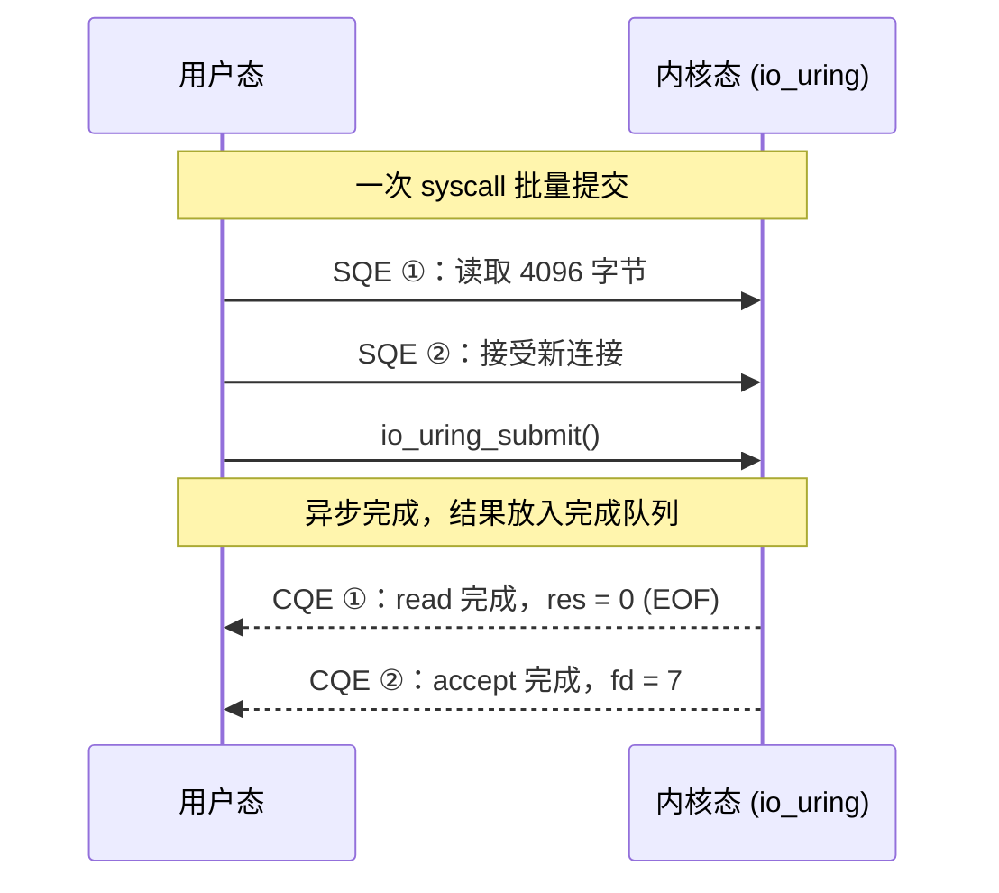
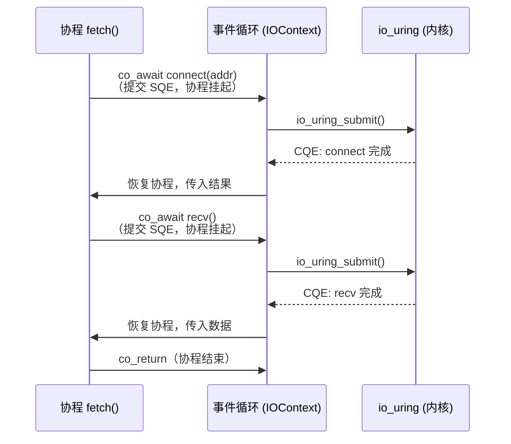

# 0.1 机制概览

> **前置阅读**：无
> **下一节**：[0.2 环境搭建](00_setup.md)

---

## 问题：高并发下的三条路

写一个能同时处理数万连接的服务器，通常有三种方案：

| 方案 | 典型实现 | 核心问题 |
|------|---------|---------|
| 线程 per 连接 | `pthread`、`std::thread` | 每连接一个线程栈（默认 8 MB），万级连接意味着 80 GB 内存；线程切换由内核调度，开销与连接数线性增长 |
| 回调 / reactor | `epoll` + 手写状态机 | `epoll_wait` 告诉你"fd 可读"，你再调用 `read`——两次系统调用；业务逻辑被切碎成回调，控制流分散，错误处理难以集中 |
| 协程 + io_uring | 本库 | 代码是直线的，执行是异步的；内核批量收割 I/O 完成事件，大幅减少系统调用次数 |

本库选择了第三条路，下面解释它的两个支柱是如何协作的。

---

## io_uring：提交意图，批量收割

传统的 `read` / `write` 是**命令式**的：你调用，内核执行，你等待结果。
io_uring 改用**队列化意图**：



SQE（Submission Queue Entry）描述"我想做什么"，CQE（Completion Queue Entry）告诉你"做完了，结果是什么"。两个队列都在用户态与内核态共享的内存里，**提交一批操作只需一次系统调用，在高吞吐场景下可以完全省去这一次**（SQPOLL 模式）。

---

## C++23 协程：直线代码，异步执行

协程是一种可以**暂停自身**然后被**恢复**的函数。编译器把协程函数编译成一个状态机：

```
auto fetch() -> async::Task<std::string>
{
    co_await connect(addr);   // 暂停点 ①
    co_await send(request);   // 暂停点 ②
    auto data = co_await recv(); // 暂停点 ③
    co_return data;
}
```

每次 `co_await` 是一个**暂停点**。协程在此处保存当前状态（局部变量、执行位置），把控制权交还给事件循环；当对应的 CQE 到达时，事件循环把协程从暂停点恢复。

从调用者的角度看，代码是直线的；从 CPU 的角度看，线程从未阻塞——它在事件循环里处理其他就绪的任务。

---

## 两者如何结合



事件循环（`IOContext`）是粘合剂：它管理 io_uring 实例，把 `co_await` 表达式翻译成 SQE 提交，把 CQE 的到来翻译成协程恢复。你写的代码只需要 `co_await`，底层的 SQE/CQE 对你完全透明。

---

## 本章小结

- io_uring 用队列化意图替代逐次系统调用，减少内核往返次数
- C++23 协程把异步代码写成直线形式，编译器生成状态机
- `IOContext` 将两者衔接：`co_await` → SQE，CQE → 协程恢复

> **下一节**：[0.2 环境搭建](00_setup.md) — 安装依赖、构建项目、运行第一个程序。
