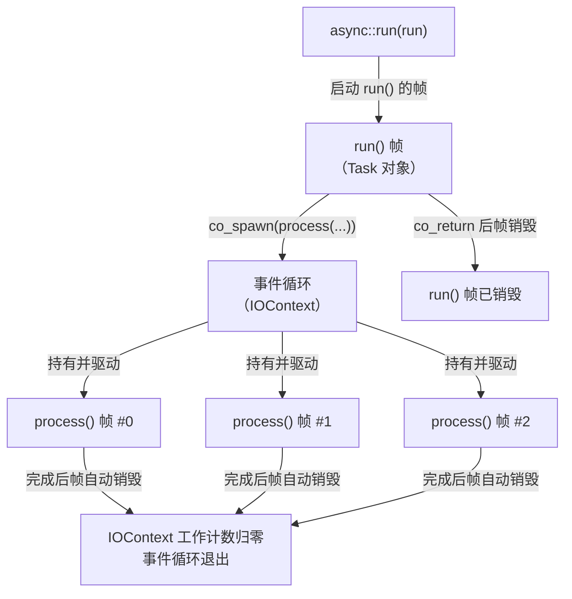

# 1.4 并发调度与生命周期

> **前置知识**：本章假设你已读完 1.1–1.3 节，理解 `Task<>`、`co_await` 与 `std::expected`。

---

## 从线性到并发

前三节的写法都是线性的——下一步总是等上一步完成再执行。但真实系统往往需要同时处理多件事：同时接收多个连接、同时等待多个响应。

`async::co_spawn` 正是为此而设计的：它把一个 `Task<>` 提交给事件循环独立运行，调用方立即继续，无需等待。

---

## 谁持有协程帧？

在理解用法之前，先弄清楚内存的归属关系。



关键结论：

- `co_spawn` 之后，`process()` 的帧由事件循环（`IOContext`）拥有，**与 `run()` 的帧无关**。
- `run()` 返回（帧销毁）之后，三个 `process()` 帧仍然存活，事件循环会继续驱动它们。
- 每次 `co_spawn` 都向 `IOContext` 的工作计数加一；任务完成时减一。当计数归零，`async::run` 才真正退出。

---

## 示例

```cpp
#include <blog.h>

namespace {

using namespace std::chrono_literals;

auto process(std::string message, int id) -> async::Task<>
{
    co_await async::sleep_for(100ms);
    log::info("task {}: {}", id, message);
}

auto run() -> async::Task<>
{
    for (int i = 0; i < 3; ++i) {
        std::string msg = std::format("message-{}", i);
        async::co_spawn(process(std::move(msg), i));
    }
    log::info("all tasks spawned, run() returning");
    co_return;
}

} // namespace

int main()
{
    async::run(run);
}
```

运行输出：

```
[2026-05-07 00:58:59.578] [212085] [info] all tasks spawned, run() returning
[2026-05-07 00:58:59.678] [212085] [info] task 2: message-2
[2026-05-07 00:58:59.678] [212085] [info] task 1: message-1
[2026-05-07 00:58:59.678] [212085] [info] task 0: message-0
```

（时间戳与 PID 因运行环境而异；后三行顺序不定，但总在 `run() returning` 之后约 100ms 同时出现）

---

## 逐行解析

### `async::co_spawn(process(std::move(msg), i))`

`process(std::move(msg), i)` 构造了一个 `Task<>` 对象，此时协程体**还没有开始执行**（Task 是懒求值的，与 1.1 节一样）。`co_spawn` 接收这个 Task，把它提交给当前线程的 `IOContext`，并立即返回。

### `std::move(msg)` 是必须的

`msg` 是 `run()` 帧里的局部变量。`run()` 会在派生任务完成之前就销毁。如果用引用捕获：

```cpp
// 错误示范（不要这样写）
async::co_spawn(process(msg, i));   // msg 是引用——run() 销毁后悬空
```

通过 `std::move` 将所有权转移进 `process()` 的参数，任务帧就拥有了数据的独立副本，与 `run()` 的生命周期完全解耦。

### 为什么顺序不定？

三个任务同时挂起在 `sleep_for(100ms)` 上，定时器触发时事件循环按内部调度顺序依次恢复它们，这个顺序是实现细节，不应依赖。

### 为什么 `run()` 结束后程序没有立即退出？

这里的行为与 `std::thread::detach()` **不同**。

用线程写同样逻辑时，`main()` 一返回进程就终止，被 detach 的线程会被强杀，数据可能没有落盘、连接可能没有关闭。`co_spawn` 刻意回避了这个陷阱：

- `co_spawn` 调用时 `IOContext` 工作计数 +1，任务帧析构时 -1。
- `async::run` 在计数归零之前不会返回。

因此"fire-and-forget"的含义是"调用方不等"，而非"运行时不等"——事件循环始终能保证所有已派生的任务跑完之后才退出。

---

## 生命周期规则小结

| 规则 | 说明 |
|------|------|
| 数据用 `std::move` 转入任务 | 防止悬空引用 |
| 不要捕获调用方的局部变量引用 | 调用方可能在任务完成前就已销毁 |
| `co_spawn` 后无法取回结果 | fire-and-forget；如需结果，使用 `co_await`（第 4 部分介绍） |
| 事件循环在所有任务完成后才退出 | `IOContext` 工作计数保证无任务泄漏 |

---

## 本章小结

`co_spawn` 将一个 Task 的帧所有权交给事件循环，实现 fire-and-forget 并发。关键安全边界只有一条：**数据用值语义（`std::move`）传入，而非引用**。

---

下一节：[2.1 TCP 客户端：连接、发送与接收](02_tcp_client.md)
