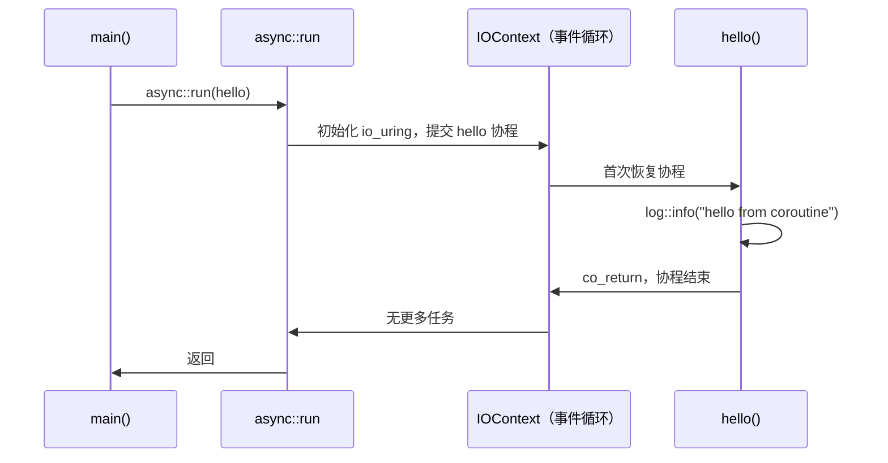

# 1.1 第一个协程

> **前置阅读**：[0.2 环境搭建](00_setup.md)
> **源文件**：[tutorial/01_hello/main.cpp](../../tutorial/01_hello/main.cpp)
> **下一节**：[1.2 挂起与恢复](01_sleep.md)

---

先把程序跑起来：

```bash
./build/tutorial/01_hello/tutorial.01_hello
```

```
[2026-05-06 21:54:36.802] [145320] [info] hello from coroutine
```

完整代码：

```cpp
#include <blog.h>

namespace {

auto hello() -> async::Task<>
{
    log::info("hello from coroutine");
    co_return;
}

} // namespace

int main()
{
    async::run(hello);
}
```

下面逐行解析。

---

## `async::Task<>`

```cpp
auto hello() -> async::Task<>
```

`async::Task<>` 是这个库统一的协程返回类型，等价于 `async::Task<void>`——不产生返回值。
只要函数的返回类型是 `Task<T>`，函数体里就可以使用 `co_await` 和 `co_return`，编译器会把它编译成一个状态机。

**`Task<>` 是惰性的**：调用 `hello()` 不会执行函数体，只会构造一个挂起的状态机对象，等待被驱动。

---

## `co_return`

```cpp
co_return;
```

协程的退出语句。`Task<void>` 中 `co_return` 不携带值，表示协程正常结束。
`co_return` 在协程里的地位等同于普通函数的 `return`，缺少它编译器会发出警告。

---

## `async::run`

```cpp
int main()
{
    async::run(hello);
}
```

`async::Task<>` 是惰性的，它本身不会自动执行。`async::run` 做三件事：

1. 在当前线程初始化一个 `IOContext`（持有 io_uring 实例的事件循环）
2. 把 `hello` 作为入口协程提交进去
3. 阻塞，驱动事件循环，直到所有任务完成后返回

`main` 调用 `async::run` 就是把当前线程**交给事件循环**，让它来驱动所有协程。

---

## 执行路径



---

## 本章小结

- `async::Task<>` 是协程的返回类型，函数体里才能用 `co_await` / `co_return`
- `Task<>` 是惰性的——调用函数只构造状态机，不执行函数体
- `async::run` 启动事件循环，驱动协程直到全部完成

> **下一节**：[1.2 挂起与恢复](01_sleep.md) — 让协程等待一段时间，观察事件循环如何在等待期间不阻塞线程。
