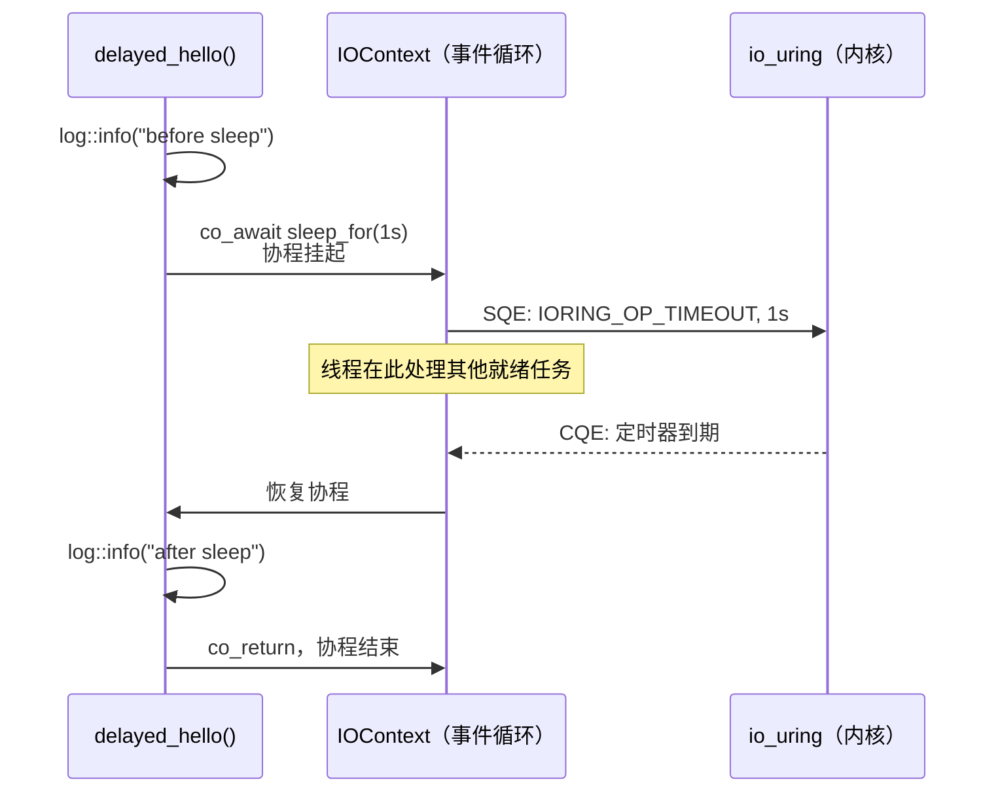

# 1.2 挂起与恢复

> **前置阅读**：[1.1 第一个协程](01_hello.md)
> **源文件**：[tutorial/02_sleep/main.cpp](../../tutorial/02_sleep/main.cpp)
> **下一节**：[1.3 值传递与错误模型](01_return_value.md)

---

## 为什么不用 `std::this_thread::sleep_for`

上一节的 `hello()` 协程什么都不等待，直接结束。现实中的异步任务通常需要等待某些事情发生——定时器到期、数据到达、连接建立。

如果在协程里写 `std::this_thread::sleep_for(1s)`，线程会真正阻塞 1 秒。在这 1 秒内，事件循环完全停转，任何其他协程都无法执行。本节介绍的 `async::sleep_for` 解决了这个问题：协程挂起，线程交还给事件循环，1 秒后由 io_uring 定时器唤醒。

---

## 代码

```cpp
#include <blog.h>

namespace {

using namespace std::chrono_literals;

auto delayed_hello() -> async::Task<>
{
    log::info("before sleep");
    co_await async::sleep_for(1s);
    log::info("after sleep");
}

} // namespace

int main()
{
    async::run(delayed_hello);
}
```

```bash
./build/tutorial/02_sleep/tutorial.02_sleep
```

```
[2026-05-06 21:57:42.930] [146096] [info] before sleep
[2026-05-06 21:57:43.930] [146096] [info] after sleep
```

两行时间戳相差 1 秒。

---

## `co_await async::sleep_for`

```cpp
co_await async::sleep_for(1s);
```

`async::sleep_for` 返回一个 awaitable 对象（`TimerAwaiter`）。`co_await` 作用于它时，发生三件事：

1. **挂起**：协程保存当前状态（局部变量、执行位置），暂停在这一行
2. **提交**：向 io_uring 提交一个 `IORING_OP_TIMEOUT` SQE，请求内核 1 秒后产生完成事件
3. **恢复**：1 秒后内核将 CQE 放入完成队列，事件循环读取它，把协程从暂停点恢复

线程在这 1 秒内**从未阻塞**——它在事件循环里等待下一个 CQE，可以随时处理其他就绪的协程。

---

## 挂起与恢复的完整路径



`co_await` 是协程与事件循环之间的**交接点**：协程在此处主动让出执行权，事件循环在条件满足时归还执行权。

---

## 本章小结

- `co_await async::sleep_for(d)` 挂起协程，不阻塞线程
- 挂起期间线程归还给事件循环，可处理其他任务
- `co_await` 是协程主动让出与被动唤醒的交接点

> **下一节**：[1.3 值传递与错误模型](01_return_value.md) — 协程如何返回值，以及为什么用 `std::expected` 而不是异常来表达失败。

