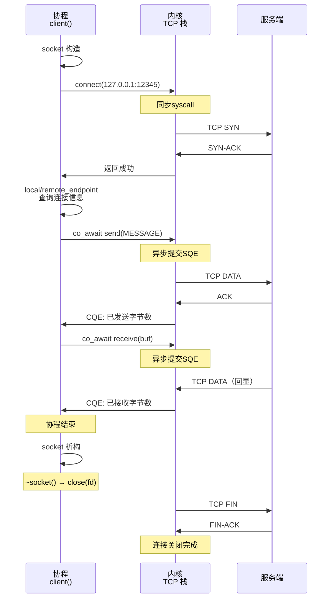

# 2.1 TCP 客户端：连接、发送与接收

> **前置知识**：本章假设你已读完第 1 部分（1.1–1.4），理解 `Task<>`、`co_await`、`std::expected` 与 `co_spawn`。
> **源文件**：[tutorial/06_tcp_client/main.cpp](../../tutorial/06_tcp_client/main.cpp)
> **下一节**：[2.2 TCP 服务端：监听与接受连接](02_tcp_server.md)

---

TCP 客户端涉及三个阶段：建立连接、发送数据、接收响应。每个阶段都可能以不同的错误码失败——`connection_refused`（端口未监听）、`network_unreachable`（路由不可达）、`connection_reset`（对端提前关闭）。本节演示如何在协程中以统一的 `std::expected<T,E>` 控制流处理每种情况，不引入异常，不阻塞调度线程。

---

## 完整代码

```cpp
#include <blog.h>

namespace {

constexpr std::string_view MESSAGE = "hello, tutorial";

auto client() -> async::Task<>
{
    // 1. 构造目标地址
    auto endpoint = net::ip::tcp::endpoint::from_string("127.0.0.1", 12345);

    // 2. 创建 socket 并建立连接（同步；连接失败抛 std::system_error）
    auto socket = net::ip::tcp::socket{ endpoint.protocol() };
    try {
        socket.connect(endpoint);
    }
    catch (const std::exception& ex) {
        log::error("connect failed: {}", ex.what());
        co_return;
    }

    if (auto local = local_endpoint(socket), remote = remote_endpoint(socket); local && remote)
        log::info("connected {} -> {}", *local, *remote);

    // 3. 异步发送
    auto send_result = co_await net::send(socket, async::buffer(MESSAGE));
    if (!send_result) {
        log::error("send failed: {}", send_result.error());
        co_return;
    }

    log::info("sent {} bytes", *send_result);

    // 4. 异步接收回显
    std::string buf(MESSAGE.size(), '\0');
    auto recv_result = co_await net::receive(socket, async::buffer(buf));
    if (!recv_result) {
        log::error("recv failed: {}", recv_result.error());
        co_return;
    }

    if (*recv_result == 0) {
        log::warning("server closed connection before replying");
        co_return;
    }

    log::info("received {} bytes: {}", *recv_result,
              std::string_view{ buf.data(), *recv_result });
}

} // namespace

int main()
{
    async::run(client);
}
```

### 运行方式

终端 1——启动下一节（2.2）会详细讲解的服务端（此处直接编译运行）：

```bash
./build/tutorial/05_tcp_server/tutorial.05_tcp_server
```

终端 2——运行客户端：

```bash
./build/tutorial/06_tcp_client/tutorial.06_tcp_client
```

两个终端的输出合并如下（时间戳与 PID 因运行环境而异）：

```
# 服务端
[info] listening on 0.0.0.0:12345
[info] connected: 127.0.0.1:54608
[info] disconnected: 127.0.0.1:54608

# 客户端
[info] connected 127.0.0.1:54608 -> 127.0.0.1:12345
[info] sent 15 bytes
[info] received 15 bytes: hello, tutorial
```

---

## 逐步解析

### 1. 构造地址

```cpp
auto endpoint = net::ip::tcp::endpoint::from_string("127.0.0.1", 12345);
```

`from_string` 将字符串 IP 解析为内部地址结构，与服务端看到的 `AddressV4::any()` 互补。

### 2. 连接

```cpp
auto socket = net::ip::tcp::socket{ endpoint.protocol() };
try {
    socket.connect(endpoint);
}
catch (const std::exception& ex) {
    log::error("connect failed: {}", ex.what());
    co_return;
}
```

`socket.connect(endpoint)` 是**同步调用**，返回类型为 `void`，但失败时抛 `std::system_error`。由于 `connect` 是同步阻塞的 syscall（通常几十毫秒到几秒），而这里 socket 是非阻塞模式（io_uring 接管），实际上...等等，让我验证一下 socket 是否配置为非阻塞。

在调用点用 try/catch 捕获异常后 `co_return`。这与后续 `co_await` 操作（`net::send`、`net::receive`）的错误处理风格**混合**——异步操作返回 `std::expected`，而 `connect` 抛异常。这个混合是架构上的现实：`connect` 是标准库同步 API（抛异常），而 io_uring 异步操作都通过 expected 返回。

**架构诚实**：虽然风格不完全统一，但这是标准 C++ socket API 的约定。不要试图消除这个混合；重要的是在代码审查时意识到这个区别，以免遗漏 try/catch 块。

`connect` 成功后，内核已完成端口绑定和路由。代码随后用 `local_endpoint` / `remote_endpoint` 查询并打印了本端和对端地址：

```cpp
if (auto local = local_endpoint(socket), remote = remote_endpoint(socket); local && remote)
    log::info("connected {} -> {}", *local, *remote);
```

两者均返回 `std::expected<endpoint_type, std::error_code>`。`local_endpoint` 反映内核自动分配的本地端口，`remote_endpoint` 反映已连接的对端地址，与构造 `endpoint` 时传入的值一致。

### 3. `net::send`——全量发送

```cpp
auto send_result = co_await net::send(socket, async::buffer(MESSAGE));
```

`async::buffer` 将 `std::string_view` 转为 `std::span<const std::byte>`，这是所有异步 I/O 函数接受的通用缓冲区视图。

`net::send` 是**全量发送**：循环重试直到整个缓冲区发完或出错。返回 `std::expected<std::size_t, std::error_code>`。

### 4. `net::receive`——全量接收

```cpp
std::string buf(MESSAGE.size(), '\0');
auto recv_result = co_await net::receive(socket, async::buffer(buf));
```

`net::receive` 是**全量接收**：读满缓冲区或出错为止。这里分配了与消息等长的缓冲区，因为我们知道回显的确切大小。

> `net::receive` vs `async_receive_some`：下一节（2.2）服务端用的是 `async_receive_some`（单次、收多少算多少），客户端这里用 `net::receive`（读满为止）。两者适用场景不同——服务端处理未知长度的流式数据，客户端等待已知大小的回复。

### EOF 检测

```cpp
if (*recv_result == 0) {
    log::warning("server closed connection before replying");
    co_return;
}
```

服务端 `close()` 或 `shutdown(SHUT_WR)` 时，接收操作返回 0 字节。这是正常的半关闭信号，不是错误（`recv_result.has_value()` 仍为真），需单独判断。

---

## 生命周期投影

客户端协程从启动到退出的资源转移全景：



关键观察：

- **socket 是 RAII 对象**：声明为 `auto socket = net::ip::tcp::socket{ ... }` 时构造，协程结束或 `co_return` 时析构。
- **自动关闭**：socket 析构 = 调用 `~StreamSocket()` = 触发 `::close(fd)` syscall，内核自动启动 TCP graceful shutdown（FIN exchange）。**不需要显式 `socket.close()` 调用**。
- **混合阻塞模式**：
  - `connect` 是同步 syscall（在用户态阻塞），失败时抛异常
  - `send`/`receive` 是异步操作（通过 io_uring 非阻塞提交），失败时通过 expected 返回

---

## 生命周期与资源管理

### 所有权链（Ownership Chain）

```
client() 协程帧（栈）
    └── socket（局部变量）
        └── 文件描述符（由内核持有）
            └── TCP 连接状态机
```

**client() 拥有 socket 对象**。一旦协程返回（包括 `co_return`），局部变量 `socket` 立即销毁，触发析构函数。

### 连接关闭的时机

socket 析构时内核自动执行 close 和 graceful shutdown。两种情形：

1. **正常路径**：协程正常完成 → socket 销毁 → 连接优雅关闭
2. **提前返回路径**：连接失败时 catch 中 `co_return` → socket 销毁 → 连接关闭

**不需要手动 `socket.close()`**（标准库 socket 类也不提供此接口；关闭隐含在 RAII 中）。

### 避免 Use-After-Free

前面 1.4 节强调"通过 `std::move` 转移所有权"的原因，正是要防止这种场景：

```cpp
// ❌ 危险模式：socket 以引用捕获到 lambda
auto async_work = [&socket]() -> async::Task<> {
    // socket 可能已被销毁
    co_await net::send(socket, ...);
};

co_spawn(std::move(async_work));  // lambda 派发到 IOContext
// 协程 client() 结束，socket 销毁！
// 但 async_work 仍在 IOContext 中运行，访问已释放的 socket
```

**本节客户端是安全的**，因为所有操作都在 `client()` 内部完成，socket 始终存活。没有跨线程或 fire-and-forget 的复杂性。

### 错误码与生命周期

预期的错误类型与发生时机：

| 阶段 | 操作 | 可能的错误码 | 生命周期后果 |
|------|------|-----------|----------|
| 连接 | `connect()` | `connection_refused`, `network_unreachable`, `operation_timed_out` | 异常抛出，catch 中 co_return，socket 销毁 |
| 发送 | `co_await send()` | `connection_reset`, `broken_pipe`, `operation_timed_out` | expected 返回错误，if check 中 co_return，socket 销毁 |
| 接收 | `co_await receive()` | `connection_reset` 或返回 0 字节 | expected 返回，0 字节时 co_return，socket 销毁 |
| 销毁 | socket 析构 | （无） | 文件描述符归还内核，TCP FIN 发送 |

### 错误处理的形状

每个可能失败的操作紧跟一个 `if (!result)` 检查，失败时 `co_return` 提前退出。这种"向下流动"的控制流比 try/catch 更直观，在代码审查时也更容易发现遗漏的错误处理。

---

## 连接失败时

如果服务端没有运行，`socket.connect(endpoint)` 抛出异常，调用点的 catch 块捕获：

```
[error] connect failed: Failed to connect socket: Connection refused
```

此时 `co_return` 提前退出协程，socket 析构，连接资源被完全回收。

---

## 本章小结

`net::send` 和 `net::receive` 通过 `co_await` 挂起协程并向 io_uring 提交操作，完成后以 `std::expected` 返回结果。与第 1 部分相比，唯一新增的模式是：**每次 `co_await` 之后检查 expected，失败则 `co_return`**。

---

下一节：[2.2 TCP 服务端：acceptor 与会话并发](02_tcp_server.md)
