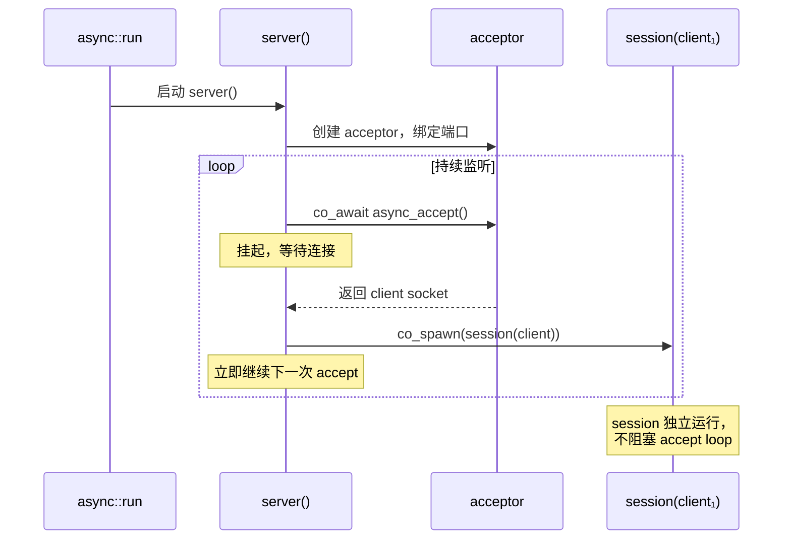

# 2.2 TCP 服务端：acceptor 与会话并发

> **前置知识**：本章假设你已读完第 1 部分（1.1–1.4）和 [2.1（客户端）](02_tcp_client.md)，理解 `Task<>`、`co_await`、`std::expected`、`co_spawn` 以及 `net::send` / `net::receive` 的错误处理模式。

---

## 服务端的结构

一个 TCP 服务端做两件事：

1. **持续监听**（accept loop）：等待新连接，接受后立即继续等待下一个。
2. **处理连接**（session）：对每个连接读取数据并回复，直到对端关闭。

这两件事天然适合两个协程：一个负责 accept，每接受一个连接就用 `co_spawn` 把它交给一个 session 协程处理。



---

## 完整代码

```cpp
#include <array>

#include <blog.h>

namespace {

// 处理单个连接：收到多少字节就回显多少，直到对端关闭
auto session(net::ip::tcp::socket client, net::ip::tcp::endpoint peer)
    -> async::Task<>
{
    log::info("connected: {}", peer);

    std::array<std::byte, 4096> buf;
    while (true) {
        auto recv_result = co_await client.async_receive_some(buf);
        if (!recv_result) {
            log::error("recv error from {}: {}", peer, recv_result.error());
            co_return;
        }

        if (*recv_result == 0) {         // EOF：对端正常关闭
            log::info("disconnected: {}", peer);
            co_return;
        }

        auto send_result = co_await net::send(client, std::span{ buf.data(), *recv_result });
        if (!send_result) {
            log::error("send error to {}: {}", peer, send_result.error());
            co_return;
        }
    }
}

auto server() -> async::Task<>
{
    auto endpoint = net::ip::tcp::endpoint{ net::ip::AddressV4::any(), 12345 };
    auto acceptor = net::ip::tcp::acceptor{ endpoint, /*reuse_port=*/true };
    log::info("listening on {}", endpoint);

    while (true) {
        net::ip::tcp::endpoint peer;
        auto accept_result = co_await acceptor.async_accept(peer);
        if (!accept_result) {
            if (accept_result.error() == std::errc::operation_canceled)
                co_return;

            log::error("accept error: {}", accept_result.error());
            continue;
        }
        // 每个连接派给独立协程，acceptor 立即继续等待下一个连接
        async::co_spawn(session(std::move(*accept_result), peer));
    }
}

auto shutdown_monitor() -> async::Task<>
{
    async::SignalSet signals{ async::signals::interrupt, async::signals::terminate };
    co_await signals.async_wait();
    log::info("shutting down...");
    async::stop();
}

auto run() -> async::Task<>
{
    async::co_spawn(shutdown_monitor());
    co_await server();
}

} // namespace

int main()
{
    async::run(run);
}
```

先启动服务端（下一节会写客户端来测试它）：

```bash
./build/tutorial/05_tcp_server/tutorial.05_tcp_server
```

```
[info] listening on 0.0.0.0:12345
```

按 Ctrl+C 优雅停止：

```
[info] shutting down...
```

---

## 逐步解析

### `acceptor` 的构造

```cpp
auto endpoint = net::ip::tcp::endpoint{ net::ip::AddressV4::any(), 12345 };
auto acceptor = net::ip::tcp::acceptor{ endpoint, /*reuse_port=*/true };
```

`AddressV4::any()` 对应 `0.0.0.0`，表示监听所有网卡。

构造函数内部依次完成：`SO_REUSEADDR`（始终开启）、可选的 `SO_REUSEPORT`、`bind`、`listen`。一行代码替代了手写服务端时通常需要的四到五个系统调用。

`reuse_port=true` 设置 `SO_REUSEPORT`，允许多个 socket 绑定同一端口——同一程序内创建多个 acceptor 做负载均衡时需要开启。这里只有一个 acceptor，但提前开启不影响正确性。

构造完成后可以用 `local_endpoint` 查询实际绑定的地址：

```cpp
if (auto ep = local_endpoint(acceptor))
    log::info("listening on {}", *ep);
```

这在端口号由命令行参数传入、或故意绑定到端口 `0`（让内核自动分配）时尤其有用——此时只有构造完成后才能知道实际端口。`local_endpoint` 返回 `std::expected<endpoint_type, std::error_code>`，对所有 socket 类型（socket、acceptor）均有效。

### `co_await acceptor.async_accept(peer)`

```cpp
net::ip::tcp::endpoint peer;
auto accept_result = co_await acceptor.async_accept(peer);
```

挂起协程，向 io_uring 提交 `accept` 操作。有新连接到达时恢复，返回 `std::expected<net::ip::tcp::socket, std::error_code>`。`peer` 被填入对端地址。

### `co_spawn(session(std::move(*accept_result), peer))`

接受成功后，把 socket 和对端地址**移入** session 协程。`std::move` 是必须的——socket 持有文件描述符，不可复制。`co_spawn` 让 session 独立运行，accept loop 不等待它，立刻回到 `co_await acceptor.async_accept`。

### 取消检测

```cpp
if (accept_result.error() == std::errc::operation_canceled)
    co_return;
```

`async::stop()` 被调用时，所有挂起的 io_uring 操作都会以 `operation_canceled` 完成。accept loop 必须显式检测这个错误并退出，否则会在取消后重新提交 accept 操作，造成无限循环。

### `shutdown_monitor` 与 `run`

```cpp
auto shutdown_monitor() -> async::Task<>
{
    async::SignalSet signals{ async::signals::interrupt, async::signals::terminate };
    co_await signals.async_wait();
    log::info("shutting down...");
    async::stop();
}

auto run() -> async::Task<>
{
    async::co_spawn(shutdown_monitor());
    co_await server();
}
```

`shutdown_monitor` 挂起等待 SIGINT（Ctrl+C）或 SIGTERM，收到后调用 `async::stop()` 取消事件循环中的所有操作。`run` 负责把两个顶层协程组合起来：先 `co_spawn` 监控器（让它在后台独立等待信号），再 `co_await server()`（等服务端退出后 `run` 才结束）。

### `session` 中的 `async_receive_some`

```cpp
auto recv_result = co_await client.async_receive_some(buf);
```

与 `net::receive` 不同，`async_receive_some` 是**单次**操作：收到任意字节就返回，不等到缓冲区填满。对回显服务这是正确的——收多少就发回多少。

### EOF 检测

```cpp
if (*recv_result == 0) {   // EOF：对端正常关闭
    log::info("disconnected: {}", peer);
    co_return;
}
```

TCP 对端调用 `close()` 或 `shutdown(SHUT_WR)` 时，接收操作返回 0 字节。这不是错误，而是正常的半关闭信号。必须显式检查，否则会对空 span 调用 `net::send` 形成死循环。

---

## 并发模型小结

此时服务端可以同时处理任意数量的连接：每个 session 协程挂起在自己的 `co_await` 上，事件循环统一调度所有 I/O 完成事件，零线程切换开销。

---

下一节：[2.3 流式读取：receive_stream 与 buffer ring](03_receive_stream.md)
