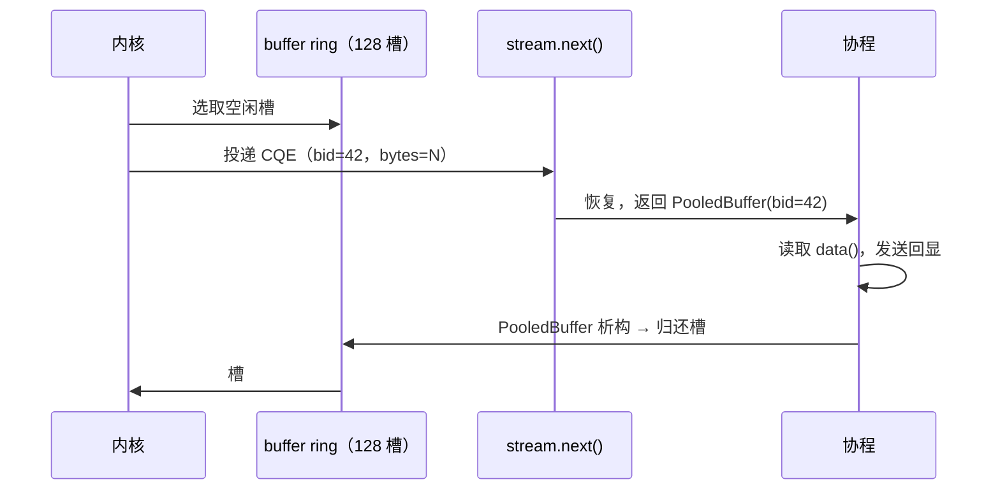

# 2.3 流式读取：receive_stream 与 buffer ring

> **前置知识**：本章假设你已读完 [2.2（服务端）](02_tcp_server.md)，理解 `acceptor`、session 并发与 `co_spawn`。

---

## 为什么不够用

回顾 2.2 服务端的 session 核心循环：

```cpp
std::array<std::byte, 4096> buf;
while (true) {
    auto recv_result = co_await client.async_receive_some(buf);
    ...
}
```

`async_receive_some` 每次只处理一次"接收"：向 io_uring 提交一个 SQE，等待一个 CQE，返回后再提交下一个。每次循环都有一次提交开销，并且缓冲区 `buf` 必须在整个 session 的生命周期内保持有效——内存归调用方管。

io_uring 提供了一个更高效的替代方案：**multishot recv + Provided Buffers**。

- **Multishot recv**：一次提交 SQE，内核连续复用它投递多个 CQE，不需要应用层重新提交。
- **Provided Buffers（buffer ring）**：内核从预先注册好的内存池里自动选择缓冲区，省去每次接收都要传递用户缓冲区的麻烦。

`receive_stream` 把这两种机制封装成一个协程友好的迭代接口。

---

## 与 async_receive_some 的对比

| | `async_receive_some` | `receive_stream` |
|---|---|---|
| SQE 提交 | 每次循环一次 | 一次，持续有效 |
| 缓冲区来源 | 调用方提供（栈/堆） | 内核从 buffer ring 选取 |
| 返回类型 | `std::expected<std::size_t, …>` | `std::expected<PooledBuffer, …>` |
| EOF 判断 | `*result == 0` | `result->data().empty()` |
| 缓冲区归还 | 无需（栈变量自动释放） | `PooledBuffer` 析构时自动归还 |

---

## 完整代码

```cpp
#include <blog.h>

namespace {

auto session(net::ip::tcp::socket client, net::ip::tcp::endpoint peer) -> async::Task<>
{
    log::info("connected: {}", peer);

    auto stream = client.receive_stream();
    while (true) {
        auto result = co_await stream.next();
        if (!result) {
            if (result.error() != std::errc::operation_canceled)
                log::error("recv error from {}: {}", peer, result.error());
            co_return;
        }

        if (result->data().empty()) {   // EOF：对端正常关闭
            log::info("disconnected: {}", peer);
            co_return;
        }

        auto send_result = co_await net::send(client, result->data());
        if (!send_result) {
            log::error("send error to {}: {}", peer, send_result.error());
            co_return;
        }
    }
}

auto server() -> async::Task<>
{
    async::this_coroutine::setup_buffer_ring(128);

    auto endpoint = net::ip::tcp::endpoint{ net::ip::AddressV4::any(), 12345 };
    auto acceptor = net::ip::tcp::acceptor{ endpoint, /*reuse_port=*/true };
    if (auto ep = local_endpoint(acceptor))
        log::info("listening on {}", *ep);

    while (true) {
        net::ip::tcp::endpoint peer;
        auto accept_result = co_await acceptor.async_accept(peer);
        if (!accept_result) {
            if (accept_result.error() == std::errc::operation_canceled)
                co_return;

            log::error("accept error: {}", accept_result.error());
            continue;
        }

        async::co_spawn(session(std::move(*accept_result), peer));
    }
}

auto shutdown_monitor() -> async::Task<>
{
    async::SignalSet signals{ async::signals::interrupt, async::signals::terminate };
    co_await signals.async_wait();
    log::info("shutting down...");
    async::stop();
}

auto run() -> async::Task<>
{
    async::co_spawn(shutdown_monitor());
    co_await server();
}

} // namespace

int main()
{
    async::run(run);
}
```

与 2.2 服务端相比，session 里去掉了 `std::array<std::byte, 4096> buf`，`async_receive_some(buf)` 换成了 `receive_stream()` + `stream.next()`；`server()` 增加了一行 `setup_buffer_ring(128)` 初始化内存池。其余结构完全相同。

### 运行方式

终端 1——启动服务端：

```bash
./build/tutorial/07_receive_stream/tutorial.07_receive_stream
```

终端 2——用 2.1 的客户端连接：

```bash
./build/tutorial/06_tcp_client/tutorial.06_tcp_client
```

```
# 服务端
[info] listening on 0.0.0.0:12345
[info] connected: 127.0.0.1:54608
[info] disconnected: 127.0.0.1:54608
[info] shutting down...

# 客户端
[info] connected 127.0.0.1:54608 -> 127.0.0.1:12345
[info] sent 15 bytes
[info] received 15 bytes: hello, tutorial
```

---

## 逐步解析

### `setup_buffer_ring(128)`

```cpp
async::this_coroutine::setup_buffer_ring(128);
```

向 io_uring 注册一个包含 128 个槽位的 buffer ring，每个槽位默认 4096 字节。注册后，内核可以在收到数据时从池中自动选取空闲槽位写入，无需每次接收都等待应用层提供缓冲区。

第一次调用会把这个 ring 设置为当前 I/O context 的**默认** buffer ring，后续 `socket.receive_stream()`（无参数版本）会自动使用它。128 个槽位足够大多数服务器场景；高并发下可根据连接数调大。

buffer ring 的内存生命周期与 I/O context 绑定，无需手动释放。

### `client.receive_stream()`

```cpp
auto stream = client.receive_stream();
```

创建一个绑定到该 socket 的 `ReceiveStream`。此时还没有向 io_uring 提交任何 SQE——操作在第一次 `co_await stream.next()` 时才提交。

### `co_await stream.next()`

```cpp
auto result = co_await stream.next();
```

返回 `std::expected<PooledBuffer, std::error_code>`。

- **首次调用**：向 io_uring 提交一个 multishot recv SQE，然后挂起协程。
- **后续调用**：若上一次 CQE 已到达并排队，立即返回（不挂起）；否则挂起等待。

内核每投递一个 CQE，`ReceiveStream` 内部就把对应的 `PooledBuffer` 入队，并在有等待的协程时唤醒它。一个 SQE 的生命周期可以跨越任意多次 `next()`。

### `PooledBuffer` 与 RAII 归还

```cpp
auto send_result = co_await net::send(client, result->data());
```

`result->data()` 返回 `std::span<std::byte>`，指向 buffer ring 中的槽位内存，零拷贝传递给 `net::send`。

`result`（`PooledBuffer`）在离开作用域时，析构函数自动调用 `release_buffer_ring(bgid, bid)`，把槽位归还给内核以便复用。无需任何手动操作。



### EOF 检测

```cpp
if (result->data().empty()) {
    log::info("disconnected: {}", peer);
    co_return;
}
```

对端调用 `close()` / `shutdown(SHUT_WR)` 时，内核投递一个字节数为 0 的 CQE。`PooledBuffer::data()` 返回空 span，此处捕获该信号并退出 session。

---

## 本章小结

`receive_stream` 用一个 multishot SQE 替代了每次循环重新提交的 `async_receive_some`，配合 buffer ring 让内核直接管理接收缓冲区，`PooledBuffer` 的析构负责归还槽位。会话循环的逻辑结构没有变化，只是把两行换成了一行。

---

下一节：[2.4 协议分帧：行协议与 TCP 半关闭](04_line_protocol.md)
