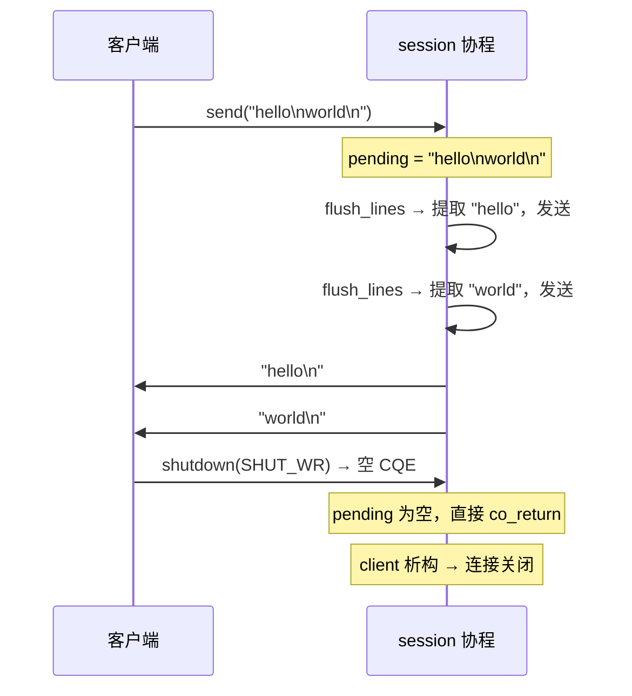

# 2.4 协议分帧：行协议与 TCP 半关闭

> **前置知识**：本章假设你已读完 [2.3（流式读取）](03_receive_stream.md)，理解 `receive_stream`、`PooledBuffer` 与 EOF 检测。

---

## TCP 是字节流，不是消息流

前几节的 echo server 把每次 `stream.next()` 收到的数据当作一个整体回显。这在测试时行得通，但存在一个根本假设——**一次 `next()` 恰好包含一条消息**。

TCP 不做这种保证。发送方调用 `send("hello\nworld\n")` 时，接收方可能：

- 一次 `next()` 收到 `"hello\nworld\n"`（合并）
- 两次 `next()` 分别收到 `"hello\n"` 和 `"world\n"`（拆分）
- 三次 `next()` 收到 `"hel"`、`"lo\nwor"`、`"ld\n"`（任意位置拆分）

**协议分帧**（framing）就是从连续字节流中识别出消息边界的过程。行协议是最简单的一种：以 `\n` 作为消息结束符。

---

## 完整代码

```cpp
#include <string>

#include <blog.h>

namespace {

// 从 pending 缓冲区中提取所有完整行（以 \n 结尾），逐行回显
// 返回已消费的字节数
auto flush_lines(std::string& pending, net::ip::tcp::socket& client,
                 const net::ip::tcp::endpoint& peer) -> async::Task<bool>
{
    std::string::size_type pos = 0;
    while (true) {
        auto nl = pending.find('\n', pos);
        if (nl == std::string::npos)
            break;

        // 去掉 \r（兼容 \r\n 行尾，例如 telnet）
        auto end = nl;
        if (end > pos && pending[end - 1] == '\r')
            --end;

        auto line = std::string_view{ pending }.substr(pos, end - pos);
        log::info("line: {}", line);

        auto reply = std::string{ line } + "\n";
        auto send_result = co_await net::send(client, async::buffer(reply));
        if (!send_result) {
            log::error("send error to {}: {}", peer, send_result.error());
            co_return false;
        }

        pos = nl + 1;
    }
    pending.erase(0, pos);
    co_return true;
}

auto session(net::ip::tcp::socket client, net::ip::tcp::endpoint peer) -> async::Task<>
{
    log::info("connected: {}", peer);

    std::string pending;           // 跨 CQE 边界的不完整行
    auto stream = client.receive_stream();

    while (true) {
        auto result = co_await stream.next();
        if (!result) {
            if (result.error() != std::errc::operation_canceled)
                log::error("recv error from {}: {}", peer, result.error());
            co_return;
        }

        if (result->data().empty()) {
            // EOF：对端关闭了写端（half-close）
            // 缓冲区里可能还有最后一行没有 \n，也回显出去
            if (!pending.empty()) {
                log::info("line (no trailing newline): {}", pending);
                auto reply = pending + "\n";
                co_await net::send(client, async::buffer(reply));
            }
            log::info("disconnected: {}", peer);
            co_return;
        }

        pending += as_string(result->data());

        if (!co_await flush_lines(pending, client, peer))
            co_return;
    }
}

auto server() -> async::Task<>
{
    async::this_coroutine::setup_buffer_ring(128);

    auto endpoint = net::ip::tcp::endpoint{ net::ip::AddressV4::any(), 12345 };
    auto acceptor = net::ip::tcp::acceptor{ endpoint, /*reuse_port=*/true };
    if (auto ep = local_endpoint(acceptor))
        log::info("listening on {}", *ep);

    while (true) {
        net::ip::tcp::endpoint peer;
        auto accept_result = co_await acceptor.async_accept(peer);
        if (!accept_result) {
            if (accept_result.error() == std::errc::operation_canceled)
                co_return;

            log::error("accept error: {}", accept_result.error());
            continue;
        }

        async::co_spawn(session(std::move(*accept_result), peer));
    }
}

auto shutdown_monitor() -> async::Task<>
{
    async::SignalSet signals{ async::signals::interrupt, async::signals::terminate };
    co_await signals.async_wait();
    log::info("shutting down...");
    async::stop();
}

auto run() -> async::Task<>
{
    async::co_spawn(shutdown_monitor());
    co_await server();
}

} // namespace

int main()
{
    async::run(run);
}
```

---

## 运行方式

启动服务端：

```bash
./build/tutorial/08_line_protocol/tutorial.08_line_protocol
```

**场景一：两行内容一次发送**（测试分帧——`hello` 和 `world` 在同一个 send 中，服务端必须拆开）：

```bash
printf "hello\nworld\n" | nc -q1 127.0.0.1 12345
```

服务端输出：

```
[info] listening on 0.0.0.0:12345
[info] connected: 127.0.0.1:33412
[info] line: hello
[info] line: world
[info] disconnected: 127.0.0.1:33412
```

nc 收到的回显：

```
hello
world
```

**场景二：末尾没有 `\n`**（测试 EOF half-close——内容被 EOF 截断，服务端从 pending 缓冲区中恢复）：

```bash
printf "no newline at end" | nc -q1 127.0.0.1 12345
```

服务端输出：

```
[info] connected: 127.0.0.1:33420
[info] line (no trailing newline): no newline at end
[info] disconnected: 127.0.0.1:33420
```

---

## 逐步解析

### `pending` 缓冲区

```cpp
std::string pending;
```

`receive_stream` 以 CQE 为单位交付数据，CQE 边界与行边界无关。`pending` 累积所有未处理的字节，直到 `\n` 出现。每次 `flush_lines` 消费完整行后，`pending.erase(0, pos)` 把已处理的前缀去掉，保留尚未组成完整行的尾部。

### `flush_lines` 中的行提取循环

```cpp
while (true) {
    auto nl = pending.find('\n', pos);
    if (nl == std::string::npos)
        break;
    ...
    pos = nl + 1;
}
pending.erase(0, pos);
```

每次找到一个 `\n` 就提取一行并发送，找不到就退出循环。`pos` 在 `pending` 内移动，避免重复扫描已处理的部分。一次 CQE 里包含多行时，循环会连续提取所有完整行。

### TCP half-close 与 EOF

```cpp
if (result->data().empty()) {
    if (!pending.empty()) {
        log::info("line (no trailing newline): {}", pending);
        auto reply = pending + "\n";
        co_await net::send(client, async::buffer(reply));
    }
    log::info("disconnected: {}", peer);
    co_return;
}
```

对端调用 `close()` 或 `shutdown(SHUT_WR)` 时，内核向 `receive_stream` 投递一个空 CQE（`data().empty()`）。这是**写端关闭（half-close）**：对端不再发送数据，但连接尚未完全关闭——服务端此时仍可以发送数据，对端还能收到。

这里把 `pending` 里未被 `\n` 终结的最后一行也回显出去，然后才 `co_return`。session 协程退出后，`client` socket 析构，连接完全关闭。



### `\r\n` 兼容

```cpp
auto end = nl;
if (end > pos && pending[end - 1] == '\r')
    --end;
```

telnet 和部分网络协议用 `\r\n` 作行尾，这里在提取行内容时跳过 `\r`，对外暴露的始终是不含换行符的纯文本。

### `as_string`

```cpp
pending += as_string(result->data());
```

`as_string` 把 `std::span<std::byte>` 零拷贝地重新解释为 `std::string_view`，再追加进 `pending`。追加操作本身有一次内存拷贝，这是不可避免的——`pending` 需要拥有内容，因为 `PooledBuffer` 在下次 `co_await` 前就会被析构归还。

### 性能考虑

本教程为了**逻辑清晰**，用 `std::string` 来累积数据。这意味着每次 CQE 到达都要拷贝一份数据进 `pending` ，如果行很长或数据到达频繁，会产生多次内存分配和拷贝。

生产代码的优化方向：

1. **多缓冲 deque**：保存多个 `PooledBuffer`（而非拷贝数据），维持它们的所有权，直到行被完全消费并发送后再析构——这样缓冲区不会被提前归还。
2. **预分配 reserve**：根据协议特性（如 HTTP header 最多 8KB）预先分配，避免增长期间的频繁重分配。
3. **零拷贝处理**：直接在 buffer_ring 内存上进行行查找和处理，而不把数据复制出来。

这些优化会增加代码复杂性。本章的目标是先理解**分帧逻辑本身**；第 5 部分（零开销抽象）会深入讨论如何消除拷贝。

---

## 本章小结

行协议分帧的关键是一个 `pending` 缓冲区：将 `receive_stream` 交付的 CQE 数据追加进去，找 `\n` 提取完整行，提取后擦除已消费前缀，留下跨 CQE 的尾部等待下次数据到达。EOF（空 CQE）触发缓冲区的最终刷新，处理末尾无 `\n` 的情况。

---

第 2 部分到此结束。下一部分：[第 3 部分：系统韧性](05_stop_then.md) — 从外部取消开始。
