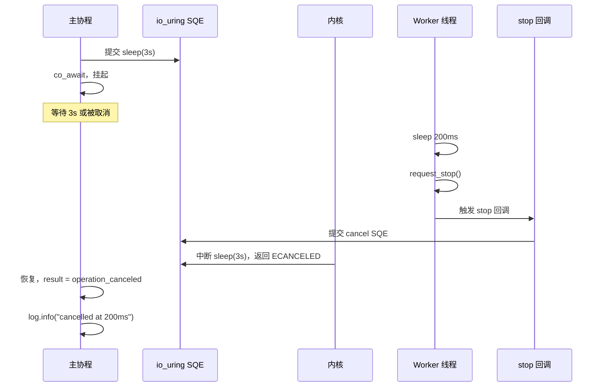

# 3.1 外部取消模型：stop_then 与协作式取消

> **前置知识**：本章假设你已读完第 2 部分（2.1–2.4）与第 1.4 节（协程帧生命周期）。

---

## 为什么需要取消

回顾第 2 部分的服务端：accept loop 通过检测 `operation_canceled` 错误来 graceful shutdown。但那是被动的——一旦 `async::stop()` 被调用，所有挂起的 I/O 自动被内核取消，返回 `operation_canceled`。

**问题**：单个操作无法提前退出。例如你想给一个 recv 加 5 秒超时，现在只能两种极端：
1. 等待 5 秒超时时内核主动返回 `timed_out` — 浪费时间
2. 等待系统全局 `stop()` — 太粗暴，可能中断其他关键操作

**解决方案**：`stop_then` 将任意异步操作包装成**可协作取消**的操作——由操作发起者（而非系统）决定何时取消，通过 `std::stop_token` 通知内核提前返回。

---

## 协作式取消 vs 系统停止

| 方面 | 系统 `async::stop()` | 协作 `stop_then` |
|------|---|---|
| **谁发起取消** | 全局事件循环 | 调用者（协程） |
| **影响范围** | 所有挂起操作 | 仅被 `stop_then` 包装的操作 |
| **典型用途** | Graceful shutdown | 单个操作超时、可选项等待 |
| **返回错误** | `operation_canceled` | `operation_canceled` |

两种机制在底层都产生相同的错误码，但语义完全不同——取消的**时机**和**范围**由发起者控制。

---

## 完整代码

```cpp
#include <stop_token>
#include <thread>

#include <blog.h>

namespace {

using namespace std::chrono_literals;

auto demo(std::stop_token token) -> async::Task<>
{
    log::info("starting 3-second cancellable sleep");

    auto result = co_await async::stop_then(
        async::sleep_for(3s),
        token
    );

    if (!result) {
        if (result.error() == std::errc::operation_canceled)
            log::info("sleep cancelled at 200ms");
        else
            log::error("stop_then sleep failed: {}", result.error());
    }
    else {
        log::info("sleep completed (should not reach here)");
    }
}

} // namespace

int main()
{
    std::stop_source stop_source;

    using namespace std::chrono_literals;

    // Worker 线程：200ms 后触发取消
    std::jthread worker{ [&stop_source] {
        std::this_thread::sleep_for(200ms);
        log::info("worker thread requesting stop");
        stop_source.request_stop();
    } };

    async::run(stop_source, demo);
    return EXIT_SUCCESS;
}
```

---

## 运行方式

```bash
./build/tutorial/09_stop_then/tutorial.09_stop_then
```

```
[info] starting 3-second cancellable sleep
[info] worker thread requesting stop
[info] sleep cancelled at 200ms
```

---

## 逐步解析

### 新的 `async::run` 重载：简化 stop_source 管理

```cpp
async::run(stop_source, demo);
```

新增的 `async::run(std::stop_source&, awaiter)` 重载自动将 `stop_source` 的 token 传给 awaiter 函数：

```cpp
auto demo(std::stop_token token) -> async::Task<> { ... }
```

这个 token 就是 main 线程中 `stop_source.request_stop()` 发送的信号。避免了在协程内部创建/管理 `stop_source` 的复杂性。

### Worker 线程触发取消

```cpp
std::jthread worker{ [&stop_source] {
    std::this_thread::sleep_for(200ms);
    log::info("worker thread requesting stop");
    stop_source.request_stop();
} };
```

`std::jthread` 在后台运行 lambda，200ms 后调用 `request_stop()` 向 `stop_source` 发出取消信号。所有监听该 source 的 `stop_token` 都会立即被通知。

### `co_await async::stop_then(operation, token)`

```cpp
auto result = co_await async::stop_then(
    async::sleep_for(3s),
    token
);
```

`stop_then` 把 `sleep_for(3s)` 这个本来不可取消的操作包装成可取消的。返回类型是 `std::expected<T, std::error_code>`，其中 `T` 是原操作的返回类型。

包装器内部：
1. 在 `await_suspend` 时注册一个 stop 回调，监听 token 的状态变化
2. 一旦 `request_stop()` 被调用，回调函数会触发，向 io_uring 提交 cancel SQE
3. 原操作立即被中断，返回 `operation_canceled`

### 错误检测

```cpp
if (result.error() == std::errc::operation_canceled)
    log::info("sleep cancelled at 200ms");
```

取消时返回 `expected` 的 `error()` 状态，错误码为 `operation_canceled`。这与系统 `stop()` 时的行为一致，所以两种取消的错误处理逻辑完全相同。

### 取消流程时序



---

## 本章小结

`stop_then` 通过 `std::stop_token` 将**全局系统停止**转化为**协作式本地取消**。结合新的 `async::run(source, awaiter)` 重载，启动代码更加简洁——无需在协程中创建 source，直接从 main 线程控制。从错误处理的角度，两种取消的结果相同，都产生 `operation_canceled`；但从控制力的角度，前者是系统级的被动停止，后者是应用级的主动取消。

下一节：[3.2 局部时间约束](06_timeout.md) — 用 `timeout` 给操作加入时间限制，处理 deadline 及其衍生的 `timed_out` 错误。
