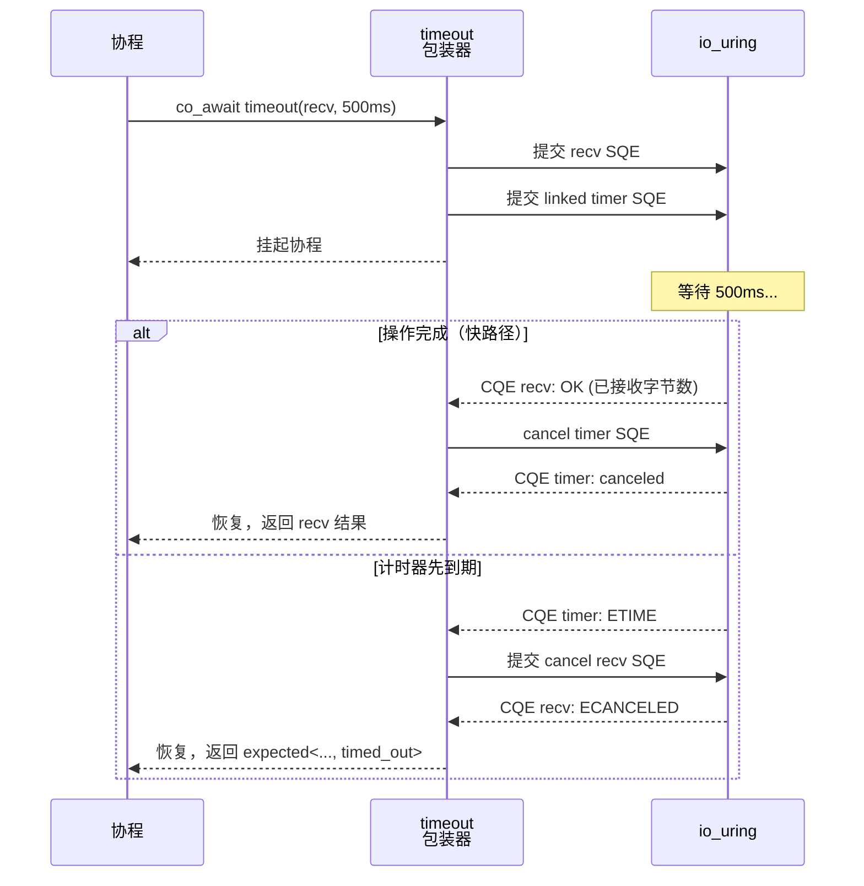

# 3.2 局部时间约束：timeout

> **前置知识**：本章假设你已读完 [3.1（外部取消）](05_stop_then.md) 以及 TCP 基础章节（2.1–2.2）。
> **源文件**：[tutorial/10_timeout/main.cpp](../../tutorial/10_timeout/main.cpp)
> **下一节**：[3.3 错误分类与重试退避](07_error_handling.md)

---

## 问题：异步操作无限期等待

前面的 `stop_then` 响应"外部触发"的取消信号。但还有另一类需求：**操作本身不应超过固定时间上限**。没有读超时保护的 `async_receive_some` 在对端不响应时会无限期挂起；没有 SLA 限制的上游调用可能拖垮尾延迟。

`timeout(op, duration)` 给任意 `cancelable_operation` 加时间上限：到期则取消该操作并返回 `std::errc::timed_out`，未到期则透传操作结果。

---

## 完整代码

```cpp
#include <array>
#include <cstdlib>

#include <blog.h>

using namespace std::chrono_literals;

namespace {

// ============================================================================
// 场景 1：业务逻辑层 SLA 超时
// ============================================================================
auto demo_sla_timeout() -> async::Task<>
{
    log::info("=== Demo 1: 业务逻辑超时熔断 (限制 200ms) ===");
    log::info("[App] 向上游发起请求，最大容忍耗时 200ms...");

    auto result = co_await async::timeout(async::sleep_for(5s), 200ms);  // <--

    if (!result && result.error() == std::errc::timed_out) {
        log::warning("[App] 任务响应超时 (>200ms)。");
        log::warning("[App] 底层 io_uring 已自动 Cancel 原挂起状态，防止死等。\n");
        co_return;
    }

    log::error("[App] 未预期的执行结果");
}

// ============================================================================
// 场景 2：网络 I/O 读超时（防止死连接）
// ============================================================================
auto mock_silent_server(net::ip::tcp::endpoint endpoint) -> async::Task<>
{
    auto acceptor = net::ip::tcp::acceptor{ endpoint, true };

    net::ip::tcp::endpoint peer;
    auto accepted = co_await acceptor.async_accept(peer);
    if (!accepted)
        co_return;

    log::info("[Server] 收到客户端连接，但在读超时窗口内不发送任何数据...");
    co_await async::sleep_for(1s);
}

auto mock_fast_server(net::ip::tcp::endpoint endpoint) -> async::Task<>
{
    auto acceptor = net::ip::tcp::acceptor{ endpoint, true };

    net::ip::tcp::endpoint peer;
    auto accepted = co_await acceptor.async_accept(peer);
    if (!accepted)
        co_return;

    co_await async::sleep_for(50ms);

    std::array<std::byte, 2> payload{ std::byte{'O'}, std::byte{'K'} };
    auto sent = co_await net::send(*accepted, std::span{ payload.data(), payload.size() });
    if (!sent)
        log::error("[Server] 发送响应失败: {}", sent.error());
}

auto demo_network_read_timeout() -> async::Task<>
{
    log::info("=== Demo 2: 网络 I/O 读取超时 (防止死连接) ===");

    auto endpoint = net::ip::tcp::endpoint{ net::ip::AddressV4::loopback(), 10086 };

    async::co_spawn(mock_silent_server(endpoint));
    co_await async::sleep_for(50ms);

    auto socket = net::ip::tcp::socket{ endpoint.protocol() };
    try {
        socket.connect(endpoint);
        log::info("[Client] 已连接服务器，准备读取数据，设置 500ms 读超时...");
    }
    catch (const std::exception& ex) {
        log::error("[Client] 连接失败: {}", ex.what());
        co_return;
    }

    std::array<std::byte, 1024> buffer;
    auto result = co_await async::timeout(socket.async_receive_some(buffer), 500ms);  // <--
    if (!result && result.error() == std::errc::timed_out) {
        log::error("[Client] 读取超时 (>500ms)，判定服务器无响应。");
        log::info("[Client] 主动放弃读取；底层 io_uring 会清理悬空 Socket 读事件。\n");
        co_return;
    }

    log::error("[Client] 未预期的执行结果");
}

// ============================================================================
// 场景 3：快路径（未触发超时）
// ============================================================================
auto demo_happy_path() -> async::Task<>
{
    log::info("=== Demo 3: 快路径放行 (未触发超时) ===");
    log::info("[App] 连接快速响应服务，读取超时阈值设为 1 秒...");

    auto endpoint = net::ip::tcp::endpoint{ net::ip::AddressV4::loopback(), 10087 };
    async::co_spawn(mock_fast_server(endpoint));
    co_await async::sleep_for(50ms);

    auto socket = net::ip::tcp::socket{ endpoint.protocol() };
    try {
        socket.connect(endpoint);
    }
    catch (const std::exception& ex) {
        log::error("[App] 连接快速服务失败: {}", ex.what());
        co_return;
    }

    std::array<std::byte, 16> buffer;
    auto result = co_await async::timeout(socket.async_receive_some(buffer), 1s);  // <--
    if (result && *result > 0) {
        log::info("[App] 请求在阈值内成功返回，读取 {} 字节，超时监控自动清理。\n", *result);
        co_return;
    }

    log::error("[App] 未预期的执行结果: {}", result.error());
}

} // namespace

int main()
{
    async::run(demo_sla_timeout);
    async::run(demo_network_read_timeout);
    async::run(demo_happy_path);
    return EXIT_SUCCESS;
}
```

```bash
./build/tutorial/10_timeout/tutorial.10_timeout
```

```text
[info] === Demo 1: 业务逻辑超时熔断 (限制 200ms) ===
[info] [App] 向上游发起请求，最大容忍耗时 200ms...
[warning] [App] 任务响应超时 (>200ms)。
[warning] [App] 底层 io_uring 已自动 Cancel 原挂起状态，防止死等。

[info] === Demo 2: 网络 I/O 读取超时 (防止死连接) ===
[info] [Client] 已连接服务器，准备读取数据，设置 500ms 读超时...
[info] [Server] 收到客户端连接，但在读超时窗口内不发送任何数据...
[error] [Client] 读取超时 (>500ms)，判定服务器无响应。
[info] [Client] 主动放弃读取；底层 io_uring 会清理悬空 Socket 读事件。

[info] === Demo 3: 快路径放行 (未触发超时) ===
[info] [App] 连接快速响应服务，读取超时阈值设为 1 秒...
[info] [App] 请求在阈值内成功返回，读取 2 字节，超时监控自动清理。
```

---

## 逐步解析

### `async::timeout(op, duration)`

```cpp
auto result = co_await async::timeout(async::sleep_for(5s), 200ms);
```

`timeout` 接受一个 `cancelable_operation` 和时间间隔。协程挂起后，运行时同时监听操作完成事件和计时器：

- **操作先完成**：返回原操作结果，计时器被取消。
- **计时器先到期**：向 io_uring 提交 `IORING_OP_ASYNC_CANCEL`，取消被监控的 SQE；返回 `std::errc::timed_out`。

返回值类型与被监控操作的返回类型相同。超时路径通过错误码 `timed_out` 标识，与正常路径共用同一类型。



### 场景 2：socket 读超时

```cpp
auto result = co_await async::timeout(socket.async_receive_some(buffer), 500ms);
```

`async_receive_some` 是典型的 `cancelable_operation`：操作由 io_uring 的 recv SQE 驱动，可以被 `IORING_OP_ASYNC_CANCEL` 取消。超时触发时，内核取消 recv SQE，socket 文件描述符保持有效——连接没有被关闭，只是这次读取被放弃了。

> **Note**：`async_receive_some` 是"最多读一次"的原语，与 `net::receive`（读满缓冲区）不同。对于超时场景，使用 `async_receive_some` 更合适——每次 `co_await` 都是独立的 cancelable 操作。

### 场景 3：快路径透传

```cpp
auto result = co_await async::timeout(socket.async_receive_some(buffer), 1s);
if (result && *result > 0) { ... }
```

操作在 1 秒内完成（约 50ms），`timeout` 透传操作结果，计时器自动清除。调用方无需区分"是否使用了 timeout 包装"——接口形状与裸操作相同。

### 超时后的连接状态

超时后 socket 本身没有被关闭。调用方可以选择：

- 关闭连接（`close(socket)`）：适用于判断对端无响应的场景。
- 重新发起读操作：适用于间歇性读超时、后续可能恢复的场景。

本节示例选择 `co_return`（隐式让协程帧销毁，析构函数关闭 socket），这是最常见的处理方式。

---

## `timeout` 与 `stop_then` 的边界

| | `timeout` | `stop_then` |
|---|---|---|
| 触发源 | 内部固定时间间隔 | 外部 `std::stop_token` |
| 触发时刻 | 确定（`duration` 到期） | 不可预测（由外部控制） |
| 错误码 | `timed_out` | `operation_canceled` |
| 典型场景 | SLA 熔断、读写超时防护 | 用户取消、进程停机信号 |

---

## 本章小结

`timeout(op, duration)` 为任意 `cancelable_operation` 添加时间上限。超时时 io_uring 操作被取消，返回 `timed_out`；未超时则透传操作结果。网络 I/O 场景中，读超时是防止死连接长期占用资源的基础防御能力。

> **下一节**：[3.3 错误分类与重试退避](07_error_handling.md) — 如何区分可重试错误与致命错误，实现指数退避重试策略。
