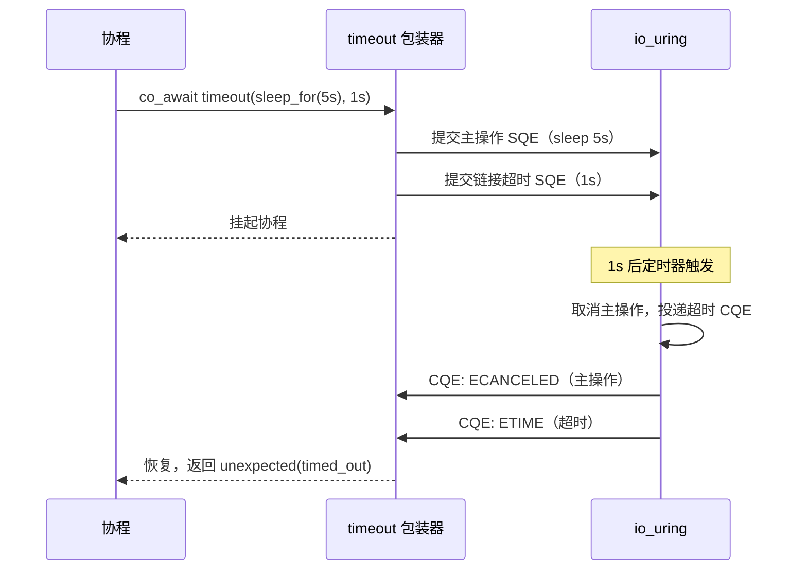

# 3.2 局部时间约束：timeout 与 deadline 语义

> **前置知识**：本章假设你已读完 [3.1（外部取消）](05_stop_then.md)，理解 `stop_token` 和协作式取消。

---

## timeout 与 stop_then 的区别

两者都能提前中断操作，但语义不同：

| 方面 | `stop_then` | `timeout` |
|------|---|---|
| **触发条件** | 外部调用 `stop_source.request_stop()` | 定时到期，自动触发 |
| **时间来源** | 调用者决定 | 相对时间（duration） |
| **典型应用** | 响应用户操作、外部信号 | 连接超时、响应期限 |
| **错误码** | `operation_canceled` | `timed_out` |

`timeout` 会自动开启一个内核定时器（io_uring linked timeout），时间到达时自动触发中断。不需要外部线程或信号源。

---

## 完整代码

```cpp
#include <chrono>

#include <blog.h>

namespace {

using namespace std::chrono_literals;

auto demo() -> async::Task<>
{
    log::info("timeout scenario: 5-second sleep with 1-second timeout");

    auto result = co_await async::timeout(
        async::sleep_for(5s),
        1s
    );

    if (!result) {
        if (result.error() == std::errc::timed_out)
            log::info("timed out at 1s (as expected)");
        else
            log::error("error: {}", result.error());
    }
    else {
        log::info("sleep completed (unexpected)");
    }
}

} // namespace

int main()
{
    async::run(demo);
    return EXIT_SUCCESS;
}
```

---

## 运行方式

```bash
./build/tutorial/10_timeout/tutorial.10_timeout
```

```
[info] timeout scenario: 5-second sleep with 1-second timeout
[info] timed out at 1s (as expected)
```

---

## 逐步解析

### `co_await async::timeout(operation, duration)`

```cpp
auto result = co_await async::timeout(
    async::sleep_for(5s),
    1s
);
```

`timeout` 将任意单次异步操作包装成有时间限制的版本。返回 `std::expected<T, std::error_code>`，其中 `T` 是原操作的返回类型。

包装器内部向 io_uring 提交两个 SQE：
1. **主操作** SQE：`sleep_for(5s)`
2. **链接超时** SQE：通过 `io_uring_prep_link_timeout` 与主操作链接，时间到达后自动中断

内核保证两个 CQE 都会到达；timeout 包装器等两者都收到后，根据是否超时决定返回值：未超时则转发主操作的结果，超时则返回 `timed_out` 错误。



### 超时时返回 `timed_out`

```cpp
if (!result) {
    if (result.error() == std::errc::timed_out)
        log::info("timed out at 1s");
}
```

`timeout` 的错误码与 `stop_then` 不同。`stop_then` 返回 `operation_canceled`，而 `timeout` 返回 `timed_out`。这允许调用者区分"主动取消"和"时间到期"两种中断原因。

### link timer vs 独立 timer

`timeout` 有两条实现路径，对应不同的操作类型：

| | link timer | 独立 timer |
|--|-----------|-----------|
| **内部机制** | `IOSQE_IO_LINK` + `io_uring_prep_link_timeout` | `when_any<Op, TimerAwaiter>` 竞速 |
| **适用操作** | io_uring 原语（`recv`、`send`、`sleep_for`…） | 任意 `cancelable_operation`（channel、stop_then…） |
| **额外开销** | 零：两个 SQE 一起提交，无额外 syscall | 略高：需要独立提交计时器 SQE |
| **错误码** | `errc::timed_out` | `errc::timed_out` |

调用方无需区分——同一个 `timeout(op, dur)` 接口，编译器根据 `op` 的类型自动选择路径：

```cpp
// link timer 路径（op 是 io_uring 原语）
auto r1 = co_await async::timeout(socket.async_receive_some(buf), 30s);

// 独立 timer 路径（op 是 channel，不走 io_uring）
auto r2 = co_await async::timeout(ch.receive(), 5s);
```

两者的错误处理写法完全一致：

```cpp
if (!r1 && r1.error() == std::errc::timed_out)
    log::warning("no data within 30 seconds");
if (!r2 && r2.error() == std::errc::timed_out)
    log::warning("channel receive timed out");
```

独立 timer 路径内部等价于：

```cpp
auto result = co_await async::when_any(ch.receive(), async::sleep_for(5s));
// sleep 赢 → 返回 errc::timed_out
// ch.receive() 赢 → 返回收到的值
```

`timeout` 只是将这个模式封装成更简洁的单行调用，并统一错误码。

---

## 本章小结

- **link timer**：零额外 syscall，适用于 io_uring 原语操作。
- **独立 timer**：基于 `when_any` 竞速，适用于 channel 等非 io_uring 操作。
- **统一接口**：调用方始终写 `timeout(op, dur)`，编译器自动选路径；超时时错误码均为 `timed_out`。
- **与 `stop_then` 的区别**：`stop_then` 响应外部取消信号（`operation_canceled`）；`timeout` 是自动计时中断（`timed_out`）。两者针对不同触发条件，可以组合使用。

下一节：[3.3 错误分类与组合](07_error_handling.md) — 对比两种取消机制，理解 `timed_out` vs `operation_canceled` 的区别，以及如何根据错误类型决定重试策略。
