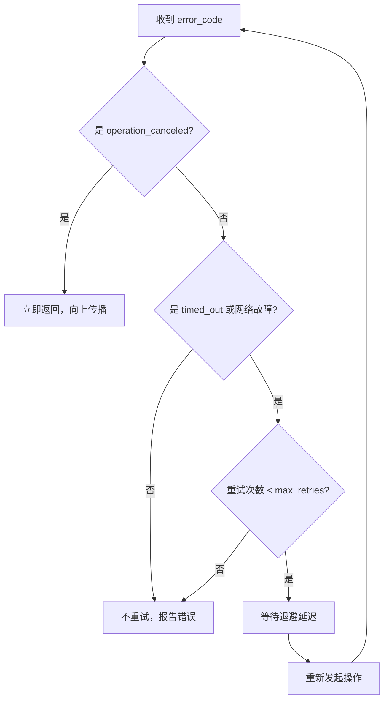

# 3.3 机制对比、错误分类与组合

> **前置知识**：本章假设你已读完 [3.1（外部取消）](05_stop_then.md) 和 [3.2（局部时间约束）](06_timeout.md)。

---

## 对照示例：同一场景，两种机制

我们先用同一个场景来直观展示 `stop_then` 与 `timeout` 的语义差异：**中断一个 5 秒的睡眠**，分别用两种方式实现。

### 用 `stop_then`：外部主动取消

```cpp
log::info("case 1: operation_canceled (from stop_then)");
std::stop_source stop_src;

// 200ms 后由外部线程请求取消
std::jthread cancel_thread{ [&stop_src] {
    std::this_thread::sleep_for(200ms);
    stop_src.request_stop();
} };

auto result = co_await async::stop_then(
    async::sleep_for(5s),
    stop_src.get_token()
);
// result.error() == std::errc::operation_canceled
```

### 用 `timeout`：时间到期自动中断

```cpp
log::info("case 2: timed_out (from timeout)");

auto result = co_await async::timeout(
    async::sleep_for(5s),
    1s              // 1 秒后自动中断
);
// result.error() == std::errc::timed_out
```

两者都提前结束了 5 秒的睡眠，但错误码不同，触发方式也完全不同。

---

## 完整代码

```cpp
#include <chrono>

#include <blog.h>

namespace {

using namespace std::chrono_literals;

// --- 辅助：重试策略 ---

auto retry_with_backoff(
    std::function<async::Task<std::expected<void, std::error_code>>()> op,
    std::size_t max_retries = 3,
    std::chrono::milliseconds initial_delay = 100ms
) -> async::Task<std::expected<void, std::error_code>>
{
    std::error_code last_error;
    auto delay = initial_delay;

    for (std::size_t attempt = 0; attempt <= max_retries; ++attempt) {
        auto result = co_await op();

        if (result) {
            log::info("attempt {}: success", attempt + 1);
            co_return std::expected<void, std::error_code>{};
        }

        last_error = result.error();

        bool is_retriable = (
            last_error == std::errc::connection_refused ||
            last_error == std::errc::connection_reset ||
            last_error == std::errc::timed_out
        );

        log::warning("attempt {}: error {} ({})",
            attempt + 1, last_error, is_retriable ? "retriable" : "fatal");

        if (!is_retriable || attempt == max_retries)
            co_return std::unexpected(last_error);

        log::info("retrying after {}ms", delay.count());
        co_await async::sleep_for(delay);
        delay *= 2;
    }

    co_return std::unexpected(last_error);
}

// --- 演示 1：机制对比 ---

auto demo_contrast() -> async::Task<>
{
    log::info("=== demo 1: stop_then vs timeout ===");

    // Case A: 外部取消（stop_then）
    {
        log::info("\ncase A: operation_canceled (stop_then)");
        std::stop_source stop_src;
        std::jthread cancel_thread{ [&stop_src] {
            std::this_thread::sleep_for(200ms);
            stop_src.request_stop();
        } };

        auto result = co_await async::stop_then(
            async::sleep_for(5s), stop_src.get_token());

        if (!result && result.error() == std::errc::operation_canceled)
            log::info("canceled externally at 200ms (as expected)");
    }

    // Case B: 时间到期（timeout）
    {
        log::info("\ncase B: timed_out (timeout)");

        auto result = co_await async::timeout(
            async::sleep_for(5s), 1s);

        if (!result && result.error() == std::errc::timed_out)
            log::info("timed out at 1s (as expected)");
    }
}

// --- 演示 2：重试策略与错误分类 ---

auto demo_retry() -> async::Task<>
{
    log::info("\n=== demo 2: retry strategy ===");

    std::size_t attempt_count = 0;

    // 前 2 次失败，第 3 次成功
    auto flaky_op = [&attempt_count]() -> async::Task<std::expected<void, std::error_code>>
    {
        attempt_count++;
        if (attempt_count <= 2)
            co_return std::unexpected(std::make_error_code(std::errc::connection_refused));
        co_return std::expected<void, std::error_code>{};
    };

    auto result = co_await retry_with_backoff(flaky_op, 5, 50ms);

    if (result)
        log::info("overall success after {} attempts", attempt_count);
    else
        log::error("overall failure: {}", result.error());
}

// --- 演示 3：operation_canceled 不重试 ---

auto demo_fatal() -> async::Task<>
{
    log::info("\n=== demo 3: non-retriable (operation_canceled) ===");

    std::size_t retry_count = 0;
    std::stop_source stop_src;
    stop_src.request_stop();   // 立即取消

    auto op = [&]() -> async::Task<std::expected<void, std::error_code>>
    {
        retry_count++;
        auto result = co_await async::stop_then(
            async::sleep_for(100ms), stop_src.get_token());
        co_return result ? std::expected<void, std::error_code>{}
                         : std::unexpected(result.error());
    };

    co_await retry_with_backoff(op, 5, 10ms);

    log::info("total attempts: {} (expected 1 — no retry on operation_canceled)",
        retry_count);
}

} // namespace

int main()
{
    async::run(demo_contrast);
    async::run(demo_retry);
    async::run(demo_fatal);
    return EXIT_SUCCESS;
}
```

---

## 运行方式

```bash
./build/tutorial/11_error_handling/tutorial.11_error_handling
```

```
[info] === demo 1: stop_then vs timeout ===

[info] case A: operation_canceled (stop_then)
[info] canceled externally at 200ms (as expected)

[info] case B: timed_out (timeout)
[info] timed out at 1s (as expected)

[info] === demo 2: retry strategy ===
[warning] attempt 1: error Connection refused (retriable)
[info] retrying after 50ms
[warning] attempt 2: error Connection refused (retriable)
[info] retrying after 100ms
[info] attempt 3: success
[info] overall success after 3 attempts

[info] === demo 3: non-retriable (operation_canceled) ===
[warning] attempt 1: error Operation canceled (fatal)
[info] total attempts: 1 (expected 1 — no retry on operation_canceled)
```

---

## 两种机制的语义边界

| 方面 | `stop_then` | `timeout` |
|------|------------|-----------|
| **触发者** | 外部（调用者创建 stop_source） | 内部（自动计时） |
| **触发时机** | 任意时刻（由调用者控制） | 精确的时间截止 |
| **错误码** | `operation_canceled` | `timed_out` |
| **可重试** | ❌ 否（主动取消，重试违反语义） | ✓ 视情况 |
| **典型场景** | 用户 Ctrl-C、应用级关闭 | 单个操作截止、idle timeout |

### 为什么错误码不同？

区分两种错误码是**设计上有意为之**的：

- `operation_canceled` 表示调用者"决定停止"——再重试完全没有意义，会与调用者意图相悖。
- `timed_out` 表示"时间不够"——对端可能只是暂时繁忙，下次可能成功，因此可以重试。

---

## Error Taxonomy：三类错误

对整个系统的错误分类，决定不同的处理策略：

| 类别 | 错误码示例 | 语义 | 策略 |
|------|-----------|------|------|
| **协作取消** | `operation_canceled` | 系统或调用者主动终止 | 立即返回，不重试，向上传播 |
| **超时中断** | `timed_out` | 操作超过截止时间 | 可重试（有限次数 + 退避） |
| **网络故障** | `connection_refused`, `connection_reset` | 对端或网络出现问题 | 可重试（取决于协议语义） |
| **协议错误** | `bad_message`, 应用自定义 | 数据本身有问题 | 不重试，报告错误 |



---

## 重试退避（Retry with Backoff）

```cpp
auto retry_with_backoff(auto op, std::size_t max_retries, auto initial_delay)
    -> async::Task<std::expected<void, std::error_code>>
{
    auto delay = initial_delay;
    for (std::size_t i = 0; i <= max_retries; ++i) {
        auto result = co_await op();
        if (result) co_return {};

        bool retriable = (
            result.error() == std::errc::connection_refused ||
            result.error() == std::errc::timed_out
        );

        if (!retriable || i == max_retries)
            co_return std::unexpected(result.error());

        co_await async::sleep_for(delay);
        delay *= 2;   // 指数退避
    }
}
```

关键点：
1. **先检查错误类型**：`operation_canceled` 不进入重试，直接返回。
2. **指数退避**：延迟倍增（100ms → 200ms → 400ms），避免频繁轰炸故障节点。
3. **有限次数**：防止无限循环——永远不要无条件重试。

---

## 组合技巧：带超时的重试

将两种机制结合——每次尝试受超时限制，且整体可被外部取消：

```cpp
auto resilient_op(std::stop_token cancel) -> async::Task<std::expected<void, std::error_code>>
{
    for (int attempt = 0; attempt < 3; ++attempt) {
        // 每次尝试：最多等 2 秒
        auto result = co_await async::timeout(
            async::stop_then(do_request(), cancel),
            2s
        );

        if (result) co_return {};

        if (result.error() == std::errc::operation_canceled)
            co_return std::unexpected(result.error());  // 外部取消，立即退出

        // timed_out 或其他错误：退避重试
        co_await async::sleep_for(100ms * (1 << attempt));
    }

    co_return std::unexpected(std::make_error_code(std::errc::timed_out));
}
```

---

## 本章小结

- **错误码是语义的**：`operation_canceled` 表示主动决定，`timed_out` 表示时间耗尽，两者不可混淆。
- **可重试性由错误类型决定**：协作取消不重试；超时和网络故障可重试，但需有限次数 + 指数退避。
- **两种机制可以嵌套**：`timeout(stop_then(op, token), duration)` 组合使用，覆盖"主动取消"和"时间到期"两种中断场景。

下一节：[4.1 显式状态聚合（when_all）](08_when_all.md) — `when_all` 并发执行多个操作，返回 `tuple<expected...>`，等所有操作完成后合并结果。

