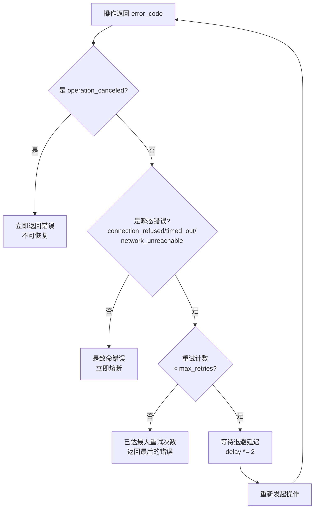

# 3.3 错误分类、重试退避与优雅取消

> **前置知识**：本章假设你已读完 [3.1（stop_then）](05_stop_then.md) 与 [3.2（timeout）](06_timeout.md)，理解 `std::expected`、`operation_canceled` 与 `timed_out` 的含义。
> **源文件**：[tutorial/11_error_handling/main.cpp](../../tutorial/11_error_handling/main.cpp)
> **下一节**：[4.1 显式状态聚合：when_all](08_when_all.md)

---

`stop_then` 和 `timeout` 均以 `std::expected<R, std::error_code>` 返回错误。错误码本身携带了语义：`connection_refused` 说明对端暂不可达，可能过一会恢复；`permission_denied` 说明鉴权失败，重试无意义。构建高可用服务的关键，正是在类型层面对错误**分类**，并让分类结果驱动重试或熔断决策——而非对每个错误码各写一段 `if-else`。

本章演示三个场景，共用一套 `with_exponential_backoff` 模板函数。

---

## 完整代码

```cpp
#include <chrono>
#include <cstdlib>

#include <blog.h>

using namespace std::chrono_literals;

namespace {

template<typename Action>
auto with_exponential_backoff(
    Action&& action,
    int max_retries = 3,
    std::chrono::milliseconds initial_delay = 50ms
) -> async::Task<std::expected<void, std::error_code>>
{
    auto delay = initial_delay;
    std::error_code last_ec;

    for (int attempt = 1; attempt <= max_retries; ++attempt) {
        auto result = co_await action();

        if (result) {
            log::info("[Retry] 第 {} 次尝试成功！", attempt);
            co_return result;
        }

        last_ec = result.error();

        bool is_transient = (
            last_ec == std::errc::connection_refused ||
            last_ec == std::errc::timed_out          ||
            last_ec == std::errc::network_unreachable
        );

        if (!is_transient) {                                            // <-- 致命错误：立刻熔断
            log::error("[Retry] 致命错误: {}，立刻熔断。", last_ec);
            co_return std::unexpected(last_ec);
        }

        if (attempt < max_retries) {
            log::warning("[Retry] 瞬态错误: {}。等待 {}ms 后进行第 {} 次重试...",
                         last_ec, delay.count(), attempt + 1);
            co_await async::sleep_for(delay);
            delay *= 2;                                                  // <-- 指数退避
        }
    }

    log::error("[Retry] 已达最大重试次数 ({})，最终放弃。", max_retries);
    co_return std::unexpected(last_ec);
}

auto demo_rpc_retry() -> async::Task<>
{
    log::info("=== Demo 1: 微服务 RPC 指数退避重试 ===");

    int attempt_count = 0;

    auto flaky_rpc_call = [&]() -> async::Task<std::expected<void, std::error_code>> {
        attempt_count++;
        co_await async::sleep_for(10ms);

        if (attempt_count <= 2)
            co_return std::unexpected(std::make_error_code(std::errc::connection_refused));

        co_return std::expected<void, std::error_code>{};
    };

    auto result = co_await with_exponential_backoff(flaky_rpc_call, 5);

    if (result)
        log::info("[Gateway] 业务请求最终完成，共尝试 {} 次。", attempt_count);
    else
        log::error("[Gateway] 全部重试耗尽: {}", result.error());
}

auto demo_fatal_circuit_break() -> async::Task<>
{
    log::info("\n=== Demo 2: 致命错误立刻熔断 ===");

    auto auth_fail_call = []() -> async::Task<std::expected<void, std::error_code>> {
        co_await async::sleep_for(10ms);
        co_return std::unexpected(std::make_error_code(std::errc::permission_denied));
    };

    auto result = co_await with_exponential_backoff(auth_fail_call, 3);

    if (!result)
        log::info("[Gateway] 熔断机制生效（{}），快速向前端返回 HTTP 403。", result.error());
}

auto demo_graceful_cancellation() -> async::Task<>
{
    log::info("\n=== Demo 3: 纯异步协作式取消 ===");

    std::stop_source stop_src;

    async::co_spawn([](std::stop_source src) -> async::Task<> {
        co_await async::sleep_for(100ms);
        log::warning("[UI] 用户点击了取消按钮，触发 StopToken！");
        src.request_stop();                                              // <-- 触发取消信号
    }(stop_src));

    log::info("[Downloader] 开始下载大文件（预计需要很久）...");

    auto result = co_await async::stop_then(
        async::sleep_for(10s),
        stop_src.get_token()
    );

    if (!result) {
        if (result.error() == std::errc::operation_canceled)
            log::info("[Downloader] 收到取消信号，安全清理临时文件碎片。");
        else
            log::error("[Downloader] 发生 I/O 错误: {}", result.error());
    }
}

} // namespace

int main()
{
    async::run(demo_rpc_retry);
    async::run(demo_fatal_circuit_break);
    async::run(demo_graceful_cancellation);
    return EXIT_SUCCESS;
}
```

```bash
./build/tutorial/11_error_handling/tutorial.11_error_handling
```

```text
[2026-05-07 17:28:21.610] [139636] [info] === Demo 1: 微服务 RPC 指数退避重试 ===
[2026-05-07 17:28:21.620] [139636] [warning] [Retry] 瞬态错误: Connection refused。等待 50ms 后进行第 2 次重试...
[2026-05-07 17:28:21.681] [139636] [warning] [Retry] 瞬态错误: Connection refused。等待 100ms 后进行第 3 次重试...
[2026-05-07 17:28:21.791] [139636] [info] [Retry] 第 3 次尝试成功！
[2026-05-07 17:28:21.791] [139636] [info] [Gateway] 业务请求最终完成，共尝试 3 次。

[2026-05-07 17:28:21.791] [139636] [info] === Demo 2: 致命错误立刻熔断 ===
[2026-05-07 17:28:21.801] [139636] [error] [Retry] 致命错误: Permission denied，立刻熔断。
[2026-05-07 17:28:21.801] [139636] [info] [Gateway] 熔断机制生效（Permission denied），快速向前端返回 HTTP 403。

[2026-05-07 17:28:21.801] [139636] [info] === Demo 3: 纯异步协作式取消 ===
[2026-05-07 17:28:21.801] [139636] [info] [Downloader] 开始下载大文件（预计需要很久）...
[2026-05-07 17:28:21.901] [139636] [warning] [UI] 用户点击了取消按钮，触发 StopToken！
[2026-05-07 17:28:21.901] [139636] [info] [Downloader] 收到取消信号，安全清理临时文件碎片。
```

---

## 逐步解析

### 错误分类矩阵

所有重试决策都发生在这一个判断分支里：

```cpp
bool is_transient = (
    last_ec == std::errc::connection_refused ||
    last_ec == std::errc::timed_out          ||
    last_ec == std::errc::network_unreachable
);

if (!is_transient)
    co_return std::unexpected(last_ec);   // <-- 致命错误：不进入退避
```

| 错误类型 | 典型错误码 | 处理策略 |
|---------|-----------|--------|
| **瞬态**（可重试） | `connection_refused`、`timed_out`、`network_unreachable` | 指数退避后重试 |
| **致命**（不可恢复） | `permission_denied`、`operation_canceled` | 立刻 `co_return` 熔断 |



### `template<typename Action>` — 零开销抽象

```cpp
template<typename Action>
auto with_exponential_backoff(Action&& action, ...) -> async::Task<...>
```

接受模板参数 `Action` 而非 `std::function<...>`。编译器在每个调用点对 lambda 完全内联，无类型擦除、无虚函数调用、无额外堆分配。

### 场景 1：瞬态重试路径

`flaky_rpc_call` 前两次返回 `connection_refused`（瞬态），第三次返回成功。`with_exponential_backoff` 等待 50ms 后重试，再等待 100ms 后再试，第三次成功后立即返回，不消耗剩余的 `max_retries` 配额。

### 场景 2：致命错误立刻熔断

`permission_denied` 不在 `is_transient` 集合中。第一次调用后 `with_exponential_backoff` 立刻 `co_return`，整个函数耗时仅约 10ms（一次模拟网络延迟），不进入退避等待。

### 场景 3：伴随协程触发取消

```cpp
async::co_spawn([](std::stop_source src) -> async::Task<> {  // <-- 伴随协程
    co_await async::sleep_for(100ms);
    src.request_stop();
}(stop_src));
```

`stop_source` 按值复制进协程帧——帧拥有数据，不存在悬空引用。`co_spawn` 方案不分配 OS 线程栈，延迟由 io_uring 定时器驱动，与 `std::jthread + sleep_for` 相比在单 IOContext 下无额外调度开销。

> **Note**：`std::stop_source::request_stop()` 是线程安全的，可从任意线程调用。在单 IOContext 模型中伴随协程与主协程在同一线程，但代码不应依赖此实现细节。

---

## 本章小结

- **类型系统驱动策略**：错误码的分类决定了 `is_transient`，`is_transient` 的值决定了重试还是熔断，无需逐一枚举每个错误码。
- `template<typename Action>` 消除了 `std::function` 的开销，编译器对 lambda 完全内联。
- 取消触发通过 `co_spawn` 实现，不引入 OS 线程，符合 TPC 架构的线程纯洁性。

> **下一节**：[4.1 显式状态聚合：when_all](08_when_all.md) — 并发提交多个 I/O 操作，全部完成后统一收敛结果。
