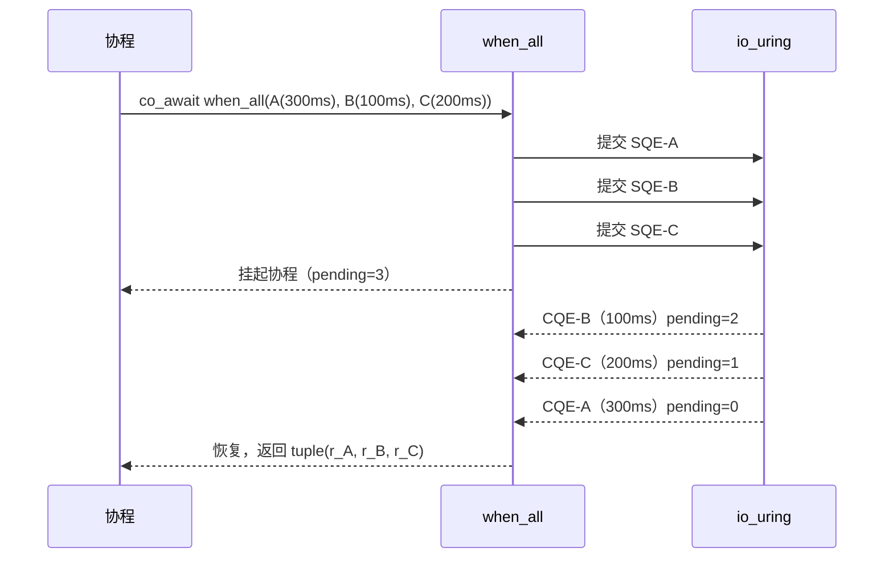

# 4.1 显式状态聚合：`when_all`

> **前置知识**：本章假设你已读完 Part 1–3（协程基础、网络 I/O、系统韧性）。

---

## 并发的两种姿态

在上一部分（Part 3）中，我们用 `co_await` 串行等待单个操作。很多情况下，多个操作之间没有依赖关系，可以**并发执行**，只需要在"所有操作都完成后"再收集结果。

`when_all` 就是为此而生：

```cpp
auto [r0, r1, r2] = co_await async::when_all(op0, op1, op2);
```

- 三个操作**同时**提交给 io_uring
- 当前协程挂起，等所有 CQE 都回来后才恢复
- 返回 `tuple<expected<R0, error_code>, expected<R1, error_code>, ...>`
- 元素顺序与参数顺序一一对应

---

## 完整代码

```cpp
#include <chrono>
#include <cstdlib>

#include <blog.h>

namespace {

using namespace std::chrono_literals;

/// 演示 1：等待所有操作完成，汇集结果
///
/// when_all 并发启动所有参数，挂起直到每一个都完成（或失败），
/// 返回 tuple<expected...>，元素顺序与参数顺序一一对应。
auto demo_when_all_basic() -> async::Task<>
{
    log::info("=== demo 1: basic when_all ===");
    auto start = std::chrono::steady_clock::now();

    // 三个"请求"并发执行（用 sleep_for 模拟不同延迟的 I/O）
    auto [r0, r1, r2] = co_await async::when_all(
        async::sleep_for(300ms),   // request A: 慢
        async::sleep_for(100ms),   // request B: 快
        async::sleep_for(200ms)    // request C: 中等
    );

    auto elapsed = std::chrono::duration_cast<std::chrono::milliseconds>(
        std::chrono::steady_clock::now() - start);

    // 总耗时取决于最慢的那个（300ms），而不是三者之和（600ms）
    log::info("all done in {}ms (expected ~300ms)", elapsed.count());

    // 每个返回值都是 std::expected<void, std::error_code>
    if (r0 && r1 && r2)
        log::info("all succeeded");
    else
        log::error("one or more failed");
}

/// 演示 2：合并两个独立操作的结果
///
/// 两个请求各自产出数据，when_all 确保二者都完成后才合并。
auto demo_merge_results() -> async::Task<>
{
    log::info("\n=== demo 2: merge results ===");
    auto start = std::chrono::steady_clock::now();

    // 并发发出两个"请求"；各自有自己的延迟
    auto [fast, slow] = co_await async::when_all(
        async::sleep_for(150ms),   // request 1
        async::sleep_for(400ms)    // request 2
    );

    auto elapsed = std::chrono::duration_cast<std::chrono::milliseconds>(
        std::chrono::steady_clock::now() - start);

    log::info("both requests done in {}ms (expected ~400ms)", elapsed.count());

    // 只有双方都成功，才执行合并逻辑
    if (!fast) {
        log::error("request 1 failed: {}", fast.error());
        co_return;
    }
    if (!slow) {
        log::error("request 2 failed: {}", slow.error());
        co_return;
    }

    log::info("results merged successfully");
}

/// 演示 3：其中一个失败时的行为
///
/// when_all 不会因某个操作失败而中途取消其他操作；
/// 所有操作运行完毕后，返回 tuple，调用者逐一检查各项结果。
auto demo_partial_failure() -> async::Task<>
{
    log::info("\n=== demo 3: partial failure ===");

    auto [r0, r1] = co_await async::when_all(
        async::sleep_for(100ms),  // 正常完成
        async::timeout(async::sleep_for(5s), 200ms)  // 超时失败
    );

    // r0 应该成功，r1 应该返回 timed_out
    log::info("r0 ok={}, r1 ok={}", static_cast<bool>(r0), static_cast<bool>(r1));

    if (!r1) {
        log::info("r1 failed with: {} (expected timed_out)", r1.error());
    }
}

} // namespace

int main()
{
    async::run(demo_when_all_basic);
    async::run(demo_merge_results);
    async::run(demo_partial_failure);
    return EXIT_SUCCESS;
}
```

---

## 运行方式

```bash
./build/tutorial/12_when_all/tutorial.12_when_all
```

```
[info] === demo 1: basic when_all ===
[info] all done in 300ms (expected ~300ms)
[info] all succeeded

[info] === demo 2: merge results ===
[info] both requests done in 400ms (expected ~400ms)
[info] results merged successfully

[info] === demo 3: partial failure ===
[info] r0 ok=true, r1 ok=false
[info] r1 failed with: Connection timed out (expected timed_out)
```

---

## 语义分析

### 时间收敛：并行 = 最慢的那个

```
demo 1 的时间线：

t=0ms    A开始(300ms), B开始(100ms), C开始(200ms)  ← 同时提交
t=100ms  B完成
t=200ms  C完成
t=300ms  A完成  ← when_all 在此恢复协程
```



三个操作总时间 **600ms**，实际等待时间 **300ms**（并发的代价只是最慢的那个）。

### 返回类型

```cpp
// when_all 的返回类型推导
auto [r0, r1, r2] = co_await async::when_all(
    async::sleep_for(300ms),   // -> std::expected<void, std::error_code>
    async::sleep_for(100ms),   // -> std::expected<void, std::error_code>
    async::sleep_for(200ms)    // -> std::expected<void, std::error_code>
);
// 解构结果：r0, r1, r2 各为 std::expected<void, std::error_code>
```

如果操作返回值（例如 `recv` 返回字节数），`expected` 中就包含实际数据：

```cpp
// 假设 read_data() 返回 expected<std::span<std::byte>, error_code>
auto [data_a, data_b] = co_await async::when_all(
    read_data(socket_a),
    read_data(socket_b)
);

if (data_a && data_b)
    merge(*data_a, *data_b);  // 双方都成功才合并
```

### 失败不中止其他操作

这一点与其他语言的实现不同：**`when_all` 不会因某个操作失败就取消其余操作**。所有操作都会运行到完成（或各自失败），然后一起返回。

```
demo 3 的时间线：

t=0ms     r0开始(100ms),  r1开始(5s，但有200ms timeout)
t=100ms   r0成功完成
t=200ms   r1超时（timed_out）← when_all 现在才恢复（等了200ms，不是100ms）
```

即使 r0 在 100ms 就完成了，`when_all` 仍然等到 r1 也结束（无论成功还是失败）才继续。

---

## `when_all` vs `all`：两个层次的并行

`when_all` 和 `all` 都是"等所有操作完成"，但面向不同层次：

| | `when_all` | `all` |
|--|-----------|-------|
| **接受类型** | `cancelable_operation`（I/O 操作） | `Task<>`（协程任务） |
| **典型参数** | `sleep_for`、`recv`、`send`、`timeout` | 任意协程函数 |
| **返回类型** | `tuple<expected<R,E>, ...>` | `void`（等所有 Task 完成） |
| **取消机制** | io_uring 链接 SQE | `stop_token` 协作取消 |

如果需要并发运行多个 `Task<>`，使用 `async::all`：

```cpp
co_await async::all(
    worker("task-A", 120ms),
    worker("task-B", 400ms),
    worker("task-C", 260ms)
);
```

`async::all` 与 `async::any` 将在 4.3 节（任务树的协作取消）详细介绍。

---

## 本章小结

- **`when_all` 并发等待**：同时提交所有操作，挂起直到全部完成。
- **返回 `tuple<expected...>`**：调用者逐一检查各项结果，失败不中止其他操作。
- **总时间 = 最慢的那个**：并发执行的代价只是等待最慢操作，而不是各操作耗时之和。

下一节：[4.2 竞速与抢占（when_any）](09_when_any.md) — 同一请求发给多个 endpoint，取先返回的。
