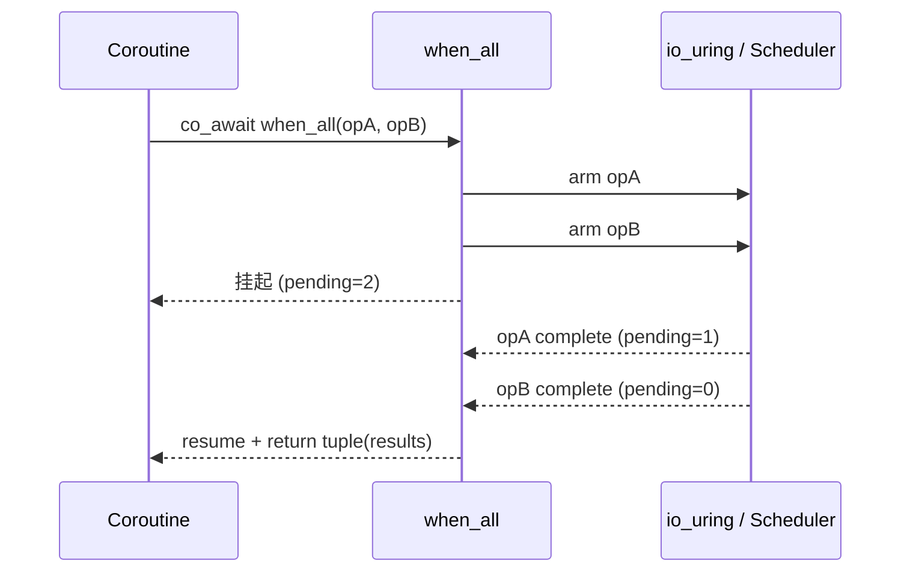

# 4.1 显式状态聚合：`when_all`

> **前置知识**：本章假设你已读完 Part 1–3（协程基础、网络 I/O、系统韧性）。
> **源文件**：[tutorial/12_when_all/main.cpp](../../tutorial/12_when_all/main.cpp)
> **下一节**：[4.2 竞速与抢占：when_any](09_when_any.md)

---

`when_all` 并发提交多个 I/O 操作，**全部完成后统一收敛结果**。与 Task 级并发不同，它直接操作底层 awaiter，适用于三类工业场景：全双工收发、Scatter-Gather 聚合、Quorum 多写。

---

## 完整代码

```cpp
#include <chrono>
#include <cstdlib>

#include <blog.h>

using namespace std::chrono_literals;

namespace {

auto demo_full_duplex() -> async::Task<>
{
    log::info("=== Demo 1: 全双工并发 I/O (零内存分配) ===");

    // 真实场景下这里会是 net::send(fd_out) 和 net::receive(fd_in)
    // 我们用 sleep_for 模拟底层的 I/O 等待时间
    auto start = std::chrono::steady_clock::now();

    log::info("[Proxy] 正在同时发起网络转发与接收...");

    auto [send_res, recv_res] = co_await async::when_all(  // <-- 并发投递两个操作
        async::sleep_for(50ms),
        async::sleep_for(150ms)
    );

    auto ms = std::chrono::duration_cast<std::chrono::milliseconds>(
        std::chrono::steady_clock::now() - start);

    log::info("[Proxy] 全双工 I/O 结束，总耗时: {}ms (预期受限于最慢的 ~150ms)", ms.count());

    // 独立检查每一条 I/O 链路的健康状态
    if (send_res && recv_res) {
        log::info("[Proxy] 数据转发与接收均成功！链路保持活跃。");
    } else {
        log::error("[Proxy] 链路发生异常中断。");
    }
}

auto demo_sla_scatter_gather() -> async::Task<>
{
    log::info("\n=== Demo 2: 带 SLA 熔断的并发拉取 (Partial Failure) ===");

    log::info("[Gateway] 开始并发请求 UserDB 和 ThirdPartyAPI...");

    // 将不稳定的第三方调用包裹在 timeout 组合子里，与稳定的 DB 请求一起投递
    auto [db_res, api_res] = co_await async::when_all(
        async::sleep_for(100ms),
        async::timeout(async::sleep_for(5s), 200ms)  // <-- 边缘服务 SLA 熔断
    );

    // 1. 处理核心数据 (必须成功)
    if (db_res) {
        log::info("[Gateway] UserDB 核心数据拉取成功！");
    } else {
        log::error("[Gateway] UserDB 拉取失败，触发致命级业务错误！");
        co_return;
    }

    // 2. 处理边缘数据 (允许服务降级)
    if (api_res) {
        log::info("[Gateway] ThirdPartyAPI 数据拉取成功！");
    } else if (api_res.error() == std::errc::timed_out) {
        log::warning("[Gateway] ThirdPartyAPI 响应超时 (已熔断)，对该模块进行缓存降级处理。");
    } else {
        log::error("[Gateway] ThirdPartyAPI 发生其他底层错误: {}", api_res.error());
    }
}

auto demo_quorum_write() -> async::Task<>
{
    log::info("\n=== Demo 3: 高可用并发双写 (Quorum Write) ===");

    log::info("[Storage] 正在将区块数据并发刷入主备节点...");

    auto [primary_res, backup_res] = co_await async::when_all(
        async::sleep_for(80ms),
        async::sleep_for(500ms)   // <-- 等待最慢的节点完成
    );

    // 等待全部完成后的多数派决议 (Quorum Consensus)
    if (primary_res && backup_res) {
        log::info("[Storage] 主备节点均写入成功，达成强一致性 (Strong Consistency)！");
    } else if (primary_res || backup_res) {
        log::warning("[Storage] 仅单个节点写入成功，警报：系统降级为弱一致性。");
    } else {
        log::error("[Storage] 主备节点全部写入失败！存在极高数据丢失风险！");
    }
}

} // namespace

int main()
{
    async::run(demo_full_duplex);
    async::run(demo_sla_scatter_gather);
    async::run(demo_quorum_write);
    return EXIT_SUCCESS;
}
```

---

## 运行方式

```bash
./build/tutorial/12_when_all/tutorial.12_when_all
```

实际输出：

```text
[2026-05-07 16:59:13.749] [131007] [info] === Demo 1: 全双工并发 I/O (零内存分配) ===
[2026-05-07 16:59:13.749] [131007] [info] [Proxy] 正在同时发起网络转发与接收...
[2026-05-07 16:59:13.899] [131007] [info] [Proxy] 全双工 I/O 结束，总耗时: 150ms (预期受限于最慢的 ~150ms)
[2026-05-07 16:59:13.899] [131007] [info] [Proxy] 数据转发与接收均成功！链路保持活跃。
[2026-05-07 16:59:13.899] [131007] [info]
=== Demo 2: 带 SLA 熔断的并发拉取 (Partial Failure) ===
[2026-05-07 16:59:13.899] [131007] [info] [Gateway] 开始并发请求 UserDB 和 ThirdPartyAPI...
[2026-05-07 16:59:14.100] [131007] [info] [Gateway] UserDB 核心数据拉取成功！
[2026-05-07 16:59:14.100] [131007] [warning] [Gateway] ThirdPartyAPI 响应超时 (已熔断)，对该模块进行缓存降级处理。
[2026-05-07 16:59:14.100] [131007] [info]
=== Demo 3: 高可用并发双写 (Quorum Write) ===
[2026-05-07 16:59:14.100] [131007] [info] [Storage] 正在将区块数据并发刷入主备节点...
[2026-05-07 16:59:14.600] [131007] [info] [Storage] 主备节点均写入成功，达成强一致性 (Strong Consistency) ！
```

---

## 逐步解析

### 1. `when_all` 的执行模型

`when_all(op0, op1, ...)` 的关键是：

1. 并发挂起/投递所有操作
2. 等待所有操作结束
3. 返回 `tuple<expected<...>, expected<...>, ...>`，顺序与参数顺序一致



### 2. 适合什么场景

1. 全双工：读写彼此独立，天然并发
2. SLA 熔断：边缘服务超时可以降级，不阻塞核心路径
3. Quorum 决议：必须收集全部结果再判断一致性级别

### 3. 与 `all` 的边界

| 组合器 | 层级 | 输入类型 | 典型用途 |
|---|---|---|---|
| `when_all` | operation 级 | awaitable operations | 并发 I/O 收敛 |
| `all` | task 级 | `Task<>` | 协程任务树并发 |

---

## 本章小结

- `when_all` 是 operation 级并发聚合，不是“计算线程池”工具。
- 它适用于全双工、Scatter-Gather、Quorum Write 这类 I/O 主导场景。
- 组合 `timeout` 可以实现局部失败隔离和服务降级。

> **下一节**：[4.2 竞速与抢占：when_any](09_when_any.md)
