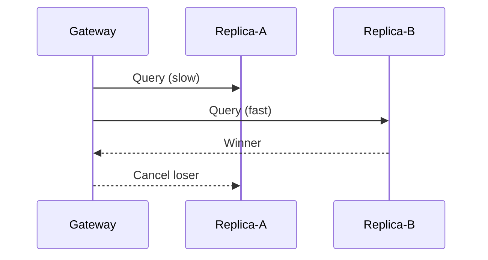

# 4.2 竞速与抢占：when_any

> **前置知识**：本章假设你已读完 [4.1（when_all）](08_when_all.md)。
> **源文件**：[tutorial/13_when_any/main.cpp](../../tutorial/13_when_any/main.cpp)
> **下一节**：[4.3 任务树协作取消：all/any](10_any.md)

---

`when_any` 并发发起多个操作，**首个完成即返回，其余自动取消**。这一特性天然契合三类模式：冗余请求、SLA 保护、全局熔断。

---

## 场景 1：Hedged Requests（冗余请求）

目标：对两个副本并发请求，谁先返回用谁。



---

## 场景 2：SLA 抢占（主链路 vs 保护线）

目标：主链路请求还在跑时，同时挂一个 SLA 保护线；保护线先触发就立刻降级。

这本质是控制平面抢占数据平面，避免慢请求拖垮尾延迟。

---

## 场景 3：Deadline Poison Pill（全局熔断）

目标：长轮询可能挂很久，用全局 deadline 作为毒丸信号，超时就立即打断。

这个模式常用于统一熔断、优雅收敛和慢链路隔离。

---

## 完整代码

对应文件：[tutorial/13_when_any/main.cpp](../../tutorial/13_when_any/main.cpp)

```cpp
#include <chrono>
#include <cstdlib>

#include <blog.h>

using namespace std::chrono_literals;

namespace {


auto demo_hedged_requests() -> async::Task<>
{
    log::info("=== Demo 1: 高可用冗余请求 (Hedged Requests) ===");
    auto start = std::chrono::steady_clock::now();

    auto result = co_await async::when_any(    // <-- 首个完成即胜出
        async::sleep_for(150ms),
        async::sleep_for(50ms)
    );

    auto ms = std::chrono::duration_cast<std::chrono::milliseconds>(
        std::chrono::steady_clock::now() - start).count();

    if (result) {
        log::info("[Gateway] 冗余请求胜利！仅耗时 {}ms 拿到了数据。(慢节点已被自动 Cancel)", ms);
    } else {
        log::error("[Gateway] 所有副本全部请求失败: {}", result.error());
    }
}

auto demo_heterogeneous_multiplexing() -> async::Task<>
{
    log::info("\n=== Demo 2: SLA 抢占竞速 (Primary I/O vs SLA Guard) ===");
    log::info("[Gateway] 主链路请求进行中，同时启用 SLA 保护线...");

    auto result = co_await async::when_any(
        async::sleep_for(500ms),
        async::timeout(async::sleep_for(5s), 80ms)  // <-- SLA 保护线
    );

    if (result) {
        log::info("[Gateway] 主链路在 SLA 内返回，继续主路径处理。");
    } else {
        log::warning("[Gateway] SLA 保护线触发（{}），主链路被取消并执行降级。", result.error());
    }
}

auto demo_poison_pill() -> async::Task<>
{
    log::info("\n=== Demo 3: Deadline Poison Pill (全局熔断) ===");
    log::info("[Client] 客户端发起长轮询，请求可能挂起很久...");

    auto result = co_await async::when_any(
        async::sleep_for(10s),
        async::timeout(async::sleep_for(5s), 100ms)  // <-- 全局 deadline 毒丸
    );

    if (!result) {
        log::info("[Client] 收到熔断信号（{}），长轮询已被瞬间打断。", result.error());
    } else {
        log::info("[Client] 长轮询正常结束。");
    }
}

} // namespace

int main()
{
    async::run(demo_hedged_requests);
    async::run(demo_heterogeneous_multiplexing);
    async::run(demo_poison_pill);
    return EXIT_SUCCESS;
}
```

---

## 运行方式

```bash
./build/tutorial/13_when_any/tutorial.13_when_any
```

实际输出：

```text
[2026-05-07 17:07:14.155] [133108] [info] === Demo 1: 高可用冗余请求 (Hedged Requests) ===
[2026-05-07 17:07:14.205] [133108] [info] [Gateway] 冗余请求胜利！仅耗时 50ms 拿到了数据。(慢节点已被自动 Cancel)

[2026-05-07 17:07:14.206] [133108] [info] === Demo 2: SLA 抢占竞速 (Primary I/O vs SLA Guard) ===
[2026-05-07 17:07:14.206] [133108] [info] [Gateway] 主链路请求进行中，同时启用 SLA 保护线...
[2026-05-07 17:07:14.286] [133108] [warning] [Gateway] SLA 保护线触发（Connection timed out），主链路被取消并执行降级。

[2026-05-07 17:07:14.286] [133108] [info] === Demo 3: Deadline Poison Pill (全局熔断) ===
[2026-05-07 17:07:14.286] [133108] [info] [Client] 客户端发起长轮询，请求可能挂起很久...
[2026-05-07 17:07:14.386] [133108] [info] [Client] 收到熔断信号（Connection timed out），长轮询已被瞬间打断。
```

---

## 逐步解析

### 场景 1：Hedged Requests（冗余请求）

对两个副本并发请求，谁先返回用谁，另一个自动取消。


### 场景 2：SLA 抢占（主链路 vs 保护线）

主链路请求还在跑时，同时挂一个 SLA 保护线——保护线先触发就立刻降级。这本质是控制平面抢占数据平面，避免慢请求拖垃尾延迟。

### 场景 3：Deadline Poison Pill（全局熔断）

长轮询可能挂很久，用全局 deadline 作为毒丸信号，超时就立即打断。常用于统一熔断、优雅收敛和慢链路隔离。

### `when_any` 的返回值类型

- 所有操作返回类型相同：直接返回 `expected<R, E>`。
- 返回类型不同：返回 `variant<expected<R1,E>, expected<R2,E>, ...>`，可通过 `index()` 判断胜出分支。

> **Note**：loser 的取消直接下发 `CANCEL SQE` 进入 io_uring，无额外线程或锁。

---

## 本章小结

- `when_any` 的核心价值是"竞速 + 取消"：首个完成即胜出，其余立即被 Cancel。
- 三种工业场景——冗余请求、SLA 抢占、全局熔断——都是同一原语的不同应用。
- 运行时开销极低：取消动作直接下发 `CANCEL SQE`，不引入额外线程或锁。

> **下一节**：[4.3 任务树协作取消：all/any](10_any.md)
