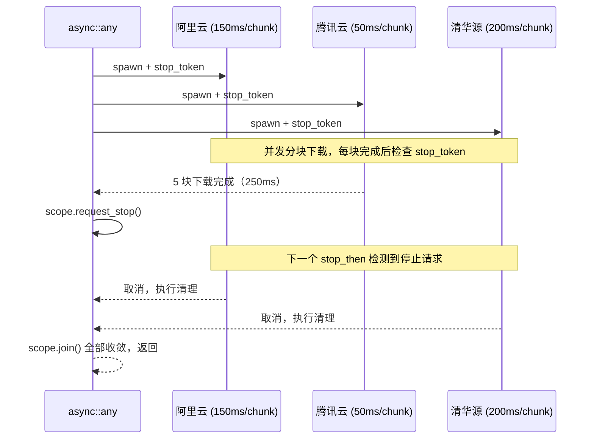

# 4.3 任务树的协作取消：`all` 与 `any`

> **前置知识**：本章假设你已读完 [4.1（when_all）](08_when_all.md) 与 [4.2（when_any）](09_when_any.md)。
> **源文件**：[tutorial/14_all_any/main.cpp](../../tutorial/14_all_any/main.cpp)
> **下一节**：[4.4 跨任务通信：Channel 与 ChannelPipe](11_channel.md)

---

`all` 与 `any` 是 **Task 级**组合器——它们接受完整的业务协程，并发运行，通过 `stop_token` 协作取消。与底层的 `when_all` / `when_any` 不同，每个 Task 都拥有独立的协程帧，可以包含任意复杂的多步逻辑。

| 维度 | `when_all` / `when_any` | `all` / `any` |
|------|------------------------|---------------|
| 编排层级 | operation 级（I/O awaiter） | Task 级（完整协程） |
| 参数类型 | `cancelable_operation` | `stop_awaitable_provider`（`async::task` 包装） |
| 取消机制 | 向 io_uring 提交 CANCEL SQE | `scope.request_stop()` + `stop_token` 协作取消 |
| 返回值 | 胜者 / 全部结果 | `void`（等所有任务收敛） |

---

## 场景 1：微服务数据聚合（`async::all`）

BFF 网关需要并发拉取三个微服务的数据。每个服务调用都包含"建立连接 → 等待 I/O → 反序列化"三步，是完整的多步状态机，无法用单一的底层 awaiter 表达。

```cpp
auto fetch_and_process(std::string service_name, std::chrono::milliseconds latency) -> async::Task<>
{
    log::info("[{}] 1. 开始建立连接并发起 RPC 请求...", service_name);
    co_await async::sleep_for(latency);  // 网络 I/O
    log::info("[{}] 2. 网络响应到达，开始进行 JSON 反序列化...", service_name);
    co_await async::sleep_for(10ms);     // CPU 处理
    log::info("[{}] 3. 数据处理完毕！", service_name);
}

auto demo_task_all() -> async::Task<>
{
    co_await async::all(
        fetch_and_process("User-Service",    120ms),
        fetch_and_process("Order-Service",   400ms),
        fetch_and_process("Message-Service", 260ms)
    );
    // 三路数据全部就绪，总耗时由最慢的 Order-Service 决定（~410ms）
}
```

`async::all` 为每个 Task 分配独立的协程帧并并发运行，等全部完成后收敛。最慢的任务决定整体耗时。

---

## 场景 2：最快镜像源竞速（`async::any`）

同时连接三个镜像源下载文件。最快的一个完成后，通过 `stop_token` 安全终止其余下载，防止继续占用带宽。

```cpp
auto download_from_mirror(
    std::string mirror_name,
    std::chrono::milliseconds chunk_delay,
    std::stop_token token  // async::task 自动注入，必须按值传入
) -> async::Task<>
{
    for (int chunk = 1; chunk <= 5; ++chunk) {
        auto result = co_await async::stop_then(async::sleep_for(chunk_delay), token);

        if (!result && result.error() == std::errc::operation_canceled) {
            log::warning("[{}] 收到取消信号，放弃剩余下载，清理临时文件...", mirror_name);
            co_return;  // 清理后安全退出
        }

        log::info("[{}] 已下载区块 {}/5", mirror_name, chunk);
    }
    log::info("[{}] 下载完成！", mirror_name);
}

auto demo_task_any() -> async::Task<>
{
    co_await async::any(
        async::task(download_from_mirror, "阿里云镜像", 150ms),
        async::task(download_from_mirror, "腾讯云镜像",  50ms),  // Winner
        async::task(download_from_mirror, "清华源镜像", 200ms)
    );
}
```

取消信号的传播路径：



### 协作式取消的关键优势

与 `when_any` 在内核层面强制终止 I/O 不同，`async::any` 的取消会**路由回业务代码**。落败的下载任务收到 `operation_canceled` 后可以执行任意清理逻辑——关闭文件句柄、删除临时文件、上报指标——这是构建有状态长任务必须的保证。

---

## 完整代码

对应文件：[tutorial/14_all_any/main.cpp](../../tutorial/14_all_any/main.cpp)

```cpp
#include <chrono>
#include <cstdlib>
#include <string>
#include <stop_token>

#include <blog.h>

using namespace std::chrono_literals;

namespace {

// ============================================================================
// 场景 1：Task 级多路并发 (async::all)
// ============================================================================

auto fetch_and_process(std::string service_name, std::chrono::milliseconds latency) -> async::Task<>
{
    log::info("[{}] 1. 开始建立连接并发起 RPC 请求...", service_name);
    co_await async::sleep_for(latency);
    log::info("[{}] 2. 网络响应到达，开始进行 JSON 反序列化...", service_name);
    co_await async::sleep_for(10ms);
    log::info("[{}] 3. 数据处理完毕！", service_name);
}

auto demo_task_all() -> async::Task<>
{
    log::info("=== Demo 1: Task 级多路并发 (微服务聚合 BFF) ===");
    auto start = std::chrono::steady_clock::now();

    co_await async::all(
        fetch_and_process("User-Service",    120ms),
        fetch_and_process("Order-Service",   400ms),
        fetch_and_process("Message-Service", 260ms)
    );

    auto ms = std::chrono::duration_cast<std::chrono::milliseconds>(
        std::chrono::steady_clock::now() - start).count();
    log::info("[Gateway] 所有微服务数据聚合完毕，总耗时: {}ms (预期约 410ms)。下发给前端。", ms);
}

// ============================================================================
// 场景 2：Task 级协作式取消 (async::any)
// ============================================================================

auto download_from_mirror(
    std::string mirror_name,
    std::chrono::milliseconds chunk_delay,
    std::stop_token token
) -> async::Task<>
{
    log::info("[{}] 建立连接，准备分块下载文件...", mirror_name);

    for (int chunk = 1; chunk <= 5; ++chunk) {
        auto result = co_await async::stop_then(async::sleep_for(chunk_delay), token);

        if (!result && result.error() == std::errc::operation_canceled) {
            log::warning("[{}] 收到取消信号，放弃剩余下载，清理临时文件...", mirror_name);
            co_return;
        }

        log::info("[{}] 已下载区块 {}/5", mirror_name, chunk);
    }

    log::info("[{}] 下载完成！", mirror_name);
}

auto demo_task_any() -> async::Task<>
{
    log::info("\n=== Demo 2: Task 级协作式取消 (最快镜像源竞速) ===");
    auto start = std::chrono::steady_clock::now();

    co_await async::any(
        async::task(download_from_mirror, "阿里云镜像", 150ms),
        async::task(download_from_mirror, "腾讯云镜像",  50ms),
        async::task(download_from_mirror, "清华源镜像", 200ms)
    );

    auto ms = std::chrono::duration_cast<std::chrono::milliseconds>(
        std::chrono::steady_clock::now() - start).count();
    log::info("[System] 文件下载任务完成，总耗时: {}ms。落败节点已被安全回收。", ms);
}

} // namespace

int main()
{
    async::run(demo_task_all);
    async::run(demo_task_any);
    return EXIT_SUCCESS;
}
```

---

## 运行方式

运行命令：`./build/tutorial/14_all_any/tutorial.14_all_any`

运行结果：

```text
[2026-05-07 17:22:54.940] [137995] [info] === Demo 1: Task 级多路并发 (微服务聚合 BFF) ===
[2026-05-07 17:22:54.940] [137995] [info] [User-Service] 1. 开始建立连接并发起 RPC 请求...
[2026-05-07 17:22:54.940] [137995] [info] [Order-Service] 1. 开始建立连接并发起 RPC 请求...
[2026-05-07 17:22:54.940] [137995] [info] [Message-Service] 1. 开始建立连接并发起 RPC 请求...
[2026-05-07 17:22:55.060] [137995] [info] [User-Service] 2. 网络响应到达，开始进行 JSON 反序列化...
[2026-05-07 17:22:55.070] [137995] [info] [User-Service] 3. 数据处理完毕！
[2026-05-07 17:22:55.200] [137995] [info] [Message-Service] 2. 网络响应到达，开始进行 JSON 反序列化...
[2026-05-07 17:22:55.210] [137995] [info] [Message-Service] 3. 数据处理完毕！
[2026-05-07 17:22:55.340] [137995] [info] [Order-Service] 2. 网络响应到达，开始进行 JSON 反序列化...
[2026-05-07 17:22:55.350] [137995] [info] [Order-Service] 3. 数据处理完毕！
[2026-05-07 17:22:55.350] [137995] [info] [Gateway] 所有微服务数据聚合完毕，总耗时: 410ms (预期约 410ms)。下发给前端。

[2026-05-07 17:22:55.350] [137995] [info] === Demo 2: Task 级协作式取消 (最快镜像源竞速) ===
[2026-05-07 17:22:55.350] [137995] [info] [阿里云镜像] 建立连接，准备分块下载文件...
[2026-05-07 17:22:55.350] [137995] [info] [腾讯云镜像] 建立连接，准备分块下载文件...
[2026-05-07 17:22:55.350] [137995] [info] [清华源镜像] 建立连接，准备分块下载文件...
[2026-05-07 17:22:55.400] [137995] [info] [腾讯云镜像] 已下载区块 1/5
[2026-05-07 17:22:55.450] [137995] [info] [腾讯云镜像] 已下载区块 2/5
[2026-05-07 17:22:55.500] [137995] [info] [阿里云镜像] 已下载区块 1/5
[2026-05-07 17:22:55.500] [137995] [info] [腾讯云镜像] 已下载区块 3/5
[2026-05-07 17:22:55.550] [137995] [info] [清华源镜像] 已下载区块 1/5
[2026-05-07 17:22:55.550] [137995] [info] [腾讯云镜像] 已下载区块 4/5
[2026-05-07 17:22:55.601] [137995] [info] [腾讯云镜像] 已下载区块 5/5
[2026-05-07 17:22:55.601] [137995] [info] [腾讯云镜像] 下载完成！
[2026-05-07 17:22:55.601] [137995] [warning] [阿里云镜像] 收到取消信号，放弃剩余下载，清理临时文件...
[2026-05-07 17:22:55.601] [137995] [warning] [清华源镜像] 收到取消信号，放弃剩余下载，清理临时文件...
[2026-05-07 17:22:55.601] [137995] [info] [System] 文件下载任务完成，总耗时: 250ms。落败节点已被安全回收。
```

---

## 关键语义

1. **`async::task` 的作用**

   `async::task` 将函数+参数绑定为 `stop_awaitable_provider`。`any` 内部启动每个协程时自动注入统一的 `stop_token`。`stop_token` 必须**按值**传入——协程帧存储参数副本，用引用会产生悬空引用（UB）。

2. **结构化并发保证**

   `co_await async::any(...)` 返回时，所有子任务必定已退出——无论是正常完成还是响应取消。不存在悬挂在事件循环中的孤儿协程帧。

3. **取消是协作式的**

   `any` 通过 `stop_token` 发出停止请求，任务在下一个取消点（`stop_then`）响应。这给了业务代码执行清理的机会，是处理有状态长任务的关键保证。

---

## 本章小结

- `all`：并发运行所有 Task，等全部完成，最慢者决定整体耗时。
- `any`：并发运行所有 Task，第一个完成后广播 stop 信号，等全部收敛退出。
- 两者均保证结构化并发：调用返回时所有子任务帧已销毁，无泄漏。

下一节：[4.4 跨任务通信：Channel 与 ChannelPipe](11_channel.md)
