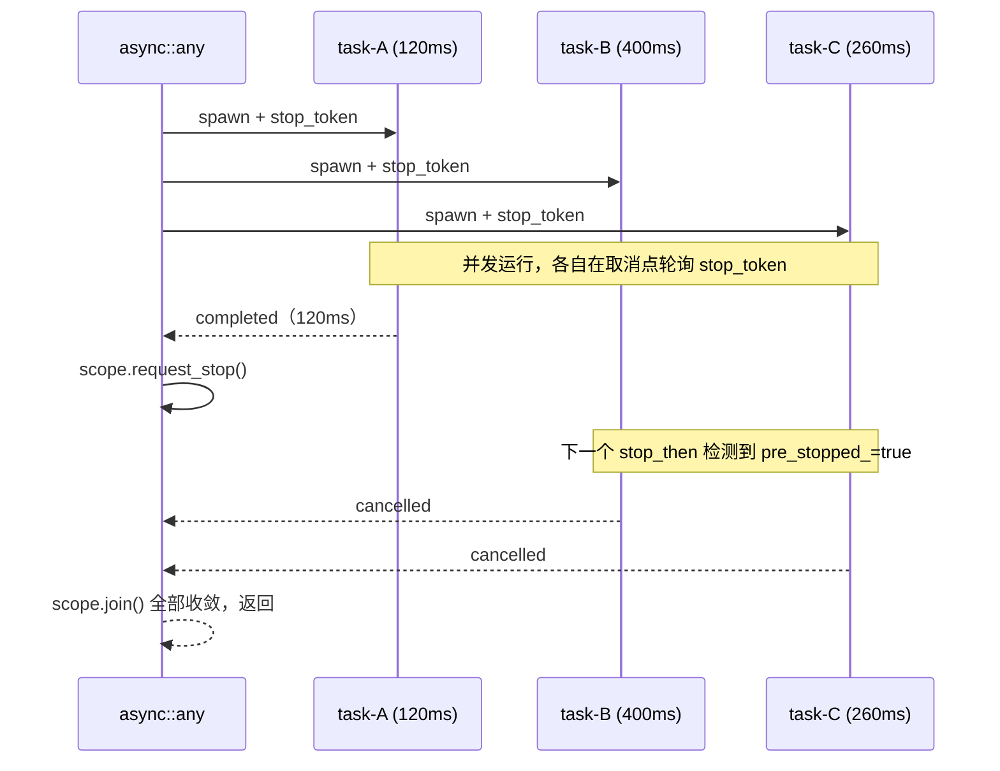

# 4.3 任务树的协作取消：`all` 与 `any`

> **前置知识**：本章假设你已读完 [4.1（when_all）](08_when_all.md) 与 [4.2（when_any）](09_when_any.md)。

---

## `all` 与 `any` 解决什么问题

`when_all` / `when_any` 是 **operation 级**组合器——它们将多个 I/O awaitable 打包，等结果汇总或竞速完成。  
`all` / `any` 是 **Task 级**组合器——它们接受函数（通过 `async::task` 包装），以协程形式并发运行，并通过 `stop_token` 协作取消。

两者覆盖不同场景：

| 维度 | `when_all` / `when_any` | `all` / `any` |
|------|------------------------|---------------|
| 编排层级 | operation 级 | Task 级 |
| 参数类型 | awaitable | `stop_awaitable_provider`（由 `async::task` 生成） |
| 取消机制 | 内部取消其余 operation | `scope.request_stop()` + `stop_token` 协作取消 |
| 返回值 | 胜者 / 全部结果 | `void`（等所有任务收敛完成） |

---

## 完整代码

```cpp
#include <chrono>
#include <cstdlib>

#include <blog.h>

namespace {

using namespace std::chrono_literals;

// ─── async::all：等所有 Task 完成 ────────────────────────────────────────────

auto worker(const char* name, std::chrono::milliseconds duration) -> async::Task<>
{
    log::info("{}: started", name);
    co_await async::sleep_for(duration);
    log::info("{}: completed", name);
}

auto demo_all() -> async::Task<>
{
    log::info("=== demo 1: async::all ===");
    auto start = std::chrono::steady_clock::now();

    co_await async::all(
        worker("A", 120ms),
        worker("B", 400ms),
        worker("C", 260ms)
    );

    auto elapsed = std::chrono::duration_cast<std::chrono::milliseconds>(
        std::chrono::steady_clock::now() - start);
    log::info("all done in {}ms (expected ~400ms)", elapsed.count());
}

// ─── async::any：第一个完成即取消其余 ───────────────────────────────────────

auto cancellable_worker(
    const char* name,
    std::chrono::milliseconds total,
    std::stop_token token          // ← by value
) -> async::Task<>
{
    log::info("{}: started", name);

    auto remaining = total;
    constexpr auto quantum = 20ms;

    while (remaining > 0ms) {
        auto step = std::min(remaining, quantum);
        auto result = co_await async::stop_then(async::sleep_for(step), token);
        if (!result) {
            log::info("{}: cancelled", name);
            co_return;
        }
        remaining -= step;
    }

    log::info("{}: completed", name);
}

auto demo_any() -> async::Task<>
{
    log::info("\n=== demo 2: async::any ===");
    auto start = std::chrono::steady_clock::now();

    co_await async::any(
        async::task(cancellable_worker, "task-A", 120ms),
        async::task(cancellable_worker, "task-B", 400ms),
        async::task(cancellable_worker, "task-C", 260ms)
    );

    auto elapsed = std::chrono::duration_cast<std::chrono::milliseconds>(
        std::chrono::steady_clock::now() - start);
    log::info("any done in {}ms (expected ~120ms)", elapsed.count());
}

// ─── demo 3：when_any（I/O 级）vs any（Task 级）对比 ─────────────────────────

auto demo_difference() -> async::Task<>
{
    log::info("\n=== demo 3: when_any vs any ===");

    {
        auto start = std::chrono::steady_clock::now();
        auto result = co_await async::when_any(
            async::sleep_for(300ms),
            async::sleep_for(100ms)   // winner
        );
        auto ms = std::chrono::duration_cast<std::chrono::milliseconds>(
            std::chrono::steady_clock::now() - start).count();
        log::info("when_any: done in {}ms, ok={}", ms, static_cast<bool>(result));
    }

    {
        auto start = std::chrono::steady_clock::now();
        co_await async::any(
            async::task(cancellable_worker, "fast", 100ms),
            async::task(cancellable_worker, "slow", 300ms)
        );
        auto ms = std::chrono::duration_cast<std::chrono::milliseconds>(
            std::chrono::steady_clock::now() - start).count();
        log::info("any: done in {}ms", ms);
    }
}

} // namespace

int main()
{
    async::run(demo_all);
    async::run(demo_any);
    async::run(demo_difference);
    return EXIT_SUCCESS;
}
```

---

## 运行方式

```bash
./build/tutorial/14_all_any/tutorial.14_all_any
```

实际输出：

```
[2026-05-07 10:14:08.492] [4180] [info] === demo 1: async::all ===
[2026-05-07 10:14:08.492] [4180] [info] A: started
[2026-05-07 10:14:08.492] [4180] [info] B: started
[2026-05-07 10:14:08.492] [4180] [info] C: started
[2026-05-07 10:14:08.613] [4180] [info] A: completed
[2026-05-07 10:14:08.755] [4180] [info] C: completed
[2026-05-07 10:14:08.893] [4180] [info] B: completed
[2026-05-07 10:14:08.893] [4180] [info] all done in 400ms (expected ~400ms)
[2026-05-07 10:14:08.893] [4180] [info] 
=== demo 2: async::any ===
[2026-05-07 10:14:08.893] [4180] [info] task-A: started
[2026-05-07 10:14:08.893] [4180] [info] task-B: started
[2026-05-07 10:14:08.893] [4180] [info] task-C: started
[2026-05-07 10:14:09.016] [4180] [info] task-A: completed
[2026-05-07 10:14:09.016] [4180] [info] task-B: cancelled
[2026-05-07 10:14:09.016] [4180] [info] task-C: cancelled
[2026-05-07 10:14:09.016] [4180] [info] any done in 123ms (expected ~120ms)
[2026-05-07 10:14:09.016] [4180] [info] 
=== demo 3: when_any vs any ===
[2026-05-07 10:14:09.118] [4180] [info] when_any: done in 102ms, ok=true
[2026-05-07 10:14:09.118] [4180] [info] fast: started
[2026-05-07 10:14:09.118] [4180] [info] slow: started
[2026-05-07 10:14:09.220] [4180] [info] fast: completed
[2026-05-07 10:14:09.220] [4180] [info] slow: cancelled
[2026-05-07 10:14:09.220] [4180] [info] any: done in 102ms
```

---

## 逐步解析

### Demo 1：`async::all`

```cpp
co_await async::all(
    worker("A", 120ms),
    worker("B", 400ms),
    worker("C", 260ms)
);
```

`async::all` 并发启动所有 Task，等**全部完成**后才恢复调用者。没有取消——最慢的任务决定整体耗时（~400ms）。`worker` 是普通协程，不需要 `stop_token`。

### Demo 2：`async::any`

```cpp
co_await async::any(
    async::task(cancellable_worker, "task-A", 120ms),
    async::task(cancellable_worker, "task-B", 400ms),
    async::task(cancellable_worker, "task-C", 260ms)
);
```

`async::any` 并发启动所有 Task，第一个完成的任务（task-A，~120ms）触发 `scope.request_stop()`，其余任务在下一个取消点收到信号后退出。`async::any` 等所有任务都**收敛完成**后才返回，因此不存在悬挂任务泄漏。

取消信号的传播路径：



#### `async::task` 的作用

`async::task` 将函数+参数绑定为 `stop_awaitable_provider`——一个接受 `stop_token` 并返回 awaitable 的可调用对象。`any` 内部为每个 provider 启动协程时，把统一的 `stop_token` 传入。

`stop_token` 必须**按值**传入函数：协程帧存储参数副本，若用引用则帧持有调用栈上的悬空引用（UB）。

#### `cancellable_worker` 的取消点设计

```cpp
auto result = co_await async::stop_then(async::sleep_for(step), token);
if (!result) {
    log::info("{}: cancelled", name);
    co_return;
}
```

`stop_then` 在挂起前检查 `token.stop_requested()`：若已请求停止，立即返回 `operation_canceled` 而不提交 io_uring 操作，避免无谓的系统调用。每 20ms 一个量子确保任务在收到信号后最多 20ms 内退出。

### Demo 3：`when_any` vs `any` 的层级差异

两者表面行为相近（都是"谁先完成"），但机制完全不同：

- **`when_any`**：在 **operation 层**工作。直接向 io_uring 提交取消 SQE，内核层面终止挂起的 I/O 操作，返回胜者结果。
- **`any`**：在 **Task 层**工作。通过 `stop_token` 发出信号，每个任务自行检测并退出——取消是**协作式**的，任务决定何时、如何响应。

`when_any` 适合无状态的 I/O 竞速；`any` 适合有内部状态、需要清理资源的任务树。

---

## 结构化并发与控制权收敛

`async::all` 和 `async::any` 都遵循**结构化并发**原则：子任务的生命周期严格嵌套在父调用的生命周期内。`co_await async::any(...)` 返回时，所有子任务必定已退出，不会有任何协程帧悬挂在事件循环中。

与 `co_spawn`（fire-and-forget）的对比：`co_spawn` 的任务生命周期不受父协程约束，调用者无法知道任务何时结束；`all` / `any` 保证调用点之后任务已完全收敛。

---

## 本章小结

- `all`：并发运行所有 Task，等全部完成。无取消。
- `any`：并发运行所有 Task，第一个完成后广播 stop 信号，等全部收敛。取消是协作式的——任务必须在适当位置轮询 `stop_token`。
- 两者均保证结构化并发：调用返回时子任务帧已全部销毁，无悬挂泄漏。

---

下一节：[4.4 跨任务通信：Channel 与 ChannelPipe](11_channel.md)
