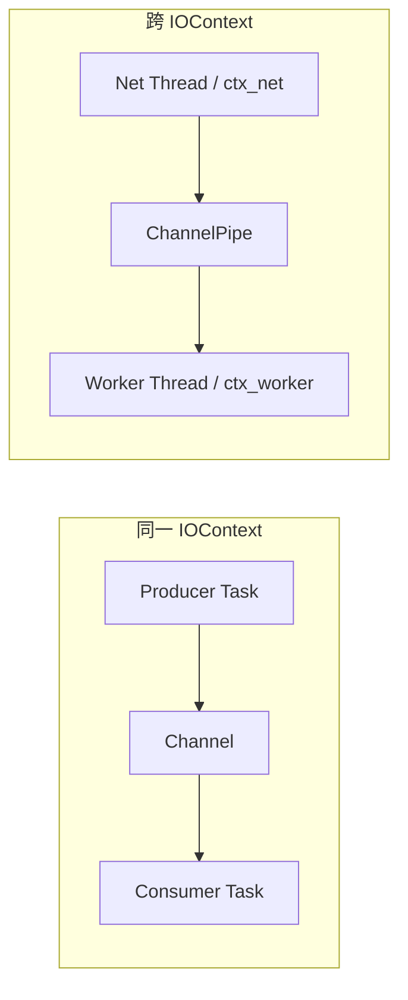
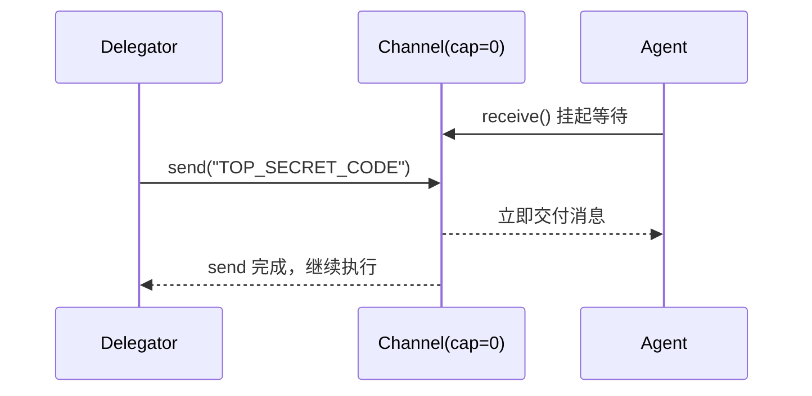
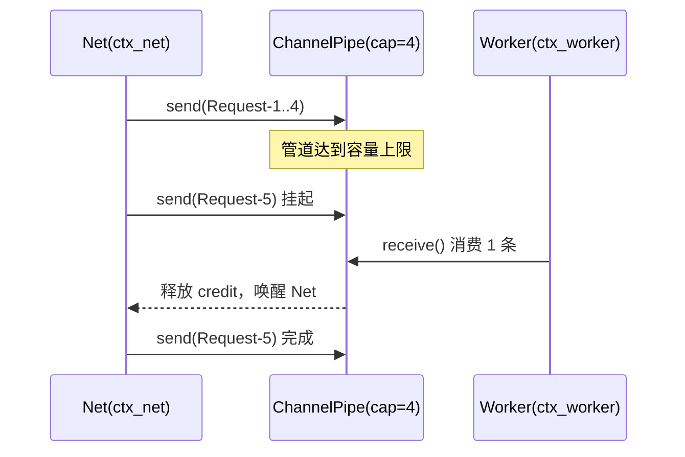

# 4.4 跨任务通信：`Channel<T>` 与 `ChannelPipe<T>`

> **前置知识**：本章假设你已读完 [4.3（all / any）](10_any.md)，理解结构化并发与协作取消。
> **源文件**：[tutorial/15_channel/main.cpp](../../tutorial/15_channel/main.cpp)

---

## 先建立心智模型

这一章解决的问题不是“怎么启动并发任务”，而是“任务之间如何安全传递数据”。

- 同一个 IOContext（同线程）里，目标是低开销协作：用 `Channel<T>`。
- 跨 IOContext（跨线程）时，目标是解耦 + 背压：用 `ChannelPipe<T>`。



口诀：同线程用 `Channel<T>`，跨线程用 `ChannelPipe<T>`。

---

## 场景选择

| 场景 | 选型 | 原因 |
|---|---|---|
| 单连接协议栈内部解耦（同线程） | `Channel<T>` | owner-thread 语义直接，开销最低 |
| 网络线程 -> 计算线程（跨线程） | `ChannelPipe<T>` | 自带跨线程传输与 backpressure |
| 先做基线、再拆线程 | 先 `Channel<T>` 再 `ChannelPipe<T>` | 先排除跨线程调度噪声 |

---

## 示例 A：`Channel<T>`（同线程三种用法）

当前实现对应文件：`tutorial/15_channel/main.cpp`

这个示例里包含三段：

1. Fan-in 聊天室广播（缓冲通道，capacity=16）
2. Rendezvous 间谍接头（无缓冲，capacity=0）
3. Timeout 看门狗（`timeout(ch.receive(), 100ms)`）

```cpp
#include <chrono>
#include <cstdlib>
#include <format>
#include <string>

#include <blog.h>

using namespace std::chrono_literals;

namespace {

auto chat_client(int client_id, async::Channel<std::string>& room_ch) -> async::Task<>
{
    for (int i = 1; i <= 3; ++i) {
        std::string msg = std::format("Client-{} 发送了弹幕 {}", client_id, i);
        log::info("[Client {}] {}", client_id, msg);
        co_await room_ch.send(msg);
        co_await async::sleep_for(20ms);
    }
    log::info("[Client {}] 离开聊天室", client_id);
}

auto room_manager(async::Channel<std::string>& room_ch) -> async::Task<>
{
    log::info("[Room] 房间广播器启动，等待弹幕...");
    while (auto msg = co_await room_ch.receive()) {
        log::info("[Room] >> 全服广播: {}", *msg);
    }
    log::info("[Room] 通道已关闭，广播器安全退出。");
}

auto demo_fan_in() -> async::Task<>
{
    log::info("=== Demo 1: Fan-in 多路汇聚 (聊天室场景，容量 16) ===");
    async::Channel<std::string> room_ch{ 16 };

    async::co_spawn(room_manager(room_ch));
    co_await async::all(
        chat_client(1, room_ch),
        chat_client(2, room_ch),
        chat_client(3, room_ch)
    );

    log::info("[Main] 所有客户端已下线，关闭房间通道。");
    room_ch.close();
    co_await async::sleep_for(10ms);
}

auto spy_delegator(async::Channel<std::string>& ch) -> async::Task<>
{
    log::info("[Delegator] 带着核心机密前往接头地点...");
    co_await async::sleep_for(50ms);
    log::info("[Delegator] 到达接头点，尝试移交机密 (挂起死等接头人)...");
    auto result = co_await ch.send("TOP_SECRET_CODE");
    if (result) {
        log::info("[Delegator] 机密已成功移交！撤退。");
    }
}

auto spy_agent(async::Channel<std::string>& ch) -> async::Task<>
{
    log::info("[Agent] 提前到达接头地点，等待机密 (挂起死等)...");
    auto result = co_await ch.receive();
    if (result) {
        log::info("[Agent] 拿到机密: {}，迅速撤离！", *result);
    }
    ch.close();
}

auto demo_rendezvous() -> async::Task<>
{
    log::info("\n=== Demo 2: Rendezvous 零容量强交握 (间谍接头) ===");
    async::Channel<std::string> ch{ 0 };
    co_await async::all(spy_delegator(ch), spy_agent(ch));
}

auto demo_timeout() -> async::Task<>
{
    log::info("\n=== Demo 3: Timeout 看门狗熔断 ===");
    async::Channel<std::string> ch{ 4 };
    log::info("[Monitor] 等待心跳信号，最多等待 100ms...");

    auto result = co_await async::timeout(ch.receive(), 100ms);
    if (!result && result.error() == std::errc::timed_out) {
        log::warning("[Monitor] 100ms 内未收到任何数据，触发熔断警报！(符合预期)");
    } else {
        log::error("[Monitor] 收到异常数据");
    }
}

} // namespace

int main()
{
    async::run(demo_fan_in);
    async::run(demo_rendezvous);
    async::run(demo_timeout);
    return EXIT_SUCCESS;
}
```

运行命令：`./build/tutorial/15_channel/tutorial.15_channel`

实际输出（2026-05-07，节选）：

```text
[2026-05-07 16:50:29.692] [129148] [info] === Demo 1: Fan-in 多路汇聚 (聊天室场景，容量 16) ===
[2026-05-07 16:50:29.692] [129148] [info] [Room] 房间广播器启动，等待弹幕...
[2026-05-07 16:50:29.752] [129148] [info] [Main] 所有客户端已下线，关闭房间通道。
[2026-05-07 16:50:29.752] [129148] [info] [Room] 通道已关闭，广播器安全退出。

[2026-05-07 16:50:29.762] [129148] [info]
=== Demo 2: Rendezvous 零容量强交握 (间谍接头) ===
[2026-05-07 16:50:29.812] [129148] [info] [Delegator] 机密已成功移交！撤退。
[2026-05-07 16:50:29.812] [129148] [info] [Agent] 拿到机密: TOP_SECRET_CODE，迅速撤离！

[2026-05-07 16:50:29.812] [129148] [info]
=== Demo 3: Timeout 看门狗熔断 ===
[2026-05-07 16:50:29.912] [129148] [warning] [Monitor] 100ms 内未收到任何数据，触发熔断警报！(符合预期)
```

### 逐步解析

#### 1) Fan-in + drain 语义

- 三个 `chat_client` 通过 `async::all(...)` 被结构化等待。
- `room_manager` 用 `co_spawn` 后台运行，循环 `while (auto msg = co_await room_ch.receive())` 自动 drain。
- `room_ch.close()` 之后，接收端会抽干缓冲后退出。

#### 2) Rendezvous（capacity=0）



#### 3) timeout 组合

`timeout(ch.receive(), 100ms)` 的类型是双层 expected：

- 外层：`expected<Inner, error_code>` 表示 timeout 本身是否超时
- 内层：`expected<T, error_code>` 表示 channel receive 的结果

在本 demo 中我们只关心“是否超时触发熔断”，所以判断外层即可。

---

## 示例 B：`ChannelPipe<T>`（跨线程背压）

当前实现对应文件：`tutorial/16_channel_pipe/main.cpp`

```cpp
#include <cstdlib>
#include <string>
#include <thread>

#include <blog.h>
#include <channel_pipe.h>
#include <sleep_for.h>

using namespace std::chrono_literals;

namespace {

auto worker_task(async::ChannelReceiver<std::string> rx) -> async::Task<>
{
    log::info("[Worker] started, waiting for requests...");
    while (auto task_data = co_await rx.receive()) {
        log::info("[Worker] processing: {}", *task_data);
        co_await async::sleep_for(200ms);
        log::info("[Worker] done: {}", *task_data);
    }
    log::info("[Worker] pipe closed, all pending tasks drained, exiting.");
}

auto net_task(async::ChannelSender<std::string> tx) -> async::Task<>
{
    log::info("[Net] started, receiving frontend requests...");
    for (int i = 1; i <= 6; ++i) {
        std::string data = "Request-" + std::to_string(i);
        log::info("[Net] received {}, forwarding to worker...", data);

        auto result = co_await tx.send(data);
        if (!result) {
            log::error("[Net] send failed, pipe closed unexpectedly!");
            break;
        }

        co_await async::sleep_for(50ms);
    }

    log::info("[Net] all requests dispatched, closing sender.");
    tx.close();
}

auto demo_cross_thread_pipeline() -> void
{
    log::info("=== Demo: cross-thread pipeline with backpressure ===");

    async::IOContext ctx_net;
    async::IOContext ctx_worker;

    auto [tx, rx] = async::make_channel<std::string>(4, ctx_net, ctx_worker);

    async::co_spawn(worker_task(std::move(rx)), ctx_worker);
    std::jthread worker_thread([&ctx_worker] { ctx_worker.run(); });

    async::co_spawn(net_task(std::move(tx)), ctx_net);
    ctx_net.run();
}

} // namespace

int main()
{
    demo_cross_thread_pipeline();
    return EXIT_SUCCESS;
}
```

运行命令：`./build/tutorial/16_channel_pipe/tutorial.16_channel_pipe`

实际输出（2026-05-07，节选）：

```text
[2026-05-07 16:50:33.121] [129172] [info] === Demo: cross-thread pipeline with backpressure ===
[2026-05-07 16:50:33.121] [129172] [info] [Net] started, receiving frontend requests...
[2026-05-07 16:50:33.121] [129173] [info] [Worker] started, waiting for requests...
[2026-05-07 16:50:33.322] [129173] [info] [Worker] done: Request-1
[2026-05-07 16:50:33.422] [129172] [info] [Net] all requests dispatched, closing sender.
[2026-05-07 16:50:34.322] [129173] [info] [Worker] done: Request-6
[2026-05-07 16:50:34.322] [129173] [info] [Worker] pipe closed, all pending tasks drained, exiting.
```

### 逐步解析



核心点：

- `ChannelPipe<T>` 是跨线程 SPSC，有界容量控制流量。
- Net 侧挂起的是“协程”，不是阻塞线程。
- `tx.close()` 后，Worker 仍会 drain 所有积压请求再退出。

---

## 与共享状态 + 锁对比

| 维度 | 消息传递（Channel / ChannelPipe） | 共享状态 + 锁 |
|---|---|---|
| 数据流向 | 明确（生产 -> 消费） | 常常模糊 |
| 背压 | 原生（有界容量） | 需手写条件变量/信号 |
| timeout 组合 | 直接 `timeout(receive(), dur)` | 往往要额外封装 |
| 调试复杂度 | 看队列与生命周期 | 看锁顺序与竞争 |

---

## 本章小结

- `Channel<T>` 适合同线程任务协作，语义直观，支持 timeout 组合。
- `ChannelPipe<T>` 适合跨线程生产消费，天然 backpressure。
- 两者都支持 close 后 drain，先排空再退出。

下一节进入第 5 部分：零开销抽象与性能边界。
